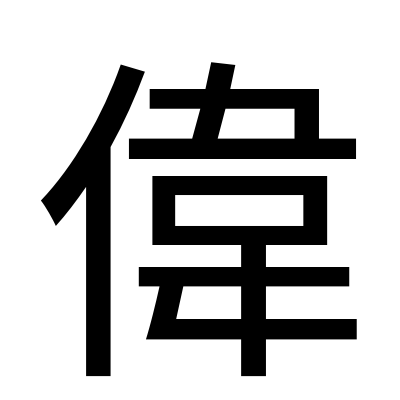
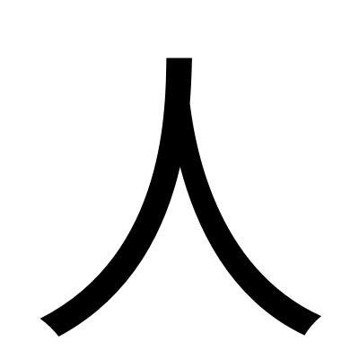
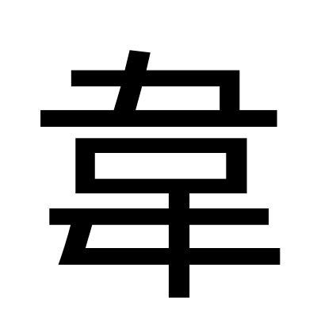

# 偉

> 字卡格式 v2：**結構層**（點砌）→ **意思層**（點解）→ **同音層**（粵音點通）→ **交叉核對**。
> 標記：`【原文】`＝字典／古籍原文照抄 ｜ `【觀察】`＝我親眼睇字形圖得出 ｜ `【分歧】`＝各家講法不一 ｜ `【引申】`＝同音推想，**唔係考據**

---

## 0. 基本資料

| 項目 | 內容 | 來源 |
|---|---|---|
| 楷書 |  | Noto Sans TC 本機 render |
| 部首 | 人部（亻） | 教育部重編國語辭典 |
| 部首外筆畫 | 9 畫 | 教育部重編國語辭典 |
| 總筆畫 | 11 畫 | 教育部重編國語辭典 |
| Unicode | U+5049 | 維基詞典 Unihan |
| 大五碼 | B0B6 | 中大字庫 |
| 倉頡碼 | 人木一手（ODMQ） | 中大字庫／維基詞典 |
| 四角號碼 | 2425.6 | 中大字庫 |
| 教部字號 | A00207 | 教育部異體字字典 |
| **粵音** | **wai5**（單讀音字，冇異讀） | 粵語審音配詞字庫（黃 p11／周 p7／李 p245／何 p70） |
| 國音 | ㄨㄟˇ wěi | 教育部重編國語辭典 |
| 中古音 | 于鬼切；云母・次濁・喉音・**上聲**・止攝・微/尾韻・合口・三等 | 《廣韻》p.255（中大字庫） |
| 上古音 | **\*ɢʷɯlʔ** | 鄭張尚芳(2003)，維基詞典轉載 |
| 異體字 | 伟（簡化字） | 維基詞典 |
| 使用頻率 | 頻序 A 976／B 869；頻次 A 1960／B 990 | 中大字庫 |
| 英文義 | admirable; extraordinary; fine-looking; powerful; big, great | 中大字庫 |

---

## 1. 結構層

### 1.1 字形演變

| 甲骨文 | 金文 | 大篆／籀文 | 小篆 | 楷書 |
|:---:|:---:|:---:|:---:|:---:|
| ✗ 無 | ✗ 無 | ✗ 無 |  |  |

**【觀察】**「偉」係**後起字**——中大字庫嘅甲骨、金文欄**一個字例都冇**，只有小篆 1 例同簡帛／其他 7 例。呢點同「豪」一樣（見 [豪.md](豪.md)），但同「家」相反（家有甲骨 + 金文）。意思係：**要追「偉」嘅字源，一定要經「韋」去追**，因為「偉」本身冇古文字可睇。

**【觀察】小篆睇到啲咩：** 左邊係一條上端微曲、向下垂直拉長嘅筆畫——即企緊嘅人（亻）。右邊嗰嚿嘢，同我抓落嚟嘅**獨立「韋」小篆逐筆對應**：上面一個部件、中間一個細方框、下面一個部件，三層疊。**即係話「偉」嘅右半，就係完整一隻「韋」，冇省過。**

### 1.2 六書歸類 —— 無爭議

**【原文】《說文解字·人部》**：「偉，奇也。从人，韋聲。」〔于鬼切〕

**【原文】中大漢語多功能字庫略說**：「從「人」，「韋」聲。本義是奇異、奇特。」

三個來源（說文、中大、維基詞典）**完全一致**：**形聲字，从人，韋聲**。冇任何一家提出異議。

> 對比：「家」有三種講法打到飛起（見 [家.md](家.md) 1.2）。「偉」冇——因為「偉」係後起嘅形聲字，造字意圖清楚，唔似「家」咁要靠甲骨文去反推。

### 1.3 部件分解

| 位置 | 部件 | Unicode | 獨立時係咩字 | 喺「偉」入面嘅角色 |
|---|---|---|---|---|
| 左 | 亻（人） | U+4EBA | **人** | **形符**（表意）：同人有關 |
| 右 | 韋 | U+97CB | 熟皮；本為「**圍**」之初文 | **聲符**（表音）wai5 ← wai4 |

**部件字形對照（我睇過嘅圖）：**

| | 甲骨文 | 金文 | 大篆 | 小篆 | 楷書 |
|---|:---:|:---:|:---:|:---:|:---:|
| **人** |  |  | — |  |  |
| **韋** |  |  |  |  |  |

**【觀察】「人」**：甲骨文係**一條側面人形**——一撇由頭部斜落，中間屈身，下面一腳垂落，另有短畫作手臂垂前。係側視、微微彎腰嘅企人。到小篆變成兩筆（撇+捺），楷書做偏旁就壓成「亻」。

**【觀察】「韋」四期演變（呢個係本卡最重要嘅一段）**：

- **甲骨文**：三層。**最上**係一個腳掌形（止），趾頭朝一邊；**中間**係一個**封閉嘅四邊形**——即城牆／城邑（囗）；**最下**又一個腳掌形，但**方向同上面嗰隻相反**。合埋就係：兩隻腳一上一下，繞住個城行。
- **金文**：仍然係三層，但上下兩個「止」形態更誇張、更似腳板，中間個框開始由方變扁。
- **大篆／籀文**：中間個「囗」明顯**壓扁**，由封閉方框變成接近一橫；上下兩部件開始線條化。
- **小篆**：定型。上面一個止之變形、中間一個細「口」、下面一個止之變形——即今日「韋」字中間嗰個「口」，**就係當年個城**。

**【觀察】關鍵**：今日寫「韋」，中間嗰個細「口」睇落好唔起眼，但佢係甲骨文入面**最大嗰嚿**——成個城。而上下嗰兩舊嘢，本來係兩隻清清楚楚嘅腳板。**成隻字嘅主角（城）被縮到最細，配角（腳）反而佔咗上下兩層。**

### 1.4 部件橫向連結：「韋」呢個城同腳去咗邊啲字

**【原文】維基詞典「字形拆解／相關派生漢字」系列#1923（韋）**，完整 31 字：

> 韋｜偉｜喡｜幃｜徫｜湋｜愇｜媁｜瑋｜椲｜暐｜煒｜禕｜稦｜褘｜緯｜諱｜韓｜鍏｜郼｜韡｜葦｜韏｜闈｜圍｜違｜韑｜韙｜颹｜衛｜衞

揀重點嘅列表：

| 字 | 結構 | 韋嘅角色 | 意思同「圍繞」嘅關係 |
|---|---|---|---|
| **韋** | 囗 + 止×2~4 | 本體 | **圍城**（本義）→ 後借為熟皮 |
| **圍** | 囗 + **韋**（聲兼義） | 聲符＋義符 | **包圍**——喺「韋」外面**再加一個囗**，攞返本義 |
| **衛** | 行 + **韋** | 義符 | **守衛**——由「繞城」嘅另一面睇 |
| **違** | 辵 + **韋** | 聲符 | 離開、違背——《說文》「韋，相背也」嗰個意思 |
| **偉** | 亻 + **韋** | **聲符** | 奇特、盛大 |
| 緯 | 糸 + 韋 | 聲符 | 橫線、緯度 |
| 葦 | 艸 + 韋 | 聲符 | 蘆葦 |
| 諱 | 言 + 韋 | 聲符 | 避忌唔講 |
| 韓 | 倝 + 韋 | 聲符 | 國名、姓 |
| 闈 | 門 + 韋 | 聲符 | 宮門、考場 |

**小篆並排比對：**

| 韋 | 偉（右半） | 圍 | 違 | 衛 |
|:---:|:---:|:---:|:---:|:---:|
|  |  |  |  |  |

**【觀察】睇圖之後執到三件事：**

1. **「圍」小篆係「韋」外面再包一個大囗。** 我親眼數到兩層方框：外面一個大嘅，入面完整一隻韋（連佢自己中間嗰個細口）。即係話「圍」有**兩個囗**——一個係原裝（喺韋入面），一個係後加。維基詞典講「累增『囗』作『圍』保留本義」，同我睇到嘅圖**完全對得上**。
2. **「衛」小篆係「韋」左右兩邊夾住「行」**（十字路口嘅兩半）。中間嗰條直柱就係韋（腳-口-腳）。
3. **「偉」右半同獨立「韋」逐筆同形**，冇壓縮、冇省略。對比「豕」做左偏旁時要壓窄（見 [家.md](家.md) 1.4）——「韋」做右偏旁反而保持完整，因為佢本身就係窄長形。

### 1.5 異體字

| 異體 | 結構差異 | 備註 |
|---|---|---|
| **伟** | 亻 + 韦 | 簡化字。「韋」簡化為「韦」，聲符跟住簡 |

教育部異體字字典列「偉」A00207 為正文字，另有**附收字 3 個**（我未能取得字形，見第 6 節）。

### 1.6 部件總表（拆到獨體為止）

| 層級 | 部件 | 獨立時係咩字 | 一句字典義 | 粵音 | 出處 |
|---|---|---|---|---|---|
| 一級 | **亻／人** | 人 | 【原文】「具有高度智慧和靈性…的高等動物」；又：別人、每人、某類身分的人、品格性情 | jan4 | 教育部重編國語辭典 ID 9236 |
| 一級 | **韋** | 韋 | 【原文】「去毛加工製成的柔軟獸皮」；又：姓；二一四部首之一 | wai4／wai5 | 教育部重編國語辭典 ID 11402 |
| 二級 | **囗** | 囗 | 城郭之象形（「圍」之本體）。重編國語辭典未收 | **wai4** | 中大字庫／維基詞典字源 |
| 二級 | **止** | 止 | 【原文】[名]「腳。同『趾』」；[動] 停住、不動 | zi2 | 教育部重編國語辭典 ID 7535 |
| 二級※ | **舛** | 舛 | 【原文】「乖違、違背」；錯誤錯亂 | cyun2 | 教育部重編國語辭典 ID 8648 |

※「舛」只喺《說文》嗰套分析入面出現，古文字學界唔用（見 4.2）。兩套都列，由你揀。

**三個獨體象形終點**：人（側面企人）、囗（城郭）、止（腳板）。三個都親眼睇過字形圖。

---

## 2. 意思層

### 2.1 成隻字查字典

| 字典 | 原文／義項 |
|---|---|
| **《說文解字·人部》** | 【原文】「偉，奇也。从人，韋聲。」 |
| **《玉篇·人部》** | 【原文】「偉，大也。」（中大字庫引） |
| **中大漢語多功能字庫** | 本義：奇異、奇特。又表卓越、高大、盛大 |
| **教育部重編國語辭典**（ID 11428） | 見下 |

**【原文】教育部重編國語辭典 ㄨㄟˇ（人部+9畫 共11畫・常用字）：**

| 詞性 | # | 意思 | 書證 |
|---|---|---|---|
| 形 | 1 | **奇異的** | 《說文解字．人部》「偉，奇也。」《管子．任法》「無偉服，無奇行。」 |
| 形 | 2 | **盛壯、卓越** | 如「偉績」「豐功偉業」。《莊子．大宗師》「偉哉，天造物者！」《文選．左思．詠史詩》「馮公豈不偉？白首不見招。」 |
| 形 | 3 | **高大** | 《後漢書．卷一九．耿弇傳》「有偉體，腰帶八圍。」晉．潘尼〈桑樹賦〉「觀茲樹之特偉」 |
| 名 | — | 姓 | 如漢代有偉璋 |

**中大字庫補充嘅書證**：《論衡．對作》「為奇偉之觀也」；唐．王勃〈滕王閣序〉「幸承恩於偉餞」（盛大義）。

**配搭點**（中大字庫）：魁、居、瑰、傀、雄、岸、宏 → 魁偉、瑰偉、雄偉、偉岸、宏偉
**成語**：豐功偉績、豐功偉業、偉績豐功、雄才偉略、偉才通識

### 2.2 部件逐個查字典

**人（U+4EBA）**

| 字典 | 內容 |
|---|---|
| 教育部重編國語辭典（ID 9236） | 【原文】「具有高度智慧和靈性，且能製造並使用工具以進行勞動的高等動物」；別人、每人、某類身分的人、品格性情、姓、二一四部首之一 |

→ **人 ＝ 人**。喺「偉」入面淨係表「同人有關」，屬泛指形符。

**韋（U+97CB）**

| 字典 | 內容 |
|---|---|
| 《說文解字》 | 【原文】「韋，相背也。从舛囗聲。獸皮之韋，可以束枉戾相韋背，故借以爲皮韋。凡韋之屬皆从韋。𣍄，古文韋。」 |
| 教育部重編國語辭典（ID 11402） | 【原文】「去毛加工製成的柔軟獸皮」《楚辭．卜居》「如脂如韋」；姓（如唐代韋應物）；部首 |
| 中大字庫略說 | 【原文】「甲金文從「囗」從二至四「止」，囗表示城邑，象眾人圍城之形，是「圍」的初文。後借來表示皮革，現多用為姓氏。」 |
| 維基詞典字源 | 【原文】「會意字，從二至四「止」從「囗」，「止」是足的象形，「囗」是城郭象形，會眾足繞城之意，是「圍」的初文。常被假借為姓氏或皮革，累增「囗」作「圍」保留本義。」 |
| 《正字通》 | 【原文】「韋，柔皮。熟曰韋，生曰革。」 |
| 《康熙字典》 | 【原文】「又通圍。《前漢·成帝紀》…《註》師古曰：韋，與圍同。」 |

→ **韋 ＝ ①本義「圍城／圍繞」（圍之初文）→ ②假借作「熟皮」→ ③今多用作姓**。呢三層要分清楚。

**囗（U+56D7）**

| 字典 | 內容 |
|---|---|
| 中大字庫／維基詞典 | 城郭之象形 |
| 粵語審音配詞字庫 | 讀 **wai4**（同「圍」「韋」） |
| 維基詞典 | 列「囗」為「韋」之**異體字**之一 |
| 教育部重編國語辭典 | 未收 |

**止（U+6B62）**

| 字典 | 內容 |
|---|---|
| 《說文》系統 | 足之象形 |
| 教育部重編國語辭典（ID 7535） | 【原文】[名]「腳。同『趾』」《漢書．刑法志》「當斬左止者」；[動] 停住、不動；部首 |

→ **止 ＝ 腳／足印**。喺「韋」入面就係繞城嘅腳。

### 2.3 結構 → 意思推導鏈

```
【字形】 亻（人）+ 韋（聲符）
   │
   ├─ 形符「人」：淨係圈定範圍＝同人有關，唔提供具體意思
   │
   └─ 聲符「韋」：wai ── 只表音，唔表意
                    │
                    ↓
              【本義】奇異、奇特      ←《說文》「奇也」
                    │
      ┌─────────────┼─────────────┐
      ↓             ↓             ↓
  【引申1】卓越    【引申2】高大    【引申3】盛大
   偉績、豐功偉業   有偉體、偉木     偉餞、偉觀
      │
      ↓
  【引申4】姓氏（漢代偉璋）
```

**每一步嘅根據：**
- 「亻＝人」← 教育部辭典 ID 9236
- 「韋＝聲符」← 《說文》「从人，韋聲」+ 中大字庫略說，三家一致
- 「本義＝奇異」← 《說文》「奇也」+ 中大字庫
- 引申 1–4 ← 教育部重編國語辭典義項 1–3 + 名詞義

**⚠️ 要提防嘅推論**：因為「韋」喺度係**純聲符**，所以**唔可以**直接講「偉＝人 + 圍繞 ＝ 被人圍住嘅人 ＝ 偉大」。呢個係附會。字典層面，「韋」對「偉」嘅意思**冇貢獻**。（但同音層另有發現，見 3.3 同 4.3。）

---

## 3. 同音層（粵音 wai5）

**【原文】粵語審音配詞字庫 wai5 全部同音同調字（28 個）：**

> 偉、緯、葦、諱、韙、湋、暐、煒、瑋、韡、韋、卉、薳、唯、洧、痏、蒍、蘤、鮪、瀢、濻、儰、徫、椲、蓶、踓、鍏、撱

### 3.1 同音同調字表

**關係類別**四選一：同源（同聲符）｜通假／聲訓（文獻有記）｜民俗諧音（有出處）｜純諧音（淨係讀音撞）

#### A組：同源（共用「韋」聲符）— 14 個

| 同音字 | 字典義（一句） | 同聲符 | 上古音（鄭張2003） | 關係類別 | 來源 |
|---|---|---|---|---|---|
| **韋** | 熟皮；本為「圍」之初文 | ✓ 本體 | \*ɢʷɯl | **同源** | 教育部 ID 11402 |
| **緯** | 織布嘅橫線；地理緯度 | ✓ | \*ɢʷɯls | **同源** | 教育部 ID 11433 |
| **葦** | 蘆葦；葦草般窄長嘅小舟 | ✓ | \*ɢʷɯlʔ | **同源** | 教育部 ID 11431 |
| **諱** | 因顧忌而不敢／不願說；隱瞞 | ✓ | \*qʰʷɯls | **同源** | 教育部 ID 5161 |
| **韙** | 對、是（「冒天下之大不韙」） | ✓ | \*ɢʷɯlʔ | **同源** | 教育部 ID 11434 |
| **煒** | 光亮嘅樣；《說文》「盛明貌」 | ✓ | \*ɢʷɯlʔ | **同源** | 教育部 ID 11429 |
| **瑋** | 美玉（《集韻》） | ✓ | \*ɢʷɯlʔ | **同源** | 教育部 ID 11430 |
| **韡** | 光明盛大嘅樣（《詩．常棣》「鄂不韡韡」） | ✓ | \*ɢʷɯlʔ | **同源** | 教育部 ID 11435 |
| **暐** | 光明（重編國語辭典未收） | ✓ | \*ɢʷɯlʔ | **同源** | 鄭張2003／維基詞典 |
| **椲** | 木名（辭典未收） | ✓ | \*ɢʷɯlʔ | **同源** | 鄭張2003 |
| **湋** | 水名（辭典未收） | ✓ | \*ɢʷɯl | **同源** | 鄭張2003 |
| **鍏** | 鍬類農具（辭典未收） | ✓ | \*ɢʷɯl(ʔ) | **同源** | 鄭張2003 |
| **徫** | 行走貌（辭典未收） | ✓ 系列#1923 | — | **同源** | 維基詞典 |
| **愇** | 恨（辭典未收；不在 wai5 表但同系列） | ✓ | \*ɢʷɯlʔ | **同源** | 鄭張2003 |

#### B組：純諧音（唔同聲符）— 14 個

| 同音字 | 字典義（一句） | 聲符 | 關係類別 | 來源 |
|---|---|---|---|---|
| **卉** | 草類植物嘅總稱（花卉） | 非韋系 | 純諧音 | 教育部 ID 5130 |
| **唯** | 對尊長嘅應答詞；唯一 | 隹 | 純諧音 | 教育部 ID 11427 |
| **洧** | 水名（洧河） | 有 | 純諧音 | 教育部 ID 11424 |
| **鮪** | 鮪魚／吞拿魚 | 有 | 純諧音 | 教育部 ID 11426 |
| **痏** | 瘡、傷 | 有 | 純諧音 | 冷僻字 |
| **薳／蒍** | 草名；姓 | 為 | 純諧音 | 冷僻字 |
| **蘤** | 花（「華」之異體） | — | 純諧音 | 冷僻字 |
| **儰** | — | 為 | 純諧音 | 冷僻字 |
| **蓶／踓** | — | 隹 | 純諧音 | 冷僻字 |
| **撱** | — | 隋 | 純諧音 | 冷僻字 |
| **瀢／濻** | — | — | 純諧音 | 冷僻字 |

**14 對 14，啱啱一半一半。**

### 3.2 同音異調字（wai 系其他聲調，只列名唔引申）

**wai4**（「韋」自己嘅本調）：為、圍、維、唯、遺、惟、違、韋、桅、圩、帷、闈、幃、濰、**囗**、鄬、潿、鮠、湋、褘、喡、蓶、醀、鍏、欈

> ⚠️ 留意：**「韋」同時讀 wai4 同 wai5**（異讀字），而「偉」淨係 wai5。所以嚴格嚟講「偉」同「韋」係同音字——呢個係下面 4.3 嘅關鍵。

### 3.3 引申

> 以下全部係【引申】＝同音推想，**唔係字典考據**。攞去用之前請睇清楚類別。

**由 A 組（同源）出發——呢啲有聲符關係撐住，最實：**

- 【引申】偉 ↔ **煒／暐／韡** 同音，三隻都解「**光明、盛大**」，而「偉」本身義項 2 就係「盛壯」、義項 3「高大」。→ 可引申為：**偉＝發光發亮咁大**。（呢條唔止係諧音，見 4.3 第 3 點）
- 【引申】偉 ↔ **韋／圍／衛** 同一聲符家族。→ 可引申為：**偉大嘅人係被圍住、被守衛嘅中心**（城喺中間，眾人繞行）。
- 【引申】偉 ↔ **瑋**（美玉）。→ 可引申為：**偉＝如玉般珍貴**。改名用「偉」「瑋」互通，取義相近。
- 【引申】偉 ↔ **緯**（橫線、緯度）。→ 可引申為：**經緯天下**，「偉」帶治理、佈局嘅意味。（「經天緯地」本身就係成語）
- 【引申】偉 ↔ **韙**（對、是）。→ 可引申為：**偉＝正確、站得住**。反面「不韙」＝冒天下之大不韙。
- 【引申】偉 ↔ **諱**（避忌唔講）。→ **反向引申**：偉大到一個點就變成忌諱、唔可以直呼其名（古人「避諱」正正係對尊長／帝王）。呢條同音關係將「偉大」同「唔可以講」駁埋一齊。
- 【引申】偉 ↔ **葦**（蘆葦）。→ 可引申為：**「一葦」＝渺小**（蘇軾「縱一葦之所如」）。同「偉＝高大」啱啱相反，係同音字入面嘅**反義配對**。

**由 B 組（純諧音）出發——淨係讀音撞，最鬆：**

- 【引申】偉 ↔ **唯**（唯一）。→ 偉＝唯一、獨一無二。
- 【引申】偉 ↔ **卉**（花卉）。→ 偉＝繁花盛放。
- 【引申】偉 ↔ **鮪**（大魚）。→ 偉＝大魚、巨物。

---

## 4. 交叉核對

### 4.1 結構 ↔ 意思：推導鏈有冇斷？

**冇斷，但有一段係空嘅。**

- 「亻」→「同人有關」：通。「偉」全部義項（奇異、卓越、高大）都係**形容人或人造之物**——《後漢書》「有偉體」形容人身材，《文選》「馮公豈不偉」形容人。形符落實咗。
- 「韋」→ 意思：**空白**。三家字典一致話係純聲符，冇一家話佢表意。所以由結構推唔到「奇也」呢個本義出嚟。
- **結論**：「偉」係典型嘅形聲字，**結構只解釋到一半**（人），另一半（點解係「奇」）要靠文獻書證，唔係靠拆字。

> 呢個係同「家」最大嘅分別：「家」拆開之後兩個部件都有話可說（屋、豬），所以先有三派爭論；「偉」拆開之後聲符係啞嘅，所以反而冇爭論。

### 4.2 字典 ↔ 字典：有冇打架？

**「偉」本身：零衝突。** 說文、中大、維基、教育部四家都話「从人，韋聲」，本義「奇也」。

**但「韋」點拆，兩套講法完全相反 ——【分歧】**

| | 《說文解字》（許慎） | 古文字學界（中大／維基詞典） |
|---|---|---|
| 拆法 | 从**舛**，**囗**聲 | 从**囗**，从二至四**止** |
| 「囗」嘅角色 | **聲符**（表音） | **形符**（城郭，表意） |
| 「腳」嘅角色 | 舛＝兩腳相背，**形符** | 止×2~4＝眾人之足，**形符** |
| 本義 | **相背** | **圍城** |
| 六書 | 形聲 | 會意 |

**兩邊將「囗」嘅角色啱啱調轉。**

**【觀察】我睇甲骨圖之後點睇：** 我睇到嘅甲骨字形係**一個封閉四邊形，上下各一隻腳，方向相反**。

- 支持說文嗰邊：上下兩隻腳**確實係方向相反**——「相背」呢個描述，同我睇到嘅圖對得上。而且「囗」讀 **wai4**（粵語審音配詞字庫實測），同「韋」wai4 **完全同音**，所以「囗聲」喺音理上**企得住**。
- 支持古文字學界嗰邊：中大話甲金文有「**二至四**」個止。如果係三隻或四隻腳，「舛」（淨係兩隻）就解釋唔到。而且《康熙字典》直接記「**又通圍**…師古曰：韋，與圍同」，《睡虎地秦簡》「韋(圍)城」寫作「韋」——**有出土同傳世雙重書證**證明韋＝圍。
- **我嘅判斷**：古文字學界嗰套證據硬啲（有出土書證 + 能解釋 3–4 腳）。但**說文嗰個「囗聲」唔係亂噏**——囗真係讀 wai4。合理嘅講法係：「囗」喺「韋」入面**又表音又表意**（亦聲），許慎睇到音嗰面，古文字學者睇到意嗰面。

**李孝定嘅第三種講法**（中大字庫引）：「自守城者言之，多腳繞城有保衛之意，則「韋」是…「衛」字初文，自攻城者言之，則「韋」是「圍」的初文。」——即係**同一個字形，睇你企喺城入面定城外面**，可以係「衛」又可以係「圍」。

### 4.3 同音 ↔ 結構：邊啲同音字同「偉」共用聲符？

**呢節係本卡最硬嘅一段。**

**1. 一半 wai5 同音字都係「韋」家族。** 28 個 wai5 字入面，**14 個**共用「韋」聲符（見 3.1 A 組）。呢個唔係巧合，係形聲字系統嘅必然結果。

**2. 「偉」同「韋」嘅上古音差一個喉塞音。**

**【原文】鄭張尚芳(2003) 同聲符字（韋系）上古漢語構擬**（維基詞典轉載）：

| 上古音 | 字 | 今粵音 |
|---|---|---|
| \*ɢʷɯl | 幃、違、**韋**、闈、湋 | **wai4** |
| \*ɢʷɯl, \*ɢʷɯls | 圍 | wai4 |
| \*ɢʷɯlʔ | 韙、煒、暐、**偉**、瑋、葦、椲、韡、愇 | **wai5** |
| \*ɢʷɯls | 緯 | wai5 |

**睇到條規律未？** 上古有 **ʔ**（喉塞尾）嗰批 → 今日粵語讀 **wai5**（陽上）；冇 ʔ 嗰批 → 讀 **wai4**（陽平）。

**即係話：「偉」\*ɢʷɯlʔ 同「韋」\*ɢʷɯl，聲母韻母一模一樣，淨係差個表上聲嘅喉塞尾。** 呢個係「韋」做「偉」聲符嘅**直接音理證據**——唔使靠《說文》一句話，兩千年前嘅讀音構擬同今日粵語嘅聲調分工，自己對得上。

> 白一平-沙加爾(2011) 另一套系統構擬「韋」為 \*ɢʷəj，英義 "go against"（相背）——同說文一致。兩套上古音系統喺聲母 ɢʷ 上一致。

**3. 「煒暐韡」三隻同音字都解「光明盛大」，而「偉」解「盛大」。**

呢個係本卡最值得諗嘅一點。A 組 14 隻同源字入面：

- **煒** \*ɢʷɯlʔ ＝「盛明貌」（說文）
- **暐** \*ɢʷɯlʔ ＝ 光明
- **韡** \*ɢʷɯlʔ ＝「光明盛大的樣子」
- **偉** \*ɢʷɯlʔ ＝「盛壯、卓越」「高大」

四隻字**同一個上古音 \*ɢʷɯlʔ**，意思都圍住「**盛大／光明**」轉。呢個現象叫「**右文說**」——聲符除咗表音仲可能帶共同義素。

**但要小心**：右文說喺學界係**有保留地接受**，唔係定論。呢四隻字意思相近，可以係 (a) 聲符真係帶「盛大」義素；亦可以係 (b) 造字時借咗同一個音，各自獨立引申到「盛大」。**我唔敢話邊個啱**——但四隻字上古同音兼同義域，呢個**現象本身**係實錘（有鄭張構擬 + 四本字典釋義支持）。

**4. 「囗」讀 wai4，證實《說文》「囗聲」音理成立。** 見 4.2。呢個係同音層反過來幫結構層做核對嘅例子。

### 4.4 一句總結

**「偉」最硬嘅證據鏈：** 亻（形符・表人）+ 韋（聲符・\*ɢʷɯlʔ vs \*ɢʷɯl 差一個喉塞尾）→ 本義「奇也」（《說文》）→ 引申卓越、高大、盛大。**結構只解釋到「同人有關」，本義要靠書證。** 而「韋」自己嘅本義（圍城）同「偉」**冇意思上嘅關係**——但同音家族入面「煒暐韡」都解「盛大」，同「偉」高度重疊，值得留意。

---

## 5. 來源清單

| # | 來源 | URL |
|---|---|---|
| 1 | 中大漢語多功能字庫 · 偉 | https://humanum.arts.cuhk.edu.hk/Lexis/lexi-mf/search.php?word=偉 |
| 2 | 中大漢語多功能字庫 · 韋 | https://humanum.arts.cuhk.edu.hk/Lexis/lexi-mf/search.php?word=韋 |
| 3 | 粵語審音配詞字庫 · 偉 | https://humanum.arts.cuhk.edu.hk/Lexis/lexi-can/search.php?q=%B0%B6 |
| 4 | 粵語審音配詞字庫 · wai5 同音字 | https://humanum.arts.cuhk.edu.hk/Lexis/lexi-can/pho-rel.php?s1=w&s2=ai&s3=5 |
| 5 | 粵語審音配詞字庫 · wai4 同音字 | https://humanum.arts.cuhk.edu.hk/Lexis/lexi-can/pho-rel.php?s1=w&s2=ai&s3=4 |
| 6 | 教育部重編國語辭典 · 偉 | https://dict.revised.moe.edu.tw/dictView.jsp?ID=11428 |
| 7 | 教育部重編國語辭典 · 韋 | https://dict.revised.moe.edu.tw/dictView.jsp?ID=11402 |
| 8 | 教育部重編國語辭典 · 人／止／舛／圍／違／衛 | ID 9236／7535／8648／11404／11405／11463 |
| 9 | 教育部重編國語辭典 · 同音字 | 緯 11433／葦 11431／諱 5161／韙 11434／煒 11429／瑋 11430／韡 11435／卉 5130／唯 11427／洧 11424／鮪 11426 |
| 10 | 教育部異體字字典 · 偉 A00207 | https://dict.variants.moe.edu.tw/search.jsp?QTP=0&WORD=偉 |
| 11 | 維基詞典 · 偉 | https://zh.wiktionary.org/wiki/偉 |
| 12 | 維基詞典 · 韋（含鄭張尚芳上古音表、系列#1923） | https://zh.wiktionary.org/wiki/韋 |
| 13 | 字形圖（小篆等） | Wikimedia Commons `偉-seal.svg`、`韋-oracle/bronze/bigseal/seal.svg`、`人-/止-/舛-/圍-/違-/衛-` |

楷書圖：本機用 Noto Sans TC render（`/home/user25/ziwei/wenshu/fonts/NotoSansTC-Regular.otf`）。

---

## 6. 存疑／未驗證

1. **教育部異體字字典嘅 3 個附收字我攞唔到。** 搜尋頁明確話「正文 1 字，附收字 3 字」，但 dictView 嘅 ID 對唔上（回 404「ID Miss!!」）。所以 1.5 節嘅異體字表**只有簡化字「伟」**，未必齊全。
2. **中大字庫甲骨／金文原拓我今次冇抓。** 「偉」本身冇甲骨金文（已核實），而「韋」嘅甲骨金文我用咗 Wikimedia 嘅摹寫 SVG，**唔係原拓**。中大字庫有 6 個甲骨字例（CHANT:0826 等）同 10 個金文字例，未逐一睇。所以 1.3 節「二至四止」嗰句我**只親眼見過兩隻腳嗰個字形**，三隻四隻嘅變體係轉述中大字庫。
3. **鄭張尚芳(2003) 我係經維基詞典轉載**，未查《上古音系》原書。
4. **「右文說」嗰段（4.3 第 3 點）** 我已經標明唔敢定論。四隻字同音同義域係事實，但「聲符帶義」呢個理論本身學界有爭議，我冇引任何一家嘅立場做背書。
5. **B 組冷僻字（痏、薳、蒍、蘤、儰、蓶、踓、撱、瀢、濻、徫、椲、湋、鍏、暐）** 重編國語辭典無收，我只憑聲符判斷佢哋唔屬「韋」系（或屬），**冇字典釋義佐證**。3.1 表入面標咗「冷僻字」嘅就係呢批。
6. **《玉篇》「偉，大也」** 係經中大字庫轉引，未查原書。
