# 娜

> 字卡格式 v2：**結構層**（點砌）→ **意思層**（點解）→ **同音層**（粵音點通）→ **交叉核對**。
> 標記：`【原文】`＝字典／古籍原文照抄 ｜ `【觀察】`＝我親眼睇字形圖得出 ｜ `【分歧】`＝各家講法不一 ｜ `【引申】`＝同音推想，**唔係考據**

---

## 0. 基本資料

| 項目 | 內容 | 來源 |
|---|---|---|
| 楷書 | 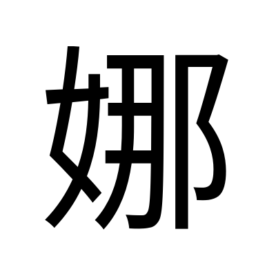 | Noto Sans TC 本機 render |
| 部首 | 女部（部首編號 38） | 粵語審音配詞字庫／教育部重編國語辭典 |
| 部首外筆畫 | 7 畫 | 教育部重編國語辭典 |
| 總筆畫 | 10 畫 | 粵語審音配詞字庫／教育部重編國語辭典 |
| Unicode | U+5A1C | 粵語審音配詞字庫／維基詞典 Unihan |
| 大五碼 | AE52 | 粵語審音配詞字庫 |
| 倉頡碼 | 女尸手中（VSQL） | 粵語審音配詞字庫／維基詞典 |
| 四角號碼 | 4742.7 | 維基詞典 |
| 教部字號 | A00928 | 教育部異體字字典 |
| **粵音** | **naa4／no4／no5**（字音分類：**異讀破音字**，三個讀音） | 粵語審音配詞字庫（詳見下表） |
| 國音 | ㄋㄨㄛˊ nuó／ㄋㄚˋ nà | 教育部重編國語辭典（ID 3145／2941） |
| 中古音 | 奴可切；泥母・次濁・舌音・**上聲**・果攝・歌／哿韻・開口・一等 | 《廣韻》p.304（中大字庫） |
| 上古音 | **\*naːlʔ** | 鄭張尚芳(2003)，維基詞典「冉」條轉載 |
| 異體字 | 見 1.5（**「娜」本身冇異體字形**，但「婀娜」一詞有「阿那」「妸娜」「嬝娜」等異寫） | 教育部重編國語辭典／異體字字典 |
| 使用頻率 | 頻序 3669／頻次 52 | 中大字庫 |
| 英文義 | elegant, graceful, delicate | 中大字庫 |
| 其他頁碼 | 《漢語大字典》p.1048；《康熙字典》**中大作 Pg.0190.230，維基詞典作 262 頁第 23 字**（兩家唔同，見第 6 節） | 中大字庫／維基詞典 |

**三個粵讀，各有各嘅分工：**

| 粵音 | 根據 | 同音字 | 詞例／備註（**原文照抄**） |
|---|---|---|---|
| **naa4** | 周 p.37、何 p.7、張群顯 | 拿、拏、蒘… | 【原文】「『娜no4』的異讀字」 |
| **no4** | 黃 p.35、周 p.37、李 p.167 | 挪、儺、挼… | 【原文】「女子人名用字」 |
| **no5** | 黃 p.35、李 p.167、何 p.255 | 橠、那 | 【原文】「婀娜, 裊娜」 |

**配搭點**（中大字庫）：姿、婀、裊、嫋

---

## 1. 結構層

### 1.1 字形演變

| 甲骨文 | 金文 | 大篆／籀文 | 小篆 | 楷書 |
|:---:|:---:|:---:|:---:|:---:|
| ✗ 無 | ✗ 無 | ✗ 無 | ✗ 無 |  |

**【觀察】「娜」一個古文字都冇，連小篆都冇。** 我逐段檢查過中大字庫「娜」字條嘅 HTML：**成頁冇任何一張字形圖**（唔止甲骨金文，連小篆欄、簡帛欄、其他欄都係空嘅），只有《廣韻》同粵音資料。我亦試過 Wikimedia Commons 嘅 `娜-seal.svg`，回 **404**。

**而且唔係我搵漏 ——【原文】教育部異體字字典 A00928 開頭第一句就係：「『娜』《說文》不錄。」**

> 呢個係 project 至今最極端嘅情況，比「偉」仲要空：
>
> | | 甲骨 | 金文 | 小篆 | 《說文》收唔收 |
> |---|:---:|:---:|:---:|:---:|
> | 家 | ✓ | ✓ | ✓ | ✓ |
> | 靜 | ✗ | ✓ | ✓ | ✓ |
> | 偉 | ✗ | ✗ | ✓ | ✓ |
> | **娜** | **✗** | **✗** | **✗** | **✗** |
>
> **所以「娜」嘅字源，一定要經「那」→「冄」同「女」兩條路去追**，本字完全冇嘢可以睇。

**兩條追溯路（下面每張圖我都親眼睇過）：**

| | 甲骨文 | 金文 | 小篆 | 傳抄古文 | 楷書 |
|---|:---:|:---:|:---:|:---:|:---:|
| **娜** | ✗ | ✗ | ✗ | ✗ |  |
| ↑聲符 **那**（＝冄+邑） | ✗ | ✗ |  | ✗ | 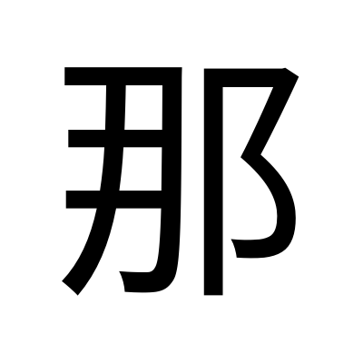 |
| ↑聲符 **冄／冉** | 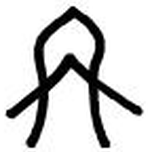 | 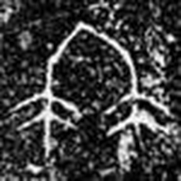 | 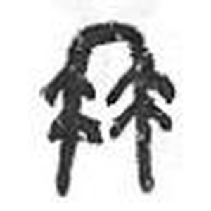 | 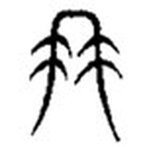 | 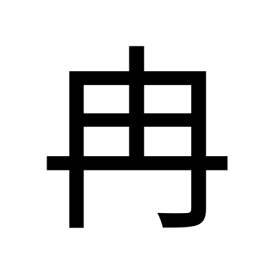 |
| ↑形符 **女** | 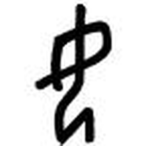 | 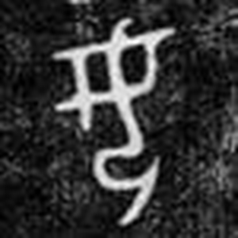 |  |  | 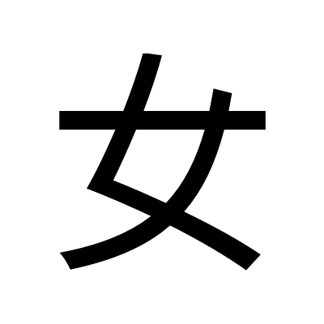 |

冉：甲骨＝甲骨文合集 CHANT:3101（中大原拓）；金文＝冉鉦鋮・戰國（中大原拓）；小篆＝康熙圖（中大）；汗簡（中大）。
女：甲骨＝甲骨文合集 CHANT:0422（中大原拓）；金文＝彭女甗・商代（中大原拓）；小篆／大篆＝Wikimedia。
那：小篆＝Wikimedia `那-seal.svg`。

**【觀察】「那」嘅小篆其實係《說文》嘅「𨙻」。** Wikimedia 個檔叫「那-seal」，但我睇張圖：**左邊係一個上有拱頂、兩側各垂一條線、線上有短畫外伸嘅部件 —— 即係「冄」**（同我抓落嚟嘅獨立「冄」小篆逐筆對得上）；**右邊係一個上圓下曲、下端拖出長勾嘅部件 —— 即係「邑」做右偏旁**（同我抓落嚟嘅獨立「邑」小篆一模一樣）。

即係話呢張圖畫嘅係 **冄 + 邑**，正正就係【原文】《說文·邑部》：「𨙻，西夷國。从邑，冄聲。安定有朝𨙻縣。」〔諾何切〕**唔係今日代詞「那」嘅小篆**（中大明言「那」不見於甲金文及《說文》）。呢一格我照放，但要記住佢係「𨙻」。

**【觀察】「冄」四期演變 —— 呢段係本卡最有價值嘅一段：**

- **甲骨文（合集 3101）**：上面係一個**尖頂嘅拱形**（兩條線由頂點向下向外分開），拱底有一個向下嘅尖角；拱嘅兩側各有**一條長線向外下方伸展**。整體似一件罩住嘅嘢，兩邊有嘢垂落嚟。
- **甲骨文（合集 H7660A，另一件）**：頂部多咗一條**橫畫**（像個蓋），下面一個拱形，拱中間有一橫，兩側同樣各有一條斜線向外下伸。**呢件嘅結構已經好接近今日嘅楷書「冉」**（外框 + 中間一豎 + 兩橫）。
- **金文（冉鉦鋮・戰國）**：上面一個尖頂拱，**左右兩邊各垂落一條豎線，而每條豎線上都有兩三條短斜畫向外伸出** —— 好清楚係**毛／鬚**。
- **小篆（康熙圖）**：拱頂 + 兩側垂線 + **每邊兩組短橫向外伸**。同金文結構**完全一致**。
- **汗簡（傳抄古文）**：同小篆一樣，但兩邊嘅短枝畫得更誇張、更似一撮撮毛。

| 冄・甲骨（合集 3101） | 冄・甲骨（合集 H7660A） | 冄・金文（冉鉦鋮） | 冄・小篆 | 冄・汗簡 |
|:---:|:---:|:---:|:---:|:---:|
|  | 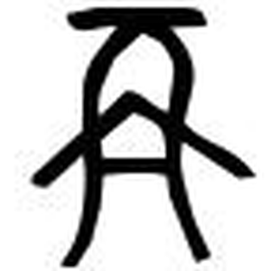 |  |  |  |

**【觀察】由呢五張圖執到一件今日睇楷書完全睇唔到嘅嘢：**

**今日寫「冉」，中間嗰兩橫係「貫穿」個框嘅；但喺金文、小篆、汗簡入面，佢哋係由兩條垂線「向外伸出」嘅短枝 —— 即係毛。** 呢點同【原文】《說文·冄部》「冄，毛冄冄也。象形」對得上，亦同中大略說「疑象毛髮下垂之貌(許慎、段玉裁)」對得上。**楷化之後，「毛」變咗「橫畫」，象形嘅痕跡被完全抹平。**

**【觀察】「女」四期演變：**

- **甲骨文（合集 0422）**：一條由上向下彎嘅線（頭同背），**中間有一個閉合嘅小圈** —— 即雙臂交疊喺胸前；線再向下屈折、向右收 —— 即跪坐嘅腿同臀。整個係**側身、屈膝、雙手交疊**嘅人形。同中大詳解【原文】「象女子雙膝和足尖着地，臀部坐於腳跟上，兩手交疊於胸前而微下垂之形」對得上。
- **金文（彭女甗・商代）**：同一結構，但線條圓渾飽滿；上面一條彎線由右上向左下，中間一個閉合小方框（交疊嘅手），下面向下彎再向右勾（腳跟）。
- **小篆**：一條長橫貫穿中間，上面一個交叉結構，下面一條長腳向右下拖。**人形已經完全睇唔出。**
- **大篆／傳抄古文**：粗線條，上端一個彎鉤向右，中間兩道斜線交叉，下拖一長腳。抽象程度更高。

**【觀察】對比商代同西周晚期嘅「女」，睇到一個具體嘅流失過程：**

| 女・商代（彭女甗） | 女・西周晚期（逆鐘） |
|:---:|:---:|
|  | 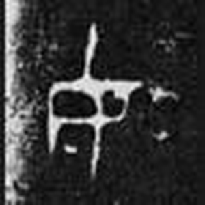 |

商代嗰件我睇到清楚嘅跪坐人形（頭、交疊嘅手、屈起嘅腿）；**西周晚期嗰件已經變成一個左右大致對稱、中間一道長橫貫穿嘅結構，我睇唔返個人形出嚟。** 呢個同中大詳解【原文】「後期金文為書寫簡便，漸失去臀壓腳跟之跪坐形態」講嘅完全一致 —— **文字記載同拓本，我兩樣都對過。**

### 1.2 六書歸類 —— 冇爭議，但《說文》根本冇收

**「娜」唔喺《說文》入面**，所以冇「說文原文」呢一欄。現存最早嘅字書記錄係《集韻》。

**【原文】中大漢語多功能字庫略說（＝詳解全文）**：「從「女」，「那」聲，作女子名字用字。《集韻‧戈韻》：「娜，女字。」」

**【原文】教育部異體字字典 A00928**：「『娜』《說文》不錄。」

**結論：形聲字，从女，那聲。** 兩家（中大、教育部）一致，冇任何一家提異議。**冇爭議嘅原因，同「偉」一樣：呢個係後起形聲字，造字意圖清楚，而且冇古文字可以拎嚟反推。**

> 但「娜」拆開之後，**下一層就開始打架**：
> - 「那」本身點嚟？→ 【分歧】，見 4.2
> - 「冄」畫嘅係咩？→ 【分歧】，見 4.2
> 「娜」本身冇爭議，係因為佢太後起、太簡單；爭議全部喺佢祖父輩度。

### 1.3 部件分解

| 位置 | 部件 | Unicode | 獨立時係咩字 | 喺「娜」入面嘅角色 |
|---|---|---|---|---|
| 左 | 女 | U+5973 | **女**（跪坐嘅女子） | **形符**（表意）：同女性有關 |
| 右 | 那 | U+90A3 | 代詞「那」；又讀 no4 表移動、多、安 | **聲符**（表音）naa4／no4／no5 |

**教育部異體字字典嘅官方寫法說明（【原文】照抄）：**

> 左半「女」之末橫斜挑。右半作「那」：左半橫折鉤下作二橫、一豎撇；右作「邑部」偏旁寫法「阝」，三畫，寫法參「那」字。

**呢段說明直接幫我哋確認咗一件事：「那」右邊嗰個「阝」係邑部，唔係阜部。** 兩個阝喺楷書一模一樣，靠肉眼分唔到，但官方寫法規範講死咗。

**部件字形對照（下面每張圖我都親眼睇過）：**

| | 甲骨文 | 金文 | 小篆 | 楷書 |
|---|:---:|:---:|:---:|:---:|
| **女** |  |  |  |  |
| **那**（小篆＝「𨙻」） | ✗ | ✗ |  |  |
| ├ **冄／冉** |  |  |  |  |
| └ **邑（阝）** |  |  |  |  |

**【觀察】「邑」三期 —— 有一個同「女」撞埋一齊嘅發現：**

- **甲骨文**：上面一個**方框**（囗＝城邑），下面一個**跪坐嘅人形**。
- **金文**：上面個框變成圓角，下面個人形線條加粗、屈曲更明顯。
- **小篆**：上面一個橢圓框，下面一個上有一橫一豎、向右伸出半圓、再向下拖長腳嘅結構。

同中大略說【原文】「甲金文『邑』字從『囗』（夏商城牆多呈方形）從『卩』（跪坐之人），本義指人聚居的地方」完全對得上。

**【觀察】關鍵：「邑」下面嗰個「卩」，同「女」都係跪坐人形。** 我兩張甲骨圖擺埋一齊睇：兩個都係側身、屈膝、臀部坐落腳跟。**分別喺「女」有雙手交疊胸前嗰個閉合小圈，「卩」冇。** 即係話 ——

**「娜」呢隻字，左邊係一個跪坐嘅人（女），右邊嗰個「阝」拆到底又係一個跪坐嘅人（卩）加一座城（囗）。成隻字有兩個跪坐嘅人。** 呢點純粹係字形觀察，**唔代表造字意圖**（「那」喺度係純聲符），但值得記低。

### 1.4 部件橫向連結：「冄」族同「女」族

**【原文】維基詞典「冉」條衍生字**（30 字）：

> 呥、㘱、姌、抩、𣲹、𤝫、柟、珃、䏥、畘、聃、袡、舑、蚺、㴂、䤡、䎃、𨚗、𤱣、𪓚、䶲、再、苒、爯、𡩋、寗、髯、㾆、㫋

**【原文】維基詞典「女」條同聲符字（鄭張尚芳2003）所列**（節錄）：

> 拿、拏、詉、蒘、笯、挐、絮、呶、怓、帑、奴、砮、駑、孥、努、弩、怒、袽、帤、女、籹、恕、如、茹、洳、鴽、蕠、汝、肗

**⚠️ 留意：「娜」唔喺「冉」條個衍生字表入面**（因為佢隔咗一層 ——「娜」从「那」，「那」先从「冄」），**但佢喺鄭張尚芳嘅「冉」系同聲符字表入面**（見 4.3）。**兩個表唔一致，因為一個按字形拆，一個按讀音歸。**

揀重點嘅列表：

| 字 | 結構 | 《說文》 | 上古音（鄭張2003） | 粵音 | 同「娜」嘅關係 |
|---|---|---|---|---|---|
| **冄／冉** | 象形 | 【原文】「毛冄冄也。象形。」〔而琰切〕 | \*njam, \*njamʔ | jim5 | 「娜」嘅祖父輩聲符 |
| **𨙻** | 冄 + 邑 | 【原文】「西夷國。从邑，冄聲。」〔諾何切〕 | — | — | 「那」嘅《說文》本字 |
| **那** | ＝𨙻 | 《說文》不錄今形 | \*naːl, \*naːlʔ, \*naːls | naa5／no4／no5／no1／no6… | **「娜」嘅直接聲符** |
| **姌** 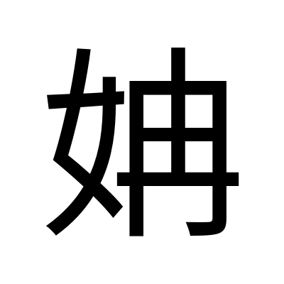 | 女 + **冄** | 【原文】「弱長皃。从女，冄聲。」〔而琰切〕 | \*njamʔ, \*neːmʔ | jim5 | **同「娜」係姊妹字**：都係女+冄系，意思都係柔弱修長 |
| **挪** | 手 + **那** | 《說文》未收 | \*naːl | no4 | 移動 |
| **儺** | 人 + 難 | 【原文】「行人節也。从人，難聲。《詩》曰：佩玉之儺。」〔諾何切〕 | — | no4 | **同「那／𨙻」同一反切**；又有柔美義（猗儺） |
| **髯** | 髟 + **冄** | — | \*njam, \*njams | jim4 | 兩頰嘅鬍鬚 —— **「冄」本義嘅直系後代** |
| **苒** | 艸 + **冄** | — | \*njamʔ | jim5 | 草柔弱下垂（苒苒） |
| **女** | 象形 | 【原文】「婦人也。象形。王育說。」〔尼呂切〕 | \*naʔ, \*nas | neoi5 | **「娜」嘅形符** |
| **奴** | 女 + 又 | 【原文】「奴婢，皆古之辠人也……从女从又。」〔乃都切〕 | \*naː | nou4 | 女系 |
| **如** | 女 + 口 | 【原文】「从隨也。从女从口。」〔人諸切〕 | \*nja, \*njas | jyu4 | 女系 |
| **拏** | 手 + **奴**聲 | 【原文】「牽引也。从手，奴聲。」〔女加切〕 | \*rnaː | naa4 | **同「娜」naa4 同音**，但屬女系（見 4.3） |
| **挐** | 手 + **如**聲 | 【原文】「持也。从手，如聲。」〔女加切〕 | \*rnaː, \*na | naa4 | 同上 |

**小篆並排比對（我睇過嘅圖）：**

| 那（＝𨙻） | 冄 | 邑 | 女 | 奴 | 如 | 拏 |
|:---:|:---:|:---:|:---:|:---:|:---:|:---:|
|  |  |  |  |  |  |  |

**【觀察】小篆並排執到三件事：**

1. **「那（𨙻）」嘅左半同獨立「冄」逐筆同形，右半同獨立「邑」逐筆同形** —— 冇省、冇壓縮。
2. **「奴」係左「女」右「又」（手）**，「如」係左「女」右「口」，「拏」係上「奴」下「手」。**三個都保留住完整嘅「女」。**
3. **上表最後一格，Wikimedia 個檔叫「拿-seal」，但我睇張圖：上半左「女」右「又」（＝奴），下半一隻「手」——即係「拏」，唔係「拿」。** 《說文》手部只有「拏」，冇「拿」（「拿」係後起俗字）。**我照放，但標明佢實際係「拏」。**

### 1.5 異體字

**「娜」本身冇異體字形。** 教育部異體字字典 A00928：正文 1 字、附收字 1 字，而我逐一查過，**嗰個附收字嘅 Unicode 都係 U+5A1C，即「娜」本身**，收喺「**姓**」附錄（同「靜」嗰張卡查到嘅情況一樣，見 [靜.md](靜.md) 1.5）。

**但「娜」出現嘅那個詞，異寫多到爆：**

| 詞 | 異寫 | 出處 |
|---|---|---|
| **婀娜** | **阿那**、**妸娜** | 【原文】教育部重編國語辭典（ID 146660）：「也作『阿那』、『妸娜』。」 |
| **嫋娜** | **裊娜**、**嬝娜** | 【原文】教育部重編國語辭典（ID 57755）：「也作『裊娜』、『嬝娜』。」 |
| （廣韻寫法） | **妸娜** | 【原文】《廣韻》p.304 娜字註解：「妸娜美皃」 |
| （紅樓夢寫法） | **嬝娜** | 【原文】《紅樓夢》第五回：「其嬝娜風流則又如黛玉。」（異體字字典引） |
| （金瓶梅寫法） | **嬌娜** | 【原文】《金瓶梅》第三五回：「打扮的甚是嬌娜。」（異體字字典引） |

**【分歧】「娜」上面配咩字，歷代冇統一過：婀／妸／阿／嫋／裊／嬝／嬌，七個寫法都見過。** 呢件事本身就話畀我哋知：**呢個係一個「聯綿詞」式嘅音節，重點喺個音，唔喺個字。** 寫邊個字係次要 —— 呢點同 3.3 嘅引申有直接關係。

### 1.6 部件總表（拆到獨體象形為止）

| 層級 | 部件 | 獨立時係咩字 | 一句字典義 | 粵音 | 出處 |
|---|---|---|---|---|---|
| 一級 | **女** | 女 | 【原文】「婦人也。象形。王育說。」 | neoi5 | 《說文·女部》 |
| 一級 | **那** | 那 | 代詞；又表移動、多、安。**《說文》不錄今形** | naa5／no4… | 中大字庫 |
| 二級 | **冄（冉）** | 冉 | 【原文】「毛冄冄也。象形。」 | jim5 | 《說文·冄部》 |
| 二級 | **邑（阝）** | 邑 | 【原文】「國也。从囗……从卩。」 | jap1 | 《說文·邑部》 |
| 三級 | **囗** | 囗 | 城邑之象形（夏商城牆多呈方形） | wai4 | 中大字庫「邑」條 |
| 三級 | **卩** | 卩 | 跪坐之人 | zit3 | 中大字庫「邑」條 |

**四個獨體象形終點**：女（跪坐嘅女子）、冄（下垂嘅毛）、囗（城邑）、卩（跪坐嘅人）。**四個我全部親眼睇過字形圖**（囗、卩 係喺「邑」嘅甲骨圖入面睇到，冇獨立圖）。

> **⚠️ 呢張表有一個要提防嘅位**：拆到「冄（毛）＋邑（城）＋女（人）」之後，**好易忍唔住將三者砌埋一齊講一個故事**（例如「城入面一個長髮垂落嘅女子」）。**唔可以咁講** —— 「那」喺「娜」入面係**純聲符**，「冄」喺「那」入面又係**純聲符**。整條聲符鏈**冇一層表意**。詳見 2.3 嘅警告。

---

## 2. 意思層

### 2.1 成隻字查字典

| 字典 | 原文／義項 |
|---|---|
| **《說文解字》** | **不錄**（【原文】教育部異體字字典：「『娜』《說文》不錄。」） |
| **《廣韻》p.304** | 【原文】「妸娜美皃」〔奴可切〕 |
| **《集韻·平聲·戈韻》** | 【原文】「娜，女字。」 |
| **中大漢語多功能字庫** | 【原文】「從『女』，『那』聲，作女子名字用字。」 |
| **教育部異體字字典**（A00928） | 兩個讀音、兩組義，見下 |
| **教育部重編國語辭典** | ID 3145（ㄋㄨㄛˊ）＋ ID 2941（ㄋㄚˋ），見下 |

**【原文】教育部異體字字典 A00928 釋義（原文照抄）：**

> ㈠ㄋㄨㄛˊ　纖細柔美。《廣韻．上聲．哿韻》：「婀娜，美皃（貌）。」《樂府詩集．卷七三．雜曲歌辭一三．古辭．焦仲卿妻》：「四角龍子幡，婀娜隨風轉。」《金瓶梅》第三五回：「儼然就是個女子，打扮的甚是嬌娜。」《紅樓夢》第五回：「早有一女子在內，其鮮妍嫵媚有似寶釵，其嬝娜風流則又如黛玉。」
>
> ㈡ㄋㄚˋ　女子名字之用字。如：「麗娜」、「安娜」、「蒙娜麗莎」。《集韻．平聲．戈韻》：「娜，女字。」

**【原文】教育部重編國語辭典：**

| ID | 注音 | 詞性 | 意思 | 書證／例 |
|---|---|---|---|---|
| **3145** | ㄋㄨㄛˊ | 形 | **纖細柔美** | 如「嫋娜」、「婀娜」 |
| **2941** | ㄋㄚˋ | 名 | **女子名字的用字** | 如「麗娜」、「安娜」 |

**兩個相關詞條（【原文】）：**

> **婀娜**（ID 146660）ㄜ　ㄋㄨㄛˊ：輕盈柔美的樣子。《樂府詩集．卷七三．雜曲歌辭一三．古辭．焦仲卿妻》：「四角龍子幡，婀娜隨風轉。」三國魏．曹植〈洛神賦〉：「華容婀娜，令我忘餐。」也作「阿那」、「妸娜」。
>
> **嫋娜**（ID 57755）ㄋㄧㄠˇ　ㄋㄨㄛˊ：柔美修長的樣子。唐．李白〈侍從宜春苑奉詔賦龍池柳色初青聽新鶯百囀歌〉：「池南柳色半青青，縈煙嫋娜拂綺城。」也作「裊娜」、「嬝娜」。

**⚠️ 一個要講清楚嘅錯位（見 4.2）**：教育部將「**女子名字用字**」歸去 **ㄋㄚˋ**、「纖細柔美」歸去 **ㄋㄨㄛˊ**；但中大粵語審音配詞字庫將「**女子人名用字**」歸去 **no4**（＝ㄋㄨㄛˊ嗰邊）、「婀娜、裊娜」歸去 **no5**，而 **naa4 只標『娜no4 的異讀字』**。**兩邊嘅分工唔對得上。**

### 2.2 部件逐個查字典

**女（U+5973）**

| 字典 | 內容 |
|---|---|
| 《說文·女部》 | 【原文】「女，婦人也。象形。王育說。凡女之屬皆从女。」〔尼呂切〕 |
| 中大字庫略說 | 【原文】「甲金文象女子跪坐之形。本義是女子。」 |
| 中大字庫詳解 | 【原文】「甲金文象女子雙膝和足尖着地，臀部坐於腳跟上，兩手交疊於胸前而微下垂之形，當今日本和韓國婦女的坐姿仍然如此，保留了中國古代的風俗。後期金文為書寫簡便，漸失去臀壓腳跟之跪坐形態。此外，甲金文『女』、『母』字相混，有讀『女』為『母』之例。」 |
| 教育部重編國語辭典（ID 3170） | 【原文】[名] 女子，與「男」相對；女兒；星宿名（二十八宿之一）；星官名；二一四部首之一。[形] 女性的、雌性的；**幼小、柔弱**（《詩經．豳風．七月》「猗彼女桑」） |
| 同上（ID 3173／9316） | ㄋㄩˋ：將女兒許配給他人。ㄖㄨˇ：你，同「汝」 |

→ **女 ＝ 跪坐嘅女子。** 喺「娜」入面淨係表「同女性有關」，屬泛指形符。
**但留意教育部辭典 [形] 第 2 義「幼小、柔弱」** —— 呢個義同「娜」嘅「纖細柔美」高度重疊，值得喺 4.1 再講。

**那（U+90A3）**

| 字典 | 內容 |
|---|---|
| 《說文·邑部》（作「𨙻」） | 【原文】「𨙻，西夷國。从邑，冄聲。安定有朝𨙻縣。」〔諾何切〕 |
| 中大字庫略說 | 【原文】「本義作代詞，指稱較遠的人或物。」 |
| 中大字庫詳解 | 【原文】「本義作代詞，指稱較遠的人或物，與『這』相對。『那』不見於甲金文及《說文》，唐詩用作本義，如齊己〈道林寓居〉：『青嶂這邊來已熟，紅塵那畔去應疏。』」；又：「另說『那』寫作『𨙻』，《說文》：『𨙻，西夷國。從邑，冄聲。』徐灝注箋：『𨙻從冄聲，蓋聲變之異，』邵瑛群經正字：『𨙻，今作那。』」 |
| 教育部重編國語辭典 ID 3142（**ㄋㄨㄛˊ**，即同「娜」同一音系嗰個讀音） | 【原文】[動] 移動。同「挪」。[形] 1.**多**。《詩經．小雅．桑扈》：「受福不那。」漢．鄭玄．箋：「那，多也。」 2.**安定**。《詩經．小雅．魚藻》：「有那其居。」漢．鄭玄．箋：「那，安貌。」[代] 如何、奈何。[名] 《詩經．商頌》的篇名…「猗與那與，置我鞀鼓。」 |
| 同上（ID 2926／2930／2940／2960／2964） | ㄋㄚ：姓。ㄋㄚˇ：疑問代詞。ㄋㄚˋ：指示詞（相對於「這」）。ㄋㄟˇ／ㄋㄟˋ：合音 |

→ **那 ＝【分歧】** ①《說文》有「𨙻」（西夷國名），今形「那」不見於《說文》；②今日最常用嘅代詞義，最早見於唐詩；③另有 ㄋㄨㄛˊ 一讀，表移動／多／安定，**呢個讀音先係同「娜」對應嗰個**。

**冄／冉（U+5184／U+5189）**

| 字典 | 內容 |
|---|---|
| 《說文·冄部》 | 【原文】「冄，毛冄冄也。象形。凡冄之屬皆从冄。」〔而琰切〕 |
| 中大字庫略說 | 【原文】「金文構形初義不明。疑象毛髮下垂之貌(許慎、段玉裁)。後世常用以表達『漸漸』之意。」 |
| 中大字庫詳解 | 【原文】「『冉』字本義是毛髮柔弱下垂之貌，梅堯臣〈和永叔晉祠〉：『晉人須識漢史美，冉冉青髯似綠蒲。』引申指一切事物下垂的樣子，曹植〈美女篇〉：『柔條紛冉冉，葉落何翩翩。』」；又：「『冉冉』又表示漸進、漸漸，形容時光漸漸流逝。《文選．屈原〈離騷〉》：『老冉冉其將至兮，恐脩名之不立。』呂向注：『冉冉，漸漸也。』」 |
| 維基詞典字源 | 【原文】「象形漢字 – 不明。可能是兩頰上的鬍鬚（髯 的本字）或龜殼的邊緣（𪚮 的本字）。」 |
| 教育部重編國語辭典（ID 9231） | 【原文】[副] 參見「冉冉」條。[名] 1.**龜甲的邊緣**。《漢書．卷二四．食貨志下》：「元龜岠冉長尺二寸。」 2.姓。如春秋時魯國有冉求 |

→ **冄 ＝【分歧】** ①毛髮柔弱下垂（許慎、段玉裁、中大）；②龜甲嘅邊緣（《漢書》用例、維基詞典所列另一說）。**中大自己都話「構形初義不明」。**

**邑（U+9091）**

| 字典 | 內容 |
|---|---|
| 《說文·邑部》 | 【原文】「邑，國也。从囗，先王之制，尊卑有大小，从卩。凡邑之屬皆从邑。」〔於汲切〕 |
| 中大字庫略說 | 【原文】「甲金文『邑』字從『囗』（夏商城牆多呈方形）從『卩』（跪坐之人），本義指人聚居的地方。」 |
| 教育部重編國語辭典（ID 10627） | 【原文】[名] 國家；京城、國都；城市；封地；二一四部首之一。[副] 憂愁不安，通「悒」 |

→ **邑 ＝ 城（囗）＋ 人（卩）＝ 人聚居嘅地方。**

### 2.3 結構 → 意思推導鏈

```
【字形】 女（形符）+ 那（聲符）
   │
   ├─ 形符「女」：圈定範圍＝同女性有關，唔提供具體意思
   │
   └─ 聲符「那」：naa／no ── 只表音，唔表意
           │
           └─ 而「那」自己 ＝ 冄（聲）+ 邑（形）
                   │
                   └─ 「冄」喺「那」入面**都係純聲符**
                          │（而且係「聲變之異」—— 徐灝注箋，見 4.3）
                          ↓
              ╔══ 整條聲符鏈冇一層表意 ══╗
                          ↓
              【最早記錄】（冇「本義」可講，因為《說文》不錄）
                    │
      ┌─────────────┴─────────────┐
      ↓                           ↓
【義一・ㄋㄨㄛˊ／no5】纖細柔美      【義二・ㄋㄚˋ／no4】女子名字用字
  婀娜、嫋娜、裊娜、嬝娜             麗娜、安娜、蒙娜麗莎
  《廣韻》「妸娜美皃」                《集韻》「娜，女字」
  最早書證：古辭〈焦仲卿妻〉、曹植〈洛神賦〉
```

**每一步嘅根據：**
- 「女＝形符」「那＝聲符」← 中大字庫略說 + 教育部異體字字典，兩家一致
- 「那＝冄聲 + 邑」← 《說文》「𨙻，西夷國。从邑，冄聲」
- 「冄喺那入面係聲變之異」← 徐灝注箋（中大轉引）
- 義一 ← 《廣韻》+ 教育部異體字字典所引四條書證
- 義二 ← 《集韻》+ 教育部兩本辭典

**⚠️ 要提防嘅推論（呢張卡最大嘅陷阱）：**

**唔可以**講「娜 ＝ 女 + 那（冄＝毛髮下垂）＝ 頭髮長長垂落嘅女子 ＝ 柔美」。

呢個講法**寫出嚟真係好順**，而且「冄」嘅本義（毛髮柔弱下垂）同「娜」嘅意思（纖細柔美）**真係好夾**。但係：

1. 「那」喺「娜」入面係**純聲符**（中大、教育部兩家一致，冇一家講佢表意）。
2. 「冄」喺「那（𨙻）」入面**都係純聲符**（《說文》明講「从邑，冄聲」）。
3. 隔咗兩層純聲符之後，**「冄」嘅字形意思傳唔到落「娜」度**。
4. **更加要命嘅係：「冄」同「那」上古根本唔同韻部**（冄 \*njam 收 -m，那 \*naːl 收 -l），徐灝早就講咗係「聲變之異」。連讀音都對唔實，就更加唔好講字義。

**但係 —— 呢條聯想雖然唔係考據，佢喺同音層有另一條路可以撐**（見 3.3 同 4.3 第 4 點）。呢個分別一定要企硬：**「唔係考據」唔等於「冇得用」，而係「要標清楚佢係邊一級」。**

---

## 3. 同音層（粵音 —— 三個讀音）

「娜」係**異讀破音字**，有 naa4、no4、no5 三個讀音。三組同音字要分開講。

### 3.1 同音同調字表

**關係類別**四選一：同源（同聲符）｜通假／聲訓（文獻有記）｜民俗諧音（有出處）｜純諧音（淨係讀音撞）

#### naa4 組（6 個）—— **【原文】粵語審音配詞字庫**：拿、哪、拏、挐、娜、蒘

| 同音字 | 字典義（一句） | 聲符 | 上古音（鄭張2003） | 關係類別 | 來源 |
|---|---|---|---|---|---|
| **拏** | 【原文】《說文》「牽引也。从手，奴聲。」〔女加切〕 | **奴**（←女） | \*rnaː | **純諧音**（屬「女」系，唔係「那」系） | 中大字庫／教育部 ID 2928 |
| **挐** | 【原文】《說文》「持也。从手，如聲。」〔女加切〕 | **如**（←女） | \*rnaː, \*na | **純諧音**（同上） | 中大字庫／教育部 ID 9296 |
| **蒘** | 蘮蒘：一種似芹嘅草，可食（《爾雅．釋草》） | **如**（←女） | \*rnaː, \*na | **純諧音** | 教育部 ID 9298 |
| **拿** | 用手取物；捕捉；掌握 | 合（手+合） | — | **純諧音**（《說文》未收，後起俗字） | 教育部 ID 2929 |
| **哪** | 疑問代詞；又讀 no4 表「哪吒」 | **那** | — | **同源**（共用「那」聲符） | 教育部 ID 2931／3144 |

> **naa4 呢組有個怪現象：六個字入面，「拏挐蒘」三個全部係「女」系（奴聲、如聲），而「娜」嘅「女」係形符唔係聲符。** 詳見 4.3。

#### no4 組（11 個）—— **【原文】**：那、娜、挪、儺、挼、捼、撋、難、哪、梛、橠

| 同音字 | 字典義（一句） | 聲符 | 上古音（鄭張2003） | 關係類別 | 來源 |
|---|---|---|---|---|---|
| **那** | 代詞；又表移動、多、安定 | ＝本體 | \*naːl, \*naːlʔ, \*naːls | **同源**（「娜」嘅聲符本身） | 中大字庫／教育部 ID 3142 |
| **挪** | 【原文】中大「從『手』，『那』聲，表示移動」 | **那** | \*naːl | **同源** | 中大字庫／教育部 ID 3143 |
| **哪** | 「哪吒」（ㄋㄨㄛˊ一讀） | **那** | — | **同源** | 教育部 ID 3144 |
| **梛／橠** | 辭典未收，中大亦無《說文》 | **那**（形聲，推測） | — | **同源**（推測，見第 6 節） | 粵語審音配詞字庫 |
| **儺** | 【原文】《說文》「行人節也。从人，難聲。《詩》曰：佩玉之儺。」〔**諾何切**〕；教育部：迎神驅疫；**[形] 柔美的樣子（猗儺）** | **難** | — | **純諧音，但要留意**：同「𨙻」**同一反切**，而且兩者都有「柔美」義（見 4.3） | 中大字庫／教育部 ID 3147 |
| **難** | 不容易；災禍 | 堇／鳥 | — | **純諧音** | 教育部 ID 2995／3000 |
| **捼** | 【原文】《說文》「推也。从手，委聲。一曰：兩手相切摩也。」〔奴禾切〕 | **委** | — | **純諧音** | 中大字庫 |
| **挼** | 搓揉、摩擦；撫玩（《說文》作「捼」，臣鉉等曰「今俗作挼，非是」） | **委**（←捼） | — | **純諧音** | 教育部 ID 3146／中大字庫 |
| **撋** | 辭典未收 | 需／耎 | — | **純諧音** | 粵語審音配詞字庫 |

#### no5 組（3 個）—— **【原文】**：那、娜、橠

| 同音字 | 字典義 | 聲符 | 關係類別 |
|---|---|---|---|
| **那** | 見上 | ＝本體 | **同源** |
| **橠** | 辭典未收 | **那**（推測） | **同源**（推測） |

**三組加埋（去重）12 個同音字：同源 6 個、純諧音 6 個，啱啱一半一半。**

### 3.2 同音異調字（只列名，唔引申）

**naa 系：**
- **naa5**：那、哪
- （naa1／naa2／naa3／naa6 未查，見第 6 節）

**no 系：**
- **no1**：那
- **no2**：**有音無字**（粵語審音配詞字庫原文）
- **no3**：**有音無字**（同上）
- **no6**：那、懦、糯、懧

> ⚠️ 留意三點：
> 1. **「那」一隻字橫跨 naa5、no1、no4、no5、no6 五個音節** —— 佢自己就係一隻超級破音字，比「娜」仲厲害。
> 2. **no2／no3 有音無字** —— 呢個音節喺粵語入面本身就好窄，所以「娜」嘅同音字先咁少。
> 3. **「女」讀 neoi5，同「娜」三個讀音一個都對唔上** —— 形符喺今日粵語完全冇聲音痕跡。

### 3.3 引申

> 以下全部係【引申】＝同音推想，**唔係考據**。攞去用之前請睇清楚類別。

**由 no4／no5 組（同源，共用「那」聲符）出發 —— 最實：**

- 【引申】娜 ↔ **那**（ㄋㄨㄛˊ一讀）＝「**多**」（《詩·桑扈》「受福不那」鄭玄箋：「那，多也」）同「**安定**」（《詩·魚藻》「有那其居」鄭玄箋：「那，安貌」）。→ 可引申為：**娜＝豐盛而安穩**。呢條有鄭玄箋做書證，係全卡最硬嘅一條引申。
- 【引申】娜 ↔ **那**（代詞）＝「**遠**」（指較遠嘅人或物，相對於「這」）。→ 可引申為：**娜＝遠處嗰個、唔喺手邊嗰個**。呢層意思喺女子名度好有戲劇性，但**純粹係諧音，字源上冇關係**。
- 【引申】娜 ↔ **挪**（移動、搬）。→ 可引申為：**娜＝會郁、會擺動**。同「婀娜隨風轉」（〈焦仲卿妻〉）嘅畫面啱啱夾 —— **而且「那」本身就有「移動」義（同「挪」）**，所以呢條比純諧音實少少。

**由 naa4 組（純諧音，但全部係「女」系）出發：**

- 【引申】娜 ↔ **拏／挐**（牽引、持、雜亂）。→ 可引申為：**娜＝牽住、扯住**。留意呢兩隻字嘅聲符係「奴」「如」，都係**从女**嘅字 —— **即係話，「娜」讀 naa4 嗰陣，佢啲同音字啱啱就係一堆「女」字頭嘅字**。呢個現象見 4.3。
- 【引申】娜 ↔ **拿**（攞、掌握）。→ 純諧音，最鬆。

**由部件出發（唔係同音，係結構）—— 標清楚級別：**

- 【引申】「娜」嘅聲符鏈拆到底有個「**冄**」，而「冄」嘅本義係「**毛髮柔弱下垂**」（《說文》「毛冄冄也」，我睇金文／小篆／汗簡三張圖都見到兩束外伸嘅毛）。**「柔弱下垂」同「娜」嘅「纖細柔美」意思上高度重疊。**
  **但呢個唔係考據**（見 2.3 嘅警告：隔咗兩層純聲符，而且上古唔同韻部）。
  **可以點用**：當成一個**意象上嘅巧合**，或者當成「**同一個語音家族傾向配柔軟義**」嘅旁證（見 4.3 第 4 點）。**唔好當成字源。**
- 【引申】「娜」左邊一個跪坐嘅女（女），右邊拆到底又有一個跪坐嘅人（卩）同一座城（囗）。→ **純字形觀察**，造字意圖上冇根據。

---

## 4. 交叉核對

### 4.1 結構 ↔ 意思：推導鏈有冇斷？

**斷得好徹底 —— 呢隻字係五張卡入面「結構解釋力」最低嗰隻。**

- **「女」→ 意思：通，但只通一半。** 「娜」兩個義（纖細柔美、女子名用字）**都同女性有關**，形符落實咗。而且教育部辭典「女」字 [形] 第 2 義正正就係「**幼小、柔弱**」（《詩·豳風·七月》「猗彼女桑」）—— **即係話「女」呢個部件本身就帶「柔弱」色彩**，唔淨止係「性別標記」。呢點比我原本預期嘅實。
- **「那」→ 意思：完全空白。** 兩家字典（中大、教育部）一致話係純聲符，冇一家話佢表意。
- **本義：講唔到。** 《說文》根本冇收「娜」，所以**冇「本義」呢個概念可以用**。現存最早嘅記錄係《廣韻》（「妸娜美皃」）同《集韻》（「娜，女字」），兩者都已經係**中古**嘅字書，而唔係造字時嘅解釋。

**結論**：「娜」係典型嘅後起形聲字，**結構只解釋到「同女性有關、可能帶柔弱義」，其餘全部要靠書證**。

> **五張卡嘅「結構解釋力」排名**（由強到弱）：
>
> | | 字 | 點解 |
> |---|---|---|
> | 1 | **家** | 兩個部件（宀、豕）都有話可說，所以先至有三派爭論 |
> | 2 | **豪** | 形符（豕）直接就係本義：豪豬 |
> | 3 | **偉** | 形符（亻）落實到「同人有關」，聲符啞；但本義「奇也」有《管子》《莊子》書證 |
> | 4 | **靜** | 兩個部件都表音，本義「審」冇任何用例 |
> | 5 | **娜** | 聲符全啞（而且啞兩層），《說文》唔收，**連「本義」呢個概念都冇得講** |

### 4.2 字典 ↔ 字典：有冇打架？

**「娜」本身：零衝突。** 中大、教育部異體字字典、教育部重編國語辭典三家都話「从女，那聲」，兩組義亦一致。**打架全部發生喺佢下面幾層。**

#### 第一處：「那」係咪《說文》嗰個「𨙻」——【分歧】

| | 講法 | 根據 |
|---|---|---|
| **中大字庫（主說）** | 「那」**不見於甲金文及《說文》**，本義係代詞，最早見唐詩 | 齊己〈道林寓居〉「紅塵那畔去應疏」 |
| **另說**（中大轉引） | 「那」寫作「**𨙻**」，即《說文》嗰個「西夷國」 | 徐灝注箋：【原文】「𨙻從冄聲，蓋聲變之異」；邵瑛《群經正字》：【原文】「𨙻，今作那」 |

**【觀察】我睇圖之後點睇：** Wikimedia 個「那-seal.svg」畫嘅係 **冄 + 邑**，即《說文》嘅「𨙻」（我逐個部件同獨立嘅「冄」「邑」小篆對過，完全同形）。**即係話，喺篆書層面只有「𨙻」，冇今日代詞嗰個「那」。** 呢點支持中大主說：**今形「那」確實唔喺《說文》。**

但「𨙻＝那」呢條線亦唔係亂講：**徐灝同邵瑛兩家都咁講，而且兩者同係諾何切。** 合理嘅講法係：**字形上「那」承自「𨙻」，但今日最常用嗰個代詞義係後起假借，同「西夷國」冇關係。** 兩說並列。

#### 第二處：「冄」畫嘅係咩 ——【分歧】

| | 講法 | 根據 |
|---|---|---|
| **許慎、段玉裁、中大** | **毛髮柔弱下垂之貌** | 【原文】《說文》「毛冄冄也。象形」；中大：「疑象毛髮下垂之貌」 |
| **維基詞典所列另一說** | **龜殼嘅邊緣**（「𪚮」嘅本字） | 【原文】維基詞典：「可能是兩頰上的鬍鬚（髯 的本字）或龜殼的邊緣（𪚮 的本字）」 |
| **教育部辭典（義項）** | 直接收「**龜甲的邊緣**」做名詞義 | 【原文】《漢書．食貨志下》：「元龜岠冉長尺二寸。」 |
| **中大自己** | 「**構形初義不明**」 | 中大略說第一句 |

**【觀察】我睇四張圖（甲骨×2、金文、小篆、汗簡）之後點睇：**

**金文、小篆、汗簡三張圖都好清楚支持「毛」嗰邊** —— 我見到嘅係**一個拱頂，兩側各垂一條線，每條線上有兩三條短枝向外伸出**。條條短枝都係**向外**伸嘅，唔係穿過去嘅橫畫。呢個形狀同「一束毛」對得上，同「龜甲邊緣」對唔上。

**但甲骨嗰兩張就冇咁肯定。** 合集 3101 嗰張，上面係一個尖頂拱，兩側兩條長線向外下伸 —— **佢可以係「兩束毛」，亦可以係「一個罩／殼嘅兩邊」**，我睇唔出決定性嘅分別。合集 H7660A 嗰張頂部多咗條橫畫、中間多咗一橫，**更似一個框，而唔似毛**。

**我嘅判斷**：**金文之後嘅字形明顯係「毛」，甲骨階段兩說都有得講。** 而中大自己都寫「構形初義不明」，所以**唔應該替佢落定論**。順帶一提：**「髯」（兩頰鬍鬚）从冄，而「𪚮」（龜甲邊）都从冄** —— 兩隻字各自繼承咗一個講法，呢件事本身就話畀我哋知，古人自己都唔統一。

#### 第三處：「拏」同「挐」邊隻解「持」、邊隻解「牽引」——【分歧】

| | 拏 | 挐 |
|---|---|---|
| **中大字庫引《說文》** | 【原文】「牽引也。从手，奴聲。」 | 【原文】「持也。从手，如聲。」 |
| **教育部重編國語辭典** | 【原文】引《說文解字．手部》：「**拏，持也**。」 | 【原文】引《廣韻》：「挐，牽引。」 |

**啱啱調轉。** 中大話「拏＝牽引、挐＝持」，教育部話「拏＝持」。**兩本都自稱引《說文》。** 我冇查過大徐本原書，**所以呢一條我照列兩邊，唔判誰對**（見第 6 節）。呢個係做 naa4 同音字表嗰陣撞到嘅，記低嚟提自己：**連《說文》嘅引文，兩家轉錄都會唔同。**

#### 第四處：兩個讀音配兩個意思，中大同教育部分工唔一致 ——【分歧】

| | 「纖細柔美」（婀娜、裊娜） | 「女子名字用字」（麗娜、安娜） |
|---|---|---|
| **教育部**（國音） | **ㄋㄨㄛˊ** nuó | **ㄋㄚˋ** nà |
| **中大粵語審音配詞字庫**（粵音） | **no5** | **no4** |
| 中大對 naa4 嘅講法 | —（冇配意思） | 【原文】只標「『娜no4』的異讀字」 |

**即係話：**
- 國音兩個讀音，分別對應兩個意思；
- **粵音三個讀音，但分工同國音對唔齊** —— 粵語係用 **no4／no5 兩個聲調**去分兩個意思，而 **naa4 淨係一個異讀，冇分配到意思**。

**【觀察・音理】呢個錯位有一個可以查證嘅解釋方向：** 「娜」《廣韻》係**奴可切、果攝歌／哿韻**，中古嘅韻母係 **-a 類（歌韻）**，粵語規律演變應該讀 **no**，唔係 **naa**。**所以 no4／no5 先係「正常」嘅粵讀，naa4 反而係後加嘅。**

**naa4 嘅來源，最可能係跟住「那」讀**（「那」粵語讀 naa5），或者跟住普通話 **nà**（＝女子名嗰個音）。**呢個係我嘅推論，唔係引自任何一家**（見第 6 節）。

### 4.3 同音 ↔ 結構：三個讀音，兩個部件，啱啱配對

**呢節係本卡最硬嘅一段。**

**1. 鄭張尚芳(2003)「冉」系同聲符字表，本身就分裂成兩截。**

**【原文】維基詞典「冉」條轉載鄭張尚芳(2003) 同聲符字（冉）上古漢語構擬（15 字全表）：**

> 那 \*naːl, \*naːlʔ, \*naːls ｜ 挪 \*naːl ｜ **娜 \*naːlʔ** ｜ 柟 \*noːm, \*njam, \*njamʔ ｜ 抩 \*noːm ｜ 聃 \*n̥ʰaːm, \*n̥ʰaːm ｜ 舑 \*n̥ʰaːm, \*njam ｜ 坍 \*n̥ʰaːm ｜ 髯 \*njam, \*njams ｜ 蚺 \*njam ｜ 呥 \*njam ｜ **冉 \*njam, \*njamʔ** ｜ 袡 \*njam ｜ 苒 \*njamʔ ｜ 姌 \*njamʔ, \*neːmʔ

**睇到條界未？同一個「冄」聲符，上古分兩批：**

| 收尾 | 字 | 韻部 |
|---|---|---|
| **-m** | **冉**、髯、蚺、呥、袡、苒、姌、聃、舑、坍、柟、抩 | 談部 |
| **-l** | **那**、挪、**娜** | 歌部 |

**即係話：「那／挪／娜」雖然寫住個「冄」，但佢哋同「冉」本身嘅上古韻部完全唔同。**

**而呢件事，清代人早就講咗。【原文】徐灝注箋：「𨙻從冄聲，蓋聲變之異。」** —— 「聲變之異」就係話：呢個聲符關係唔係正常嘅，係變咗音先至咁。**一千幾年前嘅注家憑文獻講嘅嘢，同今日嘅上古音構擬對得上。** 呢個係本卡最完整嘅一條證據鏈。

**2. 三個粵讀，啱啱各自諧到「娜」嘅一個部件。**

| 粵讀 | 同音字 | 佢哋嘅聲符 | 對應「娜」邊個部件 |
|---|---|---|---|
| **naa4** | 拏、挐、蒘 | 奴、如（**兩個都从女**） | **形符「女」** |
| **naa4** | 哪 | 那 | 聲符「那」 |
| **no4／no5** | 那、挪、哪、梛、橠 | 那 | **聲符「那」** |

**「娜」讀 naa4 嗰陣，佢啲同音字入面有三個（拏、挐、蒘）嘅聲符拆到底都係「女」；讀 no4／no5 嗰陣，同音字就變晒「那」系。**

**但要企硬講清楚呢個係咩級別：** 呢**唔係**「娜嘅形符同佢啲同音字同源」。上古音講得好白：**娜 \*naːlʔ（歌部）vs 拏 \*rnaː（魚部）**，兩個唔同韻部，**上古根本唔同音**。佢哋今日喺粵語撞埋，係一千幾年演變之後嘅**巧合**。

**所以正確嘅講法係：** 「娜」嘅 naa4 讀音，**喺今日粵語嘅音韻網絡入面**，啱啱跌咗入一個「女」字頭嘅小圈；**呢個係共時嘅事實，唔係歷時嘅同源。** 拎去用可以，但要記住佢係邊一級。

**3.「儺」同「𨙻」同一反切，而且兩者都有「柔美」義。**

- **𨙻**（＝那）：【原文】《說文》〔**諾何切**〕
- **儺**：【原文】《說文》「行人節也。从人，難聲」〔**諾何切**〕；教育部：【原文】「[形] 柔美的樣子。參見『猗儺』條。」

**兩隻字中古完全同音，而且「儺」嘅「猗儺」同「娜」嘅「婀娜」，係同一個意思（柔美）、同一個結構（雙音節聯綿詞）、聲母韻母都一樣。** 「猗儺」出自《詩經·檜風·隰有萇楚》（「猗儺其枝」），比「婀娜」早。

**即係話：「婀娜」好可能就係「猗儺」嘅後起寫法。** 呢條唔係我作 —— 兩個詞同音同義同結構，而且**「娜」自己都有七種異寫**（見 1.5）。**但我冇查到任何一家明文咁講，所以標為【分歧】待證**（見第 6 節）。

**4.「冄＝毛髮下垂」同「娜＝纖細柔美」：一個要小心處理嘅重疊。**

呢個係本卡最值得諗嘅一點，亦係最容易寫錯嘅一點。

**事實層面（有證據）：**
- 「冄」本義＝毛髮柔弱下垂（《說文》「毛冄冄也」，我睇三張圖親眼見到兩束外伸嘅毛）
- 「娜」義＝纖細柔美（《廣韻》「妸娜美皃」）
- **「姌」＝ 女 + 冄，《說文》「弱長皃」**（＝柔弱修長）—— **呢隻字係「娜」嘅結構姊妹（都係「女」+「冄」系），而意思幾乎一樣**
- 「苒」＝ 艸 + 冄 ＝ 草柔弱下垂；「髯」＝ 髟 + 冄 ＝ 下垂嘅鬍鬚
- 教育部辭典「女」字 [形] 第 2 義就係「**幼小、柔弱**」

**即係話：「冄」系嘅字，由「冉冉」「苒苒」「髯」到「姌」到「娜」，成條線都係「柔軟、下垂、修長」。**

**但唔可以由呢個跳去「所以娜嘅字形意思係長髮垂落嘅女子」**，理由 2.3 已經列咗（兩層純聲符 + 上古唔同韻部）。

**可以點講：** 呢個現象叫「**右文說**」（聲符除咗表音仲可能帶共同義素）。**右文說喺學界係有保留地接受，唔係定論** —— 同「偉」嗰張卡（煒暐韡都解「盛大」）撞到同一個問題，見 [偉.md](偉.md) 4.3 第 3 點。

**我唔敢話邊個啱。但「姌」呢隻字係一個好強嘅提示：** 同一個「女 + 冄系」嘅組合，造出嚟兩隻字（姌、娜），**兩隻嘅意思都係「柔弱修長」**。**呢個現象本身係實錘**（有《說文》「弱長皃」+ 《廣韻》「美皃」兩條原文撐）；至於**點解**會咁，就係右文說嘅範圍，我唔落結論。

### 4.4 一句總結

**「娜」最硬嘅證據鏈：** 女（形符・表女性，而且「女」本身就帶「幼小柔弱」義）+ 那（聲符・\*naːlʔ）→ **《說文》不錄**，最早見《廣韻》「妸娜美皃」同《集韻》「娜，女字」→ 兩組義（纖細柔美／女子名用字）分別對應國音 ㄋㄨㄛˊ／ㄋㄚˋ，粵音 no5／no4。**結構層幾乎解釋唔到意思** —— 冇《說文》、冇古文字、聲符全啞，係五張卡入面最空嗰隻。

**但空有空嘅玩法：** 聲符鏈拆到底係「冄」（毛髮柔弱下垂，我睇金文／小篆／汗簡三張圖親眼見到兩束外伸嘅毛），而**同一個「女+冄系」組合造出嚟嘅「姌」，《說文》訓「弱長皃」，同「娜」意思幾乎一樣**。上古音方面，鄭張構擬顯示「那挪娜」（歌部 -l）同「冉髯苒姌」（談部 -m）**唔同韻部**，而清代徐灝一句「聲變之異」早就點咗出嚟。**同音層方面，「娜」三個粵讀啱啱分別諧到自己嘅形符（naa4 ↔ 拏挐蒘，全部女系）同聲符（no4/no5 ↔ 那挪哪）** —— 呢個係共時嘅巧合，唔係同源，但係一個好用嘅鈎。

---

## 5. 來源清單

| # | 來源 | URL／位置 |
|---|---|---|
| 1 | 中大漢語多功能字庫 · 娜 | https://humanum.arts.cuhk.edu.hk/Lexis/lexi-mf/search.php?word=娜 |
| 2 | 中大漢語多功能字庫 · 那 | https://humanum.arts.cuhk.edu.hk/Lexis/lexi-mf/search.php?word=那 |
| 3 | 中大漢語多功能字庫 · 冉 | https://humanum.arts.cuhk.edu.hk/Lexis/lexi-mf/search.php?word=冉 |
| 4 | 中大漢語多功能字庫 · 女 | https://humanum.arts.cuhk.edu.hk/Lexis/lexi-mf/search.php?word=女 |
| 5 | 中大漢語多功能字庫 · 邑／姌／奴／如／拏／挐／挪／儺／捼／嫋／裊 | 同上，`?word=<字>` |
| 6 | 粵語審音配詞字庫 · 娜 | https://humanum.arts.cuhk.edu.hk/Lexis/lexi-can/search.php?q=%AER |
| 7 | 粵語審音配詞字庫 · naa4／no4／no5 同音字 | https://humanum.arts.cuhk.edu.hk/Lexis/lexi-can/pho-rel.php?s1=n&s2=aa&s3=4（另 s2=o, s3=4/5） |
| 8 | 粵語審音配詞字庫 · naa5／no1／no2／no3／no6 | 同上，改 `s2`／`s3` |
| 9 | 教育部重編國語辭典 · 娜 | ID 3145（ㄋㄨㄛˊ）／2941（ㄋㄚˋ） |
| 10 | 教育部重編國語辭典 · 詞條 | 婀娜 146660／嫋娜 57755 |
| 11 | 教育部重編國語辭典 · 部件同同音字 | 女 3170・3173・9316／那 2926・2930・2940・2960・2964・3142／冉 9231／邑 10627／拿 2929／拏 2928／挐 9296／蒘 9298／哪 2931・2943・2961・3144／挪 3143／儺 3147／挼 3146・5101／難 2995・3000／婀 10260・10284／裊 3075／嫋 3077／姌 9232／髯 9228／苒 9233 |
| 12 | 教育部異體字字典 · 娜 A00928 | https://dict.variants.moe.edu.tw/dictView.jsp?ID=9958 |
| 13 | 教育部異體字字典 · 娜 附收字 | https://dict.variants.moe.edu.tw/search.jsp?QTP=0&WORD=娜&TP=2 |
| 14 | 維基詞典 · 娜 | https://zh.wiktionary.org/wiki/娜 |
| 15 | 維基詞典 · 冉（含鄭張尚芳上古音同聲符表、衍生字表） | https://zh.wiktionary.org/wiki/冉 |
| 16 | 維基詞典 · 女（含鄭張尚芳同聲符表、白一平-沙加爾2011） | https://zh.wiktionary.org/wiki/女 |
| 17 | 字形圖・中大原拓 | 冉：甲骨文合集 CHANT:3101、CHANT:H7660A；冉鉦鋮［戰國］CHANT:428、二十年相邦冉戈［戰國］CHANT:11359；汗簡；小篆（康熙圖）<br>女：甲骨文合集 CHANT:0422；彭女甗［商代］CHANT:856、逆鐘［西周晚期］CHANT:61 |
| 18 | 字形圖・Wikimedia Commons | `那-seal`、`女-oracle/-bronze/-seal/-bigseal`、`邑-oracle/-bronze/-seal`、`奴-seal`、`如-seal`、`拿-seal`（實為「拏」） |

楷書圖：本機用 Noto Sans TC render（`fonts/NotoSansTC-Regular.otf`）。

---

## 6. 存疑／未驗證

1. **「娜」冇任何古文字，連小篆都冇 —— 呢點我核實過三次**（中大字庫全頁冇圖、Wikimedia `娜-seal.svg` 回 404、教育部異體字字典明寫「《說文》不錄」）。但我**冇查過《碑別字》《敦煌俗字譜》一類專書**，所以唔排除有唐宋寫本字形存在，只係唔喺我用開嗰幾個來源入面。
2. **「娜」嘅上古音 \*naːlʔ 係鄭張尚芳(2003)，經維基詞典「冉」條嘅同聲符表轉載，我未查《上古音系》原書。** 白一平-沙加爾(2011) 對「娜」嘅構擬**我攞唔到**（zh.wiktionary「娜」條係舊版式，冇白沙表）。
3. **《康熙字典》頁碼兩家唔同**：中大字庫作 **Pg.0190.230**，維基詞典作 **262 頁第 23 字**。我冇查原書，**兩個都列咗，冇判誰對**。
4. **4.2 第三處（「拏」同「挐」邊隻解「持」）我冇解決。** 中大引《說文》話「拏＝牽引、挐＝持」，教育部引《說文》話「拏＝持」，**兩本都自稱引《說文》而內容調轉**。我冇查大徐本原書，所以兩邊照列。
5. **4.3 第 3 點「婀娜好可能就係猗儺嘅後起寫法」—— 呢條係我自己由「同一反切 + 同義 + 同結構 + 娜有七種異寫」推出嚟嘅，唔係引自任何一家。** 我冇查到任何字書或者論文明文咁講。**請當作【分歧】待證，唔好當考據。**
6. **4.2 第四處尾段「naa4 係跟住『那』或者普通話 nà 嘅後起讀音」—— 同樣係我自己嘅推論。** 我嘅根據係《廣韻》奴可切屬果攝歌韻（粵語規律應讀 no），但**我冇查過任何粵語音韻史論著去證實 naa4 嘅實際來源**。
7. **梛、橠、撋 三隻字，教育部重編國語辭典無收，中大字庫亦冇《說文》。** 3.1 表入面我標「梛／橠 ＝ 同源（推測）」，係**淨憑聲符字形判斷**，冇字典釋義佐證。
8. **「冄」嘅甲骨文我只睇過中大收嘅兩件**（合集 3101、H7660A）。中大「冉」條總共收幾多件我冇數齊。所以 4.2 第二處「甲骨階段兩說都有得講」嗰個判斷，**係基於兩件字例，唔係基於全部**。
9. **中大字庫「冉」條嘅金文我睇咗兩件**（冉鉦鋮、二十年相邦冉戈），其中**相邦冉戈嗰件拓本好糊，我只睇到一個大致方形嘅框、中間有橫畫、兩側有短斜畫，睇唔清楚細節**，所以 1.1 嘅【觀察】主要靠冉鉦鋮嗰件。糊嗰件我冇放入卡。
10. **Wikimedia 嘅 `那-seal.svg`、`女-*.svg`、`邑-*.svg`、`奴-seal.svg`、`如-seal.svg`、`拿-seal.svg` 全部係摹寫，唔係原拓。** 只有「冉」同「女」我用咗中大嘅原拓。兩者唔好混為一談。另外 `拿-seal.svg` 我睇過之後判斷佢畫嘅其實係「**拏**」（《說文》手部只有「拏」），**檔名同內容唔一致**。
11. **《說文》引文我全部經中大字庫「《說文》」欄轉錄**（含徐鍇、徐鉉按語），未核對大徐本或段注本原書。徐灝《說文解字注箋》同邵瑛《群經正字》兩條，係經中大字庫「那」條轉引。
12. **「囗」「卩」兩個三級部件我冇獨立字形圖**，係喺「邑」嘅甲骨、金文、小篆圖入面睇到嘅。1.6 表列咗佢哋做獨體終點，但冇單獨圖佐證。
