# 家

> 字卡格式：**結構層**（點砌）→ **意思層**（點解）。每個判斷後面括號註明來源。
> 標記：`【原文】`＝字典／古籍原文照抄 ｜ `【觀察】`＝我親眼睇字形圖得出 ｜ `【分歧】`＝各家講法不一

---

## 0. 基本資料

| 項目 | 內容 | 來源 |
|---|---|---|
| 楷書 | 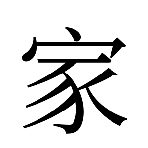 | Noto Serif CJK 本機 render |
| 部首 | 宀部 | 教育部重編國語辭典 |
| 部首外筆畫 | 7 畫 | 教育部重編國語辭典 |
| 總筆畫 | 10 畫 | 教育部重編國語辭典 |
| Unicode | U+5BB6 | 教育部異體字字典 |
| 教部字號 | A01026 | 教育部異體字字典 |
| 粵音 | gaa1（同「加、嘉」） | 中大漢語多功能字庫（黃錫凌 p1、周無邪 p40） |
| 國音 | ㄐㄧㄚ jiā ／ 又音 ㄍㄨ gū | 教育部重編國語辭典 |
| 異體字 | 傢、宊、𠖔、𡧚、𡩅 | 維基詞典 |

---

## 1. 結構層

### 1.1 字形演變

| 甲骨文 | 金文 | 大篆／籀文 | 小篆 | 楷書 |
|:---:|:---:|:---:|:---:|:---:|
| 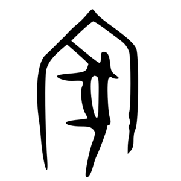 | 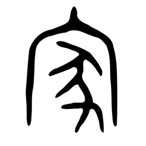 | 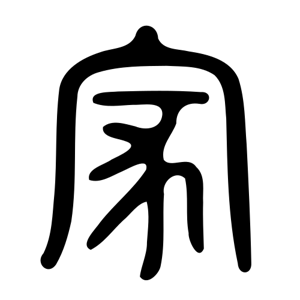 | 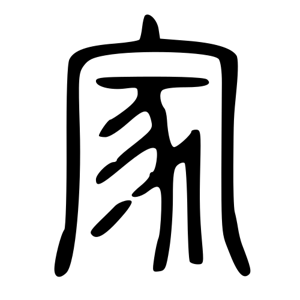 |  |

另附中大漢語多功能字庫嘅甲骨拓本（放大 4 倍）：

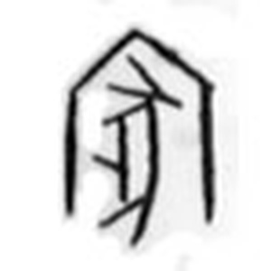

**【觀察】逐期睇到啲咩：**

- **甲骨文**：外圍係一個**尖頂嘅屋形**——一個人字形屋頂，左右兩邊各有一堵牆向下伸。呢個唔係抽象符號，係一間屋嘅側面剖視圖。屋入面（唔係下面，係**包住**）有一隻**豎立嘅動物側影**：頂部一撇係頭／吻，中間一條斜線係背脊，左邊伸出兩條短橫係四肢，右邊一條長彎線落到底，底部再有一撇（尾或後足）。
- **金文**：屋頂變闊、頂端多咗一粒尖突。入面隻動物形態更清楚：頭、身、兩對足、向右下垂嘅尾都分得出。
- **大篆／籀文**：屋頂由「人字形」拉成接近方框，兩堵牆變垂直。入面動物開始線條化，具象感減弱。
- **小篆**：屋頂定型成標準「宀」（頂上一點 + 兩肩下垂）；入面動物定型成標準「豕」小篆寫法。
- **楷書**：宀 + 豕，變成上下結構。

**【觀察】關鍵一點：兩個部件變形速度差好遠。** 「宀」由甲骨到楷書一路都係「罩住上面」，位置關係冇變過，但**由睇得出係屋 → 睇唔出係屋**（楷書只剩一點加一橫鉤）。「豕」相反，位置一路喺入面／下面，但**由一隻認得出嘅豬 → 一堆抽象筆畫**。兩者都失去咗象形性，但係以唔同方式失去。

### 1.2 六書歸類 —— 【分歧】呢度學界未有定論

**【原文】《說文解字·宀部》**：「家，居也。从宀，豭省聲。」
（註：宀部第一個字就係「家」——《說文》編次上「宀」部之首即為「家」。）

三種講法，我全部列出：

| # | 講法 | 主張者 | 內容 | 對「豬」嘅處理 |
|---|---|---|---|---|
| A | **形聲**：从宀、豭省聲 | 許慎《說文》 | 「豭」（公豬）省去「叚」，剩返「豕」做聲符 | 豬＝**聲符**（表音） |
| B | **會意**：豕之居 | 段玉裁《說文解字注》 | 段質疑：從豕之字咁多，點知就係「豭」之省？點解唔直接講「叚聲」？主張本義係**豬嘅居所**，引申假借為人之居；並認為「家」應歸豕部 | 豬＝**形符**（表意），而且係本義主角 |
| C | **形聲**：从宀、豭（初文）聲 | 古文字學界主流（於省吾一系） | 甲骨文有一字象**帶雄性生殖器嘅豬**，即「豭」之初文。「家」下部本作此形，後聲符類化訛變為「豕」。音理相合：家、豭中古同《廣韻》古牙切，上古同擬 \*kˤra | 豬＝**聲符**，但字形本身確係公豬 |

**【原文】中大漢語多功能字庫略說**：「甲金文從『宀』從『豕』，或從『豭』，『豭』是聲符，象公豬之形，意會家居之中圈養牲畜。」

**⚠️ 要提防嘅流行講法**：坊間好興講「屋下養豬就係家」。古文字學界認為呢個係**附會**——「凡言省聲，必有其不省」，冇「不省」字形佐證嘅省聲說難以服人，於是說文學者轉而主張會意，附會之語頗多。中大字庫雖然講「意會家居之中圈養牲畜」（並引苗人住屋上住人下養畜為證），但主流意見係：**「豕／豭」喺呢度主要係表音，唔係表「養豬」呢個意思**。

**我嘅結論**：講法 C 證據最硬（有出土字形 + 音理雙重支持）。但**無論邊個講法，「家」入面嗰個部件都係一隻豬**——分歧只在於佢係表音定表意。

### 1.3 部件分解

| 位置 | 部件 | Unicode | 獨立時係咩字 | 喺「家」入面嘅角色 |
|---|---|---|---|---|
| 上（罩住） | 宀 | U+5B80 | 交覆深屋，即屋頂／房舍 | **形符**（表意）：表示「屋」「居所」 |
| 下（被罩） | 豕 | U+8C55 | **豬** | **聲符**（主流）／形符（段玉裁）——本作「豭」＝公豬 |

**部件字形對照（我睇過嘅圖）：**

| | 甲骨文 | 金文 | 大篆 | 小篆 | 楷書 |
|---|:---:|:---:|:---:|:---:|:---:|
| **宀** | 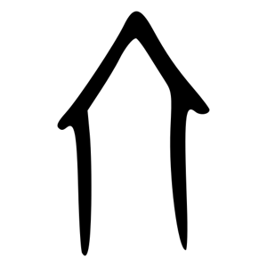 | 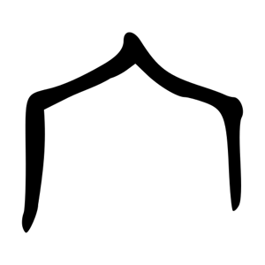 | 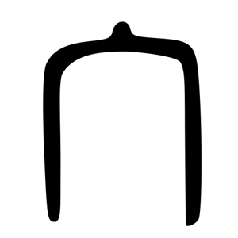 | 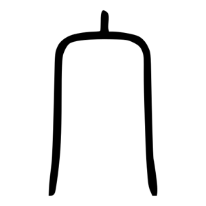 | 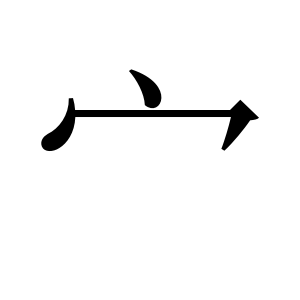 |
| **豕** | 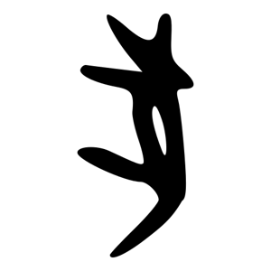 | 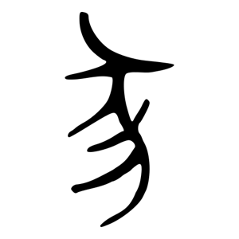 | 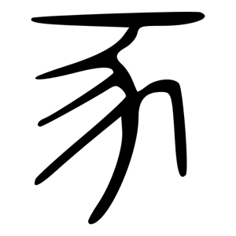 | 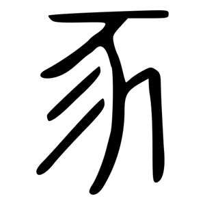 | 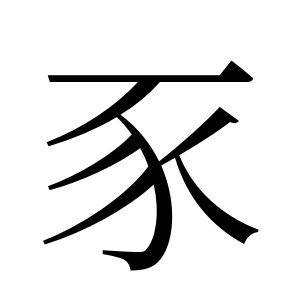 |

**【觀察】視覺比對結果（呢個係「家含有豬」嘅直接證據）：**

1. 「家」甲骨文嘅**外框**，同獨立「宀」甲骨文**完全同形**——都係尖頂 + 兩堵牆。
2. 「家」甲骨文嘅**內部動物**，同獨立「豕」甲骨文**同一套構件**（頭、背脊、四足、垂尾）。分別只係「家」入面嗰隻要塞入屋頂之下，所以擺得斜啲、窄啲。
3. 到小篆同楷書，「家」嘅下半同獨立「豕」**逐筆對應**：一橫（頭）、撇、彎鉤（背脊）、三撇（足）、捺。

即係話——**「家」呢個字，字面上就係「屋入面有隻豬」**。

### 1.4 部件橫向連結：「豕」呢隻豬去咗邊啲字

| 字 | 結構 | 豕嘅角色 | 意思同豬嘅關係 |
|---|---|---|---|
| **豕** | 獨體象形 | 本體 | **豬**（本義） |
| **豬** | 左豕 + 右者（聲） | 形符 | 豬（今通用字） |
| **豭** | 左豕 + 右叚（聲） | 形符 | **公豬**——就係《說文》講「家」省聲嗰個字 |
| **家** | 上宀 + 下豕 | 聲符／形符（有爭議） | 屋 + 豬 |
| **豪** | 上高省 + 下豕 | 形符 | **豪豬**（箭豬）→ 見 [豪.md](豪.md) |
| 豚 | 肉 + 豕 | 形符 | 小豬 |
| 逐 | 辵 + 豕 | 形符 | 追趕（本義：追豬） |
| 冢 | 冖 + 豕(+丶) | — | 墳墓 |

**小篆並排比對：**

| 豕 | 豬 | 豭 | 家（下半） | 豪（下半） |
|:---:|:---:|:---:|:---:|:---:|
|  | 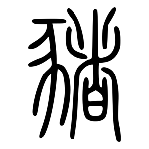 | 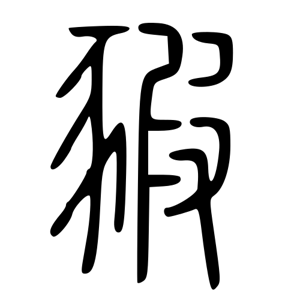 |  | 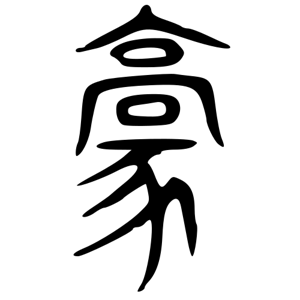 |

**【觀察】** 「豕」做左偏旁（豬、豭）時會**壓窄**，捺變成點，讓位俾右邊；做下部件（家、豪）時**保持完整形態**，捺可以完全伸展。同一個部件，位置唔同寫法唔同——呢個係楷書部件變形嘅通則。

### 1.5 異體字

| 異體 | 結構差異 | 備註 |
|---|---|---|
| **傢** | 亻 + 家 | 加人旁分化。今用於「傢俬／傢伙」，本字仍係「家」 |
| 宊 | 宀 + 犬 | 豕換成犬（豬換成狗） |
| 𠖔 | 冖 + 豕 | 宀簡化為冖 |
| 𡧚 / 𡩅 | 宀 + 豕之變形 | 寫本俗字 |

【觀察】留意「宊」——豬換成狗都仲係「家」。呢個側面支持講法 C：如果「豕」係表意（養豬），換成犬就講唔通；但如果係表音／泛指家畜，就有轉換空間。

---

## 2. 意思層

### 2.1 成隻字查字典

| 字典 | 原文／義項 | 例 |
|---|---|---|
| **《說文解字》** | 【原文】「家，居也。从宀，豭省聲。」 | — |
| **《說文解字注》（段玉裁）** | 本義為**豕之居**，引申假借為人之居 | — |
| **中大漢語多功能字庫** | 本義：居住之所；家庭生活的場所 | — |
| **教育部重編國語辭典**（ID 5502） | 見下方完整義項 | — |

**教育部重編國語辭典 ㄐㄧㄚ jiā：**

| 詞性 | # | 意思 | 例 |
|---|---|---|---|
| 名 | 1 | 眷屬共同生活的處所 | 回家 |
| 名 | 2 | 共同生活的人員 | 一家大細 |
| 名 | 3 | **學術流派** | 儒家、道家 |
| 名 | 4 | 【原文】「經營某種行業或具有某種身分的人」 | 農家、商家、店家 |
| 名 | 5 | **尊稱學有專長者** | 專家、科學家 |
| 名 | 6 | 自稱或稱他人 | — |
| 名 | 7 | 古代大夫統治的政治區域 | — |
| 名 | 8 | 私有財產 | 家產 |
| 名 | 9 | **量詞**：計算家庭、店鋪、企業單位 | 三家公司 |
| 名 | 10 | 姓氏 | — |
| 動 | — | 居住 | — |
| 形 | — | 謙稱親長／家中的／**家中飼養的** | 家父、家禽 |
| 助 | — | 句中助詞，相當於「地」「的」 | — |

**又音 ㄍㄨ gū（名）**：對女子的尊稱（如「班昭曹大家」）。

### 2.2 部件逐個查字典

**宀（U+5B80）**

| 字典 | 內容 |
|---|---|
| 《說文解字》 | 【原文】「宀，交覆深屋也。象形。凡宀之屬皆从宀。」 |
| 《說文解字注》 | 「交覆」＝古屋四面斜坡出水，東西南北相交覆蓋；「深屋」＝有堂有室；字形「象兩下之形，亦象四注之形」 |
| 維基詞典 | 英譯 "roof"；粵音 min4；3 畫；部首 40 |

→ **宀 ＝ 屋頂／房舍**。俗稱「寶蓋頭」。

**豕（U+8C55）**

| 字典 | 內容 |
|---|---|
| 《說文解字》 | 【原文】「豕，彘也。竭其尾，故謂之豕。象毛足而後有尾。」 |
| 教育部重編國語辭典（ID 8750） | **豬**，一種家畜。例：《詩經》「有豕白蹢，烝涉波矣」。214 部首之一 |
| 維基詞典 | 【原文】「小豬，或直接代表豬」；英譯 "boar / swine"；粵音 ci2；7 畫 |
| 中大字庫 | 甲骨文象側視豎立豬形，腹部線條明顯、尾微垂。與「犬」之別：豕尾下垂腹肥，犬尾上蹶腹瘦 |

→ **豕 ＝ 豬**。呢個係本卡最核心嘅一條。

**豭（U+8C6D）**（《說文》所指嘅本聲符）

| 字典 | 內容 |
|---|---|
| 中大字庫（家條） | 【原文】「『豭』是聲符，象公豬之形」 |
| 結構 | 左豕（形符：豬）+ 右叚（聲符） |

→ **豭 ＝ 公豬**。

### 2.3 結構 → 意思推導鏈

```
【字形】 宀（屋）+ 豕／豭（豬／公豬）
   │
   ├─ 講法A/C：豕(豭) 只係借嚟表音 kˤra ──┐
   │                                      ├─→ 【本義】居所、住處
   └─ 講法B（段玉裁）：豕之居（豬嘅窩）──┘      （《說文》「居也」）
                                                    │
                        ┌───────────────────────────┼──────────────────┐
                        ↓                           ↓                  ↓
                【引申1】住喺入面嘅人          【引申2】學術流派      【引申3】量詞
                 家人、一家大細                儒家、道家             三家公司
                        │                           │
                        ↓                           ↓
                【引申4】自家嘅／馴養嘅       【引申5】某方面專門人才
                 家父、家禽、家畜               專家、科學家、文豪
```

**每一步嘅根據：**
- 「宀＝屋」← 《說文》「交覆深屋也」
- 「豕＝豬」← 《說文》「彘也」+ 教育部辭典 + 維基詞典
- 「本義＝居所」← 《說文》「居也」
- 引申 1–5 ← 教育部重編國語辭典義項 1–10
- 「家禽／家畜」呢個「馴養」義 ← 教育部辭典形容詞欄「家中飼養的」。**留意呢個義項同「豕」嘅關係係後起嘅巧合，唔可以反過來用嚟證明本義係「養豬」**

---

## 3. 來源清單

| # | 來源 | URL |
|---|---|---|
| 1 | 中大漢語多功能字庫 · 家 | https://humanum.arts.cuhk.edu.hk/Lexis/lexi-mf/search.php?word=家 |
| 2 | 中大漢語多功能字庫 · 豕 | https://humanum.arts.cuhk.edu.hk/Lexis/lexi-mf/search.php?word=豕 |
| 3 | 教育部重編國語辭典 · 家 | https://dict.revised.moe.edu.tw/dictView.jsp?ID=5502 |
| 4 | 教育部重編國語辭典 · 豕 | https://dict.revised.moe.edu.tw/dictView.jsp?ID=8750 |
| 5 | 教育部異體字字典 · 家 A01026 | https://dict.variants.moe.edu.tw/dictView.jsp?ID=10794 |
| 6 | 維基詞典 · 家 | https://zh.wiktionary.org/wiki/家 |
| 7 | 維基詞典 · 宀 | https://zh.wiktionary.org/wiki/宀 |
| 8 | 說文解字 · 宀（含段注） | https://www.shuowen.org/view/4534 |
| 9 | 字形圖（甲骨／金文／大篆／小篆） | Wikimedia Commons `家-oracle.svg` / `家-bronze.svg` / `家-bigseal.svg` / `家-seal.svg`（同 宀-、豕-） |
| 10 | 甲骨拓本 | 中大字庫 `/Lexis/lexi-mf/oracle/5bb6-1243408809.jpg` |

楷書圖：本機用 Noto Serif CJK SC render（字形為簡化字系統嘅明體，「家」簡繁同形，不影響部件分析）。

---

## 4. 存疑／未驗證

1. **帶生殖器嘅甲骨文「家」我未親眼睇過。** 文獻（於省吾一系）引《合補》1265 為證，話字形明顯見到公豬生殖器。我睇到嘅中大甲骨拓本**冇**呢個特徵。所以講法 C 我係轉述文獻，唔係親眼驗證。要落實需查《甲骨文合集補編》原書。
2. **段玉裁原文我係經二手轉述**（搜尋結果），未直接讀《說文解字注》宀部原文。
3. **徐中舒《甲骨文字典》**對「家」嘅釋形我搵唔到原文，未能引用。
4. 「宊」（宀+犬）呢個異體我喺維基詞典見到列名，但未查到佢嘅使用年代同出處。1.5 節嗰個推論（支持講法 C）係**我自己嘅推理，唔係文獻講法**。
