# 發

> 字卡格式 v2：**結構層**（點砌）→ **意思層**（點解）→ **同音層**（粵音點通）→ **交叉核對**。
> 標記：`【原文】`＝字典／古籍原文照抄 ｜ `【觀察】`＝我親眼睇字形圖得出 ｜ `【分歧】`＝各家講法不一 ｜ `【引申】`＝同音推想，**唔係考據**

---

## 0. 基本資料

| 項目 | 內容 | 來源 |
|---|---|---|
| 楷書 | 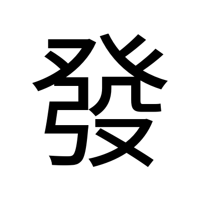 | Noto Sans TC 本機 render |
| 部首 | 癶部（部首編號 105） | 粵語審音配詞字庫／教育部重編國語辭典 |
| 部首外筆畫 | 7 畫 | 教育部重編國語辭典 |
| 總筆畫 | 12 畫 | 粵語審音配詞字庫／教育部重編國語辭典 |
| Unicode | U+767C | 粵語審音配詞字庫／維基詞典 Unihan |
| 大五碼 | B56F | 粵語審音配詞字庫 |
| 倉頡碼 | 弓人弓竹水（NONHE） | 粵語審音配詞字庫／維基詞典 |
| 四角號碼 | 1224.7 | 維基詞典 |
| 部件組合 | ⿱癶𭚧（＝癶 + 弓殳） | 維基詞典 |
| 教部字號 | A02720 | 教育部異體字字典 |
| **粵音** | **faat3／fat3／but3／but6**（字音分類：**異讀破音字**，四個讀音） | 粵語審音配詞字庫（詳見下表） |
| 國音 | ㄈㄚ fā | 教育部重編國語辭典（ID 1532） |
| 中古音 | 方伐切；非母・全清・唇音・**入聲**・山攝・元／月韻・合口・三等 | 《廣韻》p.479（中大字庫） |
| 上古音 | **\*pad**（鄭張尚芳2003）／**\*Cə.pat**（白一平-沙加爾2011，英義 "fly forth"） | 維基詞典轉載 |
| 簡化字 | 发 | 維基詞典 |
| 使用頻率 | **頻序 38／頻次 38502** | 中大字庫 |
| 英文義 | issue, dispatch, send out, emit | 中大字庫 |
| 其他頁碼 | 《漢語大字典》p.2761；《康熙字典》p.0712.100 | 中大字庫 |

> **⚠️ 頻序 38** —— 即全粵語語料庫入面排第 38 位。對比之下：靜 894、偉 976、娜 3669。**「發」係本 project 至今做過最高頻嘅字**，高過「家」同「豪」。

**四個粵讀：**

| 粵音 | 根據 | 同音字 | 詞例／備註（**原文照抄**） |
|---|---|---|---|
| **faat3** | 黃 p.8、周 p.111、何 p.52 | 法、髮、砝、琺 | 【原文】「發生, 發言, 啟發…暴發, 頒發, 發達, 發展, 發酵, 發憤圖強, 發悶, 發凡舉例, 併發, 批發, 百發百中」 |
| **fat3** | 李 p.323 | 沷、砝、琺、法、髮 | 【原文】「『發faat3』的異讀字」 |
| **but3** | 何 p.355 | 缽、砵、鱍、襏、般、**撥** | 【原文】「形容魚躍的聲音」 |
| **but6** | 李 p.323 | **撥**、勃、脖、跋、渤… | 【原文】「『發but3』的異讀字」 |

**配搭點**（中大字庫，共 57 個）：一、打、先、至、抖、批、抒、併、弩、泄、芽、勃、姿、炮、突、借、冢、射、神、訐、起、軔、送、迸、偶、動、啟、愣、揭、散、窗、萌、越、意、楞、煥、頒、蓄、蒸、酵、暴、噱、奮、整、激、駿、爆、難、觸、闡、紺、痧、摃、獃、觱、擿、聵、齎

---

## 1. 結構層

### 1.1 字形演變

| 甲骨文 | 金文 | 大篆／籀文 | 小篆 | 楷書 |
|:---:|:---:|:---:|:---:|:---:|
| 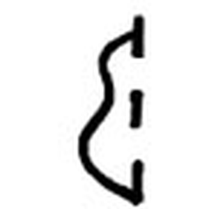 | 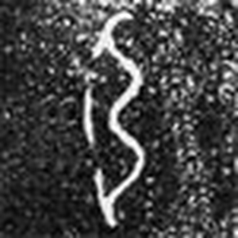 | ✗ 無 | 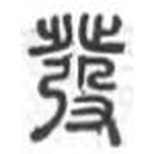 |  |
| 合集 2614 | 彈乍父辛鼎・西周早期 | | 《說文》小篆（康熙圖） | |

**【觀察】「發」有齊甲骨、金文、小篆 —— 而且中大收咗 40 張圖，係本 project 至今最齊嘅一隻。** 對比：娜（0 張）、偉（1 張小篆）、靜（無甲骨）。呢隻字可以**逐階段睇住佢點樣變**，唔使靠推。

#### 甲骨文三個階段（全部中大原拓，我逐張睇過）

| 階段 A・弓 + 斷弦 | 階段 A・另一件 | 階段 B・弓 + 斷弦 + 攴 | 階段 B・另一件 | 階段 B・第三件 | 階段 C・弦已連 + 攴 |
|:---:|:---:|:---:|:---:|:---:|:---:|
|  | 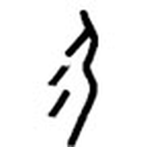 | 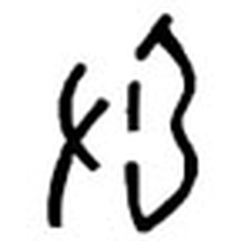 | 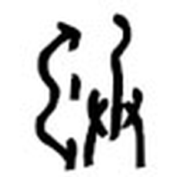 | 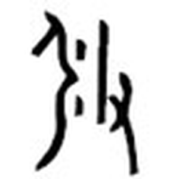 | 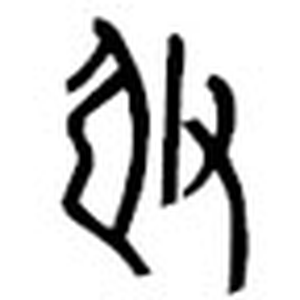 |
| 合集 2614 | 合集 2625 | 合集 2620 | 合集 2622 | 合集 H41429 | 合集 2627B |

**【觀察】呢六張擺埋一齊，睇到一條完整嘅演變線：**

- **階段 A（合集 2614、2625）**：一條彎曲嘅 **S 形線**（＝弓身），旁邊有**三截互相唔連接嘅短畫**。2614 嗰件三截係豎嘅、2625 嗰件三截係斜嘅，但**兩件都係斷開嘅**。**冇任何手、冇任何腳。**
- **階段 B（合集 2620、2622、H41429）**：同樣係弓身 + 斷開嘅短畫，**但多咗一件嘢**——2620 喺左邊、2622 同 H41429 喺右邊，都係一條豎線加一個斜叉／交叉形，即**「攴」（手持棍棒去撥）**。
- **階段 C（合集 2627B）**：弓身 + **一條完整連住嘅長豎**（弦唔再斷開！）+ 右邊嘅「攴」。

**【觀察】最關鍵嘅一張對照 —— 「發」同「弓」點樣分家：**

| 弓（合集 2613・中大原拓） | 弓（Wikimedia 摹寫） | 發・階段 A（合集 2614・中大原拓） | 發・階段 A（Wikimedia 摹寫） |
|:---:|:---:|:---:|:---:|
| 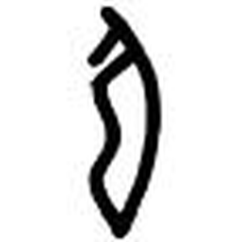 |  |  |  |

**「弓」嗰兩張：弓背 + 一條完整連住嘅弦。**（中大原拓嗰件弦只畫咗上端一小截，Wikimedia 摹寫嗰件由頂到底一條完整線。）
**「發」嗰兩張：一模一樣嘅弓背 + 弦斷成兩三截短畫。**

**即係話：「發」唔係「弓」加咗零件，而係「弓」嘅弦被畫斷。** 呢個係我兩個獨立來源（中大原拓＋Wikimedia 摹寫）四張圖對比得出嘅，**唔係靠文字描述推。** 而中大詳解正好咁講：

> **【原文】** 「甲骨文初形從『弓』，弓弦處以不相連接的小點(◎)表示射箭時，**弓弦被拉撥後不斷顫動的樣子**，本義是發射。」

**一個「畫斷」嘅動作，就由「一件死物（弓）」變成「一個正在發生嘅事件（啱啱射完、弦仲喺度震）」。** 呢個係甲骨文造字法入面好精巧嘅一手。

**【觀察】階段 B → C 解釋咗個「斷弦」點解會消失：** 中大詳解【原文】「由於加『攴』後，不再畫出弓弦顫動之形，發射之意也很明顯，便把顫動的弓弦形簡化為弓。」——**我喺 2627B 親眼見到弦已經連成一條。** 即：**加咗「手」之後，就唔再需要「震」去表達「射」。**

#### 金文兩個階段

| 早期・承甲骨初形 | 後期・已加「癶」 | 後期・另一件 |
|:---:|:---:|:---:|
|  | 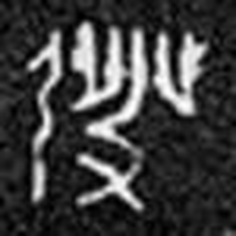 | 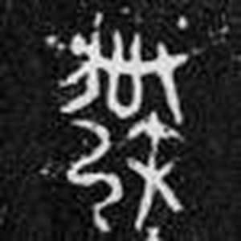 |
| 彈乍父辛鼎・西周早期 | 姑發反劍・春秋晚期 | 純釜・戰國 |

**【觀察】** 
- **西周早期（彈乍父辛鼎）**：拓本白字。我見到一條 S 形彎線（弓身）加旁邊一條較短嘅豎線。**結構好簡單，就係弓 + 弦，冇手冇腳** —— 承甲骨階段 A。
- **春秋晚期（姑發反劍）**：**上面多咗一排向上嘅短豎／分叉，即「癶」（兩隻向外嘅腳）**；左下一條彎線（弓）；右下一個交叉形（殳／攴嘅手）。
- **戰國（純釜）**：同姑發反劍一致——上「癶」、下左「弓」、下右「殳／攴」。

**即係話：「癶」呢個部件，係到咗春秋晚期先加上去。** 中大詳解【原文】「後期金文於『攴』上加『𣥠』旁改造成聲符『癹』，故『發』由表意字變為從『弓』，『癹』聲的形聲字(參裘錫圭)。」——**我親眼見到呢一步。**

**【觀察】小篆：** 上面兩組左右對稱、向外張開嘅腳形（＝癶，兩隻背向嘅止）；下左一個三個彎嘅「弓」；下右一個「殳」（上面一個彎鉤形，下面一隻手）。**三件嘢清清楚楚，同今日楷書一一對應。**

### 1.2 六書歸類 —— 唔係一個分類，係一個「轉換過程」

**【原文】《說文解字·弓部》**：「發，射發也。从弓，癹聲。」〔方伐切〕

**【原文】教育部異體字字典 A02720**：「大徐本：射發也。从弓，癹聲。（方伐切）段注本：射發也。从弓，癹聲。（方伐切）」——**大徐、段注兩本一字不差。**

**【原文】中大漢語多功能字庫略說**：「甲骨文表示弓弦被拉撥後不斷顫動的樣子，本義是發射。」

**呢隻字最特別嘅地方：佢唔係「一開始就係形聲」或者「一開始就係會意」，而係有紀錄咁由一種變成另一種。**

| 階段 | 字形 | 六書 | 點解 |
|---|---|---|---|
| 甲骨 A | 弓 + 斷開嘅弦 | **指事／象事**（廣義嘅表意） | 用「弦斷開」呢個抽象標記去表示「震動」，唔係畫一件實物 |
| 甲骨 B | 弓 + 斷弦 + 攴 | **會意** | 加咗「手持棍撥」，兩件嘢合起嚟表意 |
| 甲骨 C | 弓 + 弦 + 攴 | **會意** | 斷弦冇咗，剩返「用手撥弓」 |
| 金文早期 | 弓 + 弦 | 承甲骨初形 | |
| 金文後期～今 | 癶 + 弓 + 殳（＝弓 + 癹） | **形聲** | 「攴」上加「𣥠」→ 變成聲符「癹」 |

**【分歧】—— 但呢個分歧係「時代唔同」，唔係「學者打架」：**

- **《說文》（許慎）**：形聲，从弓，癹聲。**許慎只見到小篆，佢講嘅係最後階段，冇錯。**
- **裘錫圭／中大字庫**：本來係表意字，後期金文先變成形聲字。**佢哋見到甲骨金文，講嘅係全程。**

**兩家唔係對立，係睇唔同時間切片。** 我兩邊都列，唔揀一個當定論。但要指出：**《說文》嘅「癹聲」喺甲骨階段係唔成立嘅**，因為嗰陣根本冇「癹」。

> 對比：「靜」有四家打到飛起（見 [靜.md](靜.md) 1.2），「偉」三家一致（見 [偉.md](偉.md) 1.2）。「發」係第三種情況——**冇人打架，但答案會隨住你問邊個年代而改變。**

### 1.3 部件分解 —— 兩套拆法【分歧】

**同一隻字，《說文》同教育部官方寫法規範拆得唔同：**

| | 《說文》拆法 | 教育部楷書寫法拆法 |
|---|---|---|
| 拆成 | **弓**（形符）+ **癹**（聲符） | **癶**（上）+ **弓**（下左）+ **殳**（下右） |
| 幾多件 | 2 件 | 3 件 |
| 「弓」喺邊 | 獨立嘅形符 | 夾喺「癶」同「殳」中間 |

**【原文】教育部異體字字典 A02720 寫法說明**：

> 楷書寫法：上「癶」之捺上兩短撇輕觸，不穿捺筆；下左作「弓」，右作「殳」，次筆不鉤，末捺改頓。寫法參「癹」（B02815）字。「廢」、「撥」、「潑」等字偏旁同此。

**【觀察】點解會有兩套 —— 我睇小篆圖之後明白咗：** 小篆圖入面，「癶」喺最上、「弓」喺左下、「殳」喺右下，**三件嘢視覺上係平排嘅**。但按造字邏輯，「癶」同「殳」先係一組（＝癹，聲符），「弓」係另一組（形符）。**「弓」插咗入「癹」中間，所以肉眼睇落好似三件平排，實際上係「弓」被「癹」包住。**

**呢個係典型嘅「視覺結構 ≠ 造字結構」。** 教育部規範講緊點寫，《說文》講緊點解，兩者都啱，但唔可以混。

| 位置 | 部件 | Unicode | 獨立時係咩字 | 喺「發」入面嘅角色 |
|---|---|---|---|---|
| 上 | 癶 | U+7676 | 兩隻背向嘅腳（《說文》作「𣥠」） | 聲符「癹」嘅上半 |
| 下左 | 弓 | U+5F13 | **弓** | **形符**（表意）：同射箭有關 |
| 下右 | 殳 | U+6BB3 | 古兵器；手持捶擊工具 | 聲符「癹」嘅下半 |
| （合） | 癹 | U+7679 | 以足蹋夷艸（除草） | **聲符**（表音）\*pʰaːd／\*baːd |

**部件字形對照（下面每張圖我都親眼睇過）：**

| | 甲骨文 | 金文 | 小篆 | 楷書 |
|---|:---:|:---:|:---:|:---:|
| **弓** |  |  |  | 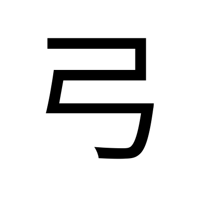 |
| **癶** | ✗ 無獨立字例 | ✗ 無獨立字例 | 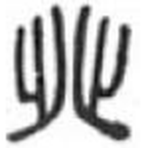 | 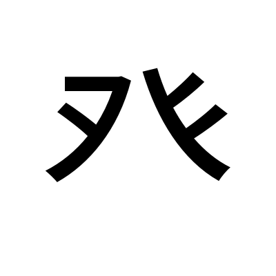 |
| **殳** |  |  |  | 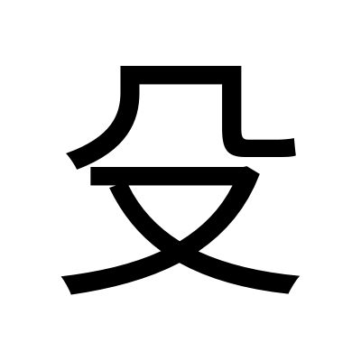 |
| **攴**（甲骨階段用） |  | 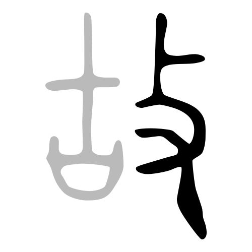 |  | 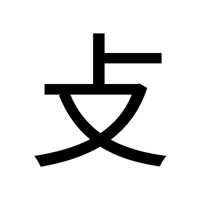 |

弓：甲骨＝合集 2613（中大原拓）；金文＝虢季子白盤・西周晚期（中大原拓）；小篆＝Wikimedia。
癶：小篆＝康熙圖（中大）。殳：甲骨＝Wikimedia 摹寫；金文＝十五年曹鼎・西周中期（中大原拓）；小篆＝Wikimedia。

**【觀察】「癶」小篆：** 左右兩個**對稱嘅腳形**，每邊一條主豎 + 一條向上嘅分支 + 底部向外拖出嘅腳掌，**兩隻腳嘅腳趾方向啱啱相反**（左邊向左、右邊向右）。同【原文】《說文》「足剌𣥠也。从止、𣥂」對得上（「𣥂」就係倒轉嘅「止」）。

**【觀察】「殳」：** Wikimedia 摹寫嗰張最清楚——上面一個**橢圓／環形**（工具嘅頭），下面一條長柄向下，柄嘅右下有一隻**三指嘅手**握住。即「手持一件頭部有份量嘅捶擊工具」。中大原拓（合集 22196）嗰件我睇到上面一個圓圈同下面一隻手，**但拓本糊，細節睇唔清**，所以我用咗摹寫版入表（見第 6 節）。

| 殳・甲骨（中大原拓・合集 22196） | 殳・甲骨（Wikimedia 摹寫） |
|:---:|:---:|
| 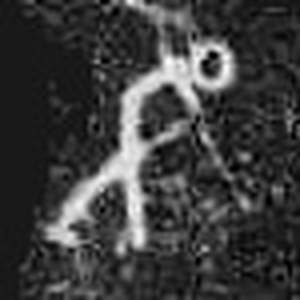 |  |

**【觀察】兩張擺埋一齊嘅理由：** 原拓嗰件我睇到上面一個圓圈、下面疑似一隻手，**但拓本糊到睇唔清柄同手指**；摹寫嗰件三樣嘢（環形頭、長柄、三指手）一目了然。**擺埋一齊就見到摹寫本「補」咗幾多** —— 呢個亦係本 project 一路堅持分開標「原拓」同「摹寫」嘅原因。

**【觀察】「攴」同「殳」點分：** 兩個都係「手持工具」，分別喺**工具嘅頭**——「攴」拎嘅係一條**直嘅短棍**（甲骨圖入面上面一條斜短畫），「殳」拎嘅係**頭部有個環／團嘅嘢**。呢個分別喺「發」度有實際意義：**甲骨階段用「攴」（撥弦嘅動作），到金文改成「殳」（作為聲符「癹」嘅一部分）。**

### 1.4 部件橫向連結：「癹」族同「弓」族

**【原文】維基詞典「發」條衍生字**（17 字）：

> 㗶、墢（𫭨）、**撥**（𫝼／拨）、**潑**（溌／泼）、橃（𭩰）、襏（袯）、䚨、蹳（𫏆）、醱（醗／酦）、鏺（䥽）、驋（𩧯）、鱍、㔇、**廢**（廃／废）、蕟（𬜧）、癈（㾱）、𥳊

**留意：呢啲字全部係从「發」得聲，唔係从「癹」。** 即「發」自己已經升級做聲符。

**【原文】鄭張尚芳(2003)「癹」系同聲符字全表** —— **只有兩個字：**

> 發 \*pad ｜ 癹 \*pʰaːd, \*baːd

**呢個表短到得兩個字，係我做過五隻字入面最短嘅。** 對比：「靜」嘅青系 50+ 字、「娜」嘅冉系 15 字、「偉」嘅韋系 31 字。**原因好簡單：「癹」本身太冷僻，佢一造出嚟就畀「發」搶咗晒位。**

揀重點嘅列表：

| 字 | 結構 | 《說文》 | 上古音 | 粵音 | 同「發」嘅關係 |
|---|---|---|---|---|---|
| **癹** 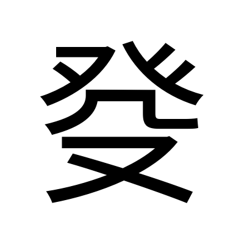 | 𣥠 + 殳 | 【原文】「以足蹋夷艸。从𣥠从殳。《春秋傳》曰：癹夷蘊崇之。」〔普活切〕 | \*pʰaːd, \*baːd | bat6 | **「發」嘅聲符本身**；何琳儀認為佢係「撥」嘅初文 |
| **癶**  | 止 + 𣥂 | 【原文】「足剌𣥠也。从止、𣥂。凡𣥠之屬皆从𣥠。**讀若撥**。」〔北末切〕 | — | but6 | 聲符上半；**《說文》明講「讀若撥」** |
| **撥** 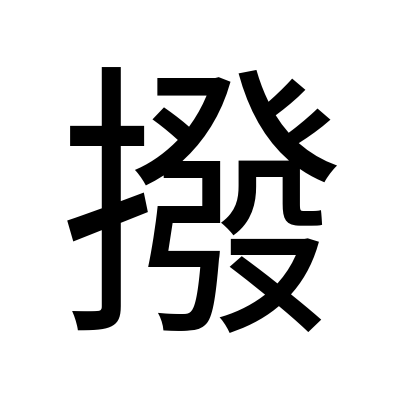 | 手 + **發**聲 | 【原文】「治也。从手，發聲。」〔北末切〕 | — | but3／but6 | **同「發」嘅 but3／but6 讀音完全同音**（見 4.3） |
| **廢** | 广 + **發**聲 | 【原文】「屋頓也。从广，發聲。」〔方肺切〕 | — | fai3 | 停止、捨棄 |
| **潑** | 水 + **發**聲 | 《說文》未收 | — | put3 | 潑水 |
| **醱** | 酉 + **發**聲 | 《說文》未收 | — | put3 | 醱酵（今多寫「發酵」） |
| **弓**  | 象形 | 【原文】「以近窮遠。象形。古者揮作弓。」〔居戎切〕 | \*kʷɯŋ（鄭張）／\*kʷəŋ（白沙） | gung1 | **「發」嘅形符** |
| **殳**  | 又 + 工具 | 【原文】「以杸殊人也……从又，𠘧聲。」〔市朱切〕 | \*djo（鄭張）／\*do（白沙） | syu4 | 聲符下半 |
| **法** 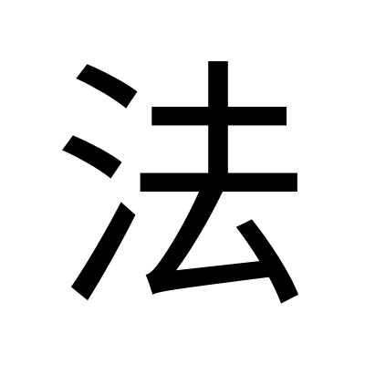 | 水 + 廌 + 去 | — | **\*p.kap**（白沙，**收 -p**） | faat3 | **同「發」faat3 同音，但上古韻尾唔同**（見 4.3） |
| **髮** 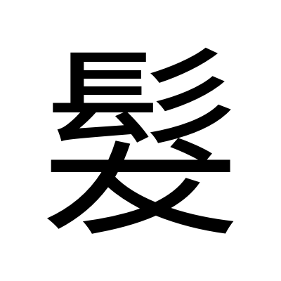 | 髟 + **犮**聲 | — | \*pod（鄭張）／\*pot（白沙） | faat3 | **同上，唔同聲符系列** |

**小篆並排比對（我睇過嘅圖）：**

| 發 | 癶 | 弓 | 殳 | 攴 |
|:---:|:---:|:---:|:---:|:---:|
|  |  |  |  |  |

**【觀察】小篆並排執到三件事：**

1. **「發」上半同獨立「癶」逐筆同形** —— 兩隻對稱、腳趾朝外嘅腳，冇省冇改。
2. **「發」下左嗰個「弓」，同獨立「弓」小篆一樣**（三個彎嘅豎曲線），但**壓窄咗**——因為要同右邊嘅「殳」companion 擠喺同一層。
3. **「發」下右同獨立「殳」同形** —— 上面一個彎鉤（工具頭），下面一隻手。

**即係話：「發」小篆係三個完整部件砌埋，冇一個被省略。**

### 1.5 異體字

| 異體 | 結構 | 備註 |
|---|---|---|
| **发** | 草書楷化 | **中國大陸簡化字。留意：「发」同時係「發」同「髮」兩隻字嘅簡化字**（faat3 同音字合併），見 4.3 |
| **彂** | 癶 + 弓 + 彡？ | 維基詞典所列 |
| **𤼲／𤼵／𤼦／𭛁／𭣺／𢽔／𥳊** | 各種變體 | 維基詞典所列；我未取得字形，亦未查到出處 |
| （另有 4 個） | — | 維基詞典仲列咗 4 個擴展 G／H 區嘅異體，**本 project 三隻字型都畫唔出**（見第 6 節） |

**教育部異體字字典 A02720**：正文 1 字、附收字 3 字。我逐一查過，**三個附收字嘅 Unicode 全部都係 U+767C，即「發」本身**，分別收喺「**台**」（臺灣閩南語）、「**客**」（客語）、「**姓**」（姓氏）三個附錄。**同「靜」「娜」兩張卡嘅情況一模一樣** —— 睇嚟呢個係教育部異體字字典嘅通例，唔係個別現象。

### 1.6 部件總表（拆到獨體象形為止）

| 層級 | 部件 | 獨立時係咩字 | 一句字典義 | 粵音 | 出處 |
|---|---|---|---|---|---|
| 一級 | **弓** | 弓 | 【原文】「以近窮遠。象形。古者揮作弓。」 | gung1 | 《說文·弓部》 |
| 一級 | **癹** | 癹 | 【原文】「以足蹋夷艸。从𣥠从殳。」 | bat6 | 《說文·𣥠部》 |
| 二級 | **癶（𣥠）** | 癶 | 【原文】「足剌𣥠也。从止、𣥂。讀若撥。」 | but6 | 《說文·𣥠部》 |
| 二級 | **殳** | 殳 | 【原文】「以杸殊人也……从又，𠘧聲。」 | syu4 | 《說文·殳部》 |
| 三級 | **止** | 止 | 腳／足印（同「趾」） | zi2 | 《說文·止部》 |
| 三級 | **𣥂** | 𣥂 | **倒轉嘅「止」**（腳趾朝相反方向） | — | 《說文·𣥠部》 |
| 三級 | **又** | 又 | 【原文】「手也。象形。」 | jau6 | 《說文·又部》 |
| ※甲骨階段 | **攴** | 攴 | 手持棍棒敲擊 | pok3 | 中大字庫 |

**三個獨體象形終點**：**弓**（上咗弦嘅弓）、**止**（腳板，「𣥂」係佢倒轉）、**又**（右手）。**三個我全部親眼睇過字形圖。**

| 弓・甲骨（中大原拓） | 止・甲骨（Wikimedia 摹寫） | 又・甲骨（Wikimedia 摹寫） |
|:---:|:---:|:---:|
|  |  |  |

**【觀察】「止」嘅甲骨文**：一條主豎（腳掌同小腿），上端分出兩三條短枝（腳趾），趾頭**全部朝同一個方向**。「癶」就係將兩隻咁嘅腳擺埋一齊、**趾頭朝相反方向**（我喺 1.3 嘅癶小篆圖見到）。「又」則係一條斜杆分出三指，即一隻右手。

**⚠️ 呢隻字有一個好特別嘅地方：拆到底，三個終點係「弓、腳、手」——即「一件武器 + 一對腳 + 一隻手」。** 但要企硬：**「腳」同「手」嗰邊（癹）喺今日嘅「發」入面係純聲符，唔表意。** 唯一表意嘅係「弓」。詳見 2.3 嘅警告。

---

## 2. 意思層

### 2.1 成隻字查字典

| 字典 | 原文／義項 |
|---|---|
| **《說文解字·弓部》** | 【原文】「發，射發也。从弓，癹聲。」〔方伐切〕 |
| **《廣韻》p.479** | 【原文】「發起，又舒也，明也，舉也，闋也，揚也。《說文》曰：䠶發也。」〔方伐切〕 |
| **中大漢語多功能字庫** | 本義：發射 |
| **教育部異體字字典**（A02720） | 12 個義項，見下 |
| **教育部重編國語辭典**（ID 1532） | 8 動詞義 + 量詞義，見下 |

**【原文】教育部異體字字典 A02720 釋義（12 項，原文照抄・節錄書證）：**

> 1. **放射**。如：「百發百中」。《說文解字．弓部》：「發，射發也。」唐．李賀〈日出行〉：「白日下崑崙，發光如舒絲。」《鏡花緣》第二六回：「弓弦響處，那彈子如雨點一般打將出去，真是彈無虛發，每發一彈，岸上即倒一人。」
> 2. **起程、離去**。《詩經．齊風．東方之日》：「在我闥兮，履我發兮。」宋．柳永〈雨霖鈴〉詞：「留戀處，蘭舟催發。」
> 3. **送出、付出**。如：「發送」。《史記．卷八一．廉頗藺相如列傳》：「大王欲得璧，使人發書至趙王。」
> 4. **卸下、解開**。《史記．卷五三．蕭相國世家》：「夫獵，追殺獸兔者狗也，而發蹤指示獸處者人也。」
> 5. **生長、產生**。《詩經．大雅．生民》：「實發實秀，實堅實好。」唐．王維〈相思〉詩：「紅豆生南國，秋來發故枝。」
> 6. **開始、啟動**。《漢書．陳勝項籍傳》：「先發制人，後發制於人。」
> 7. **興起、舉事**。《孟子．告子下》：「舜發於畎畝之中。」
> 8. **啟發、闡明**。《論語．述而》：「不憤不啟，不悱不發。」
> 9. **顯露、揭露**。《禮記．中庸》：「喜怒哀樂之未發，謂之中。」
> 10. **公布、散布**。如：散發。《書．冏命》：「發號施令，罔有不臧。」
> 11. **擴大、張揚**。如：發展、發育。《楚辭．大招》：「春氣奮發，萬物遽只。」
> 12. **量詞**：計算箭或槍、炮中子彈之數量單位。《漢書．匈奴傳下》：「弓一張，矢四發。」

**【原文】教育部重編國語辭典 ㄈㄚ（癶部+7畫 共12畫・常用字）節錄：**

| 詞性 | # | 意思 | 書證 |
|---|---|---|---|
| 動 | 1 | **放射** | 如「彈無虛發」、「百發百中」 |
| 動 | 2 | 生長、產生 | 如「發芽」。唐．王維〈相思〉「紅豆生南國，秋來發故枝」 |
| 動 | 3 | 開始、啟動 | 如「發動」、「先發制人」、「一觸即發」 |
| 動 | 4 | 興起 | 如「發跡」。《孟子．告子下》「舜發於畎畝之中」 |
| 動 | 5 | 起程 | 如「出發」。宋．柳永〈雨霖鈴〉「留戀處，蘭舟催發」 |
| 動 | 6 | 啟發 | 如「振聾發聵」。《論語．述而》「不憤不啟，不悱不發」 |
| 動 | 7 | 現露 | 《禮記．中庸》「喜怒哀樂之未發，謂之中」 |
| 動 | 8 | 送出、付出 | 如「發放」、「發錢」、「散發傳單」 |
| 名 | — | 量詞（子彈、炮彈） | 如「手槍裡還剩下四發子彈」 |

**【觀察・義項排列】12 個義項擺埋一齊，可以見到一個清楚嘅擴散方向：**

> **射（實物離弦）→ 起程（人離開）→ 送出（物離手）→ 生長（芽離枝）→ 開始（事離靜）→ 顯露（情離內）→ 散布（消息離源）**

**每一個引申義，都保留住「由一點離開、向外去」呢個核心。** 呢個唔係我作，係 12 個義項本身嘅排列講出嚟。而白一平-沙加爾對「發」嘅英義譯法【原文】「**fly forth**」（飛出去），同呢條線完全一致。

### 2.2 部件逐個查字典

**弓（U+5F13）**

| 字典 | 內容 |
|---|---|
| 《說文·弓部》 | 【原文】「弓，以近窮遠。象形。古者揮作弓。《周禮》：六弓：王弓、弧弓，以射甲革甚質；夾弓、庾弓，以射干侯鳥獸；唐弓、大弓，以授學射者。凡弓之屬皆从弓。」〔居戎切〕 |
| 中大字庫略說 | 【原文】「古文字『弓』象上了弦的弓，為射箭之器。」 |
| 教育部重編國語辭典（ID 4382） | 【原文】[名] 武器名。由彎成弧形的木條繫上絲繩製成用以發射箭矢或彈丸的器具；量詞（六尺為一弓）；姓；二一四部首之一。[動] 彎曲（如「弓腰」、「弓著背」） |

→ **弓 ＝ 上咗弦嘅弓。** 留意《說文》嘅訓解【原文】「**以近窮遠**」——用近處嘅力去窮盡遠處，呢句本身就已經係「發」嘅意思。

**癹（U+7679）**

| 字典 | 內容 |
|---|---|
| 《說文·𣥠部》 | 【原文】「癹，以足蹋夷艸。从𣥠从殳。《春秋傳》曰：癹夷蘊崇之。」〔普活切〕 |
| 段玉裁注 | 【原文】「从癶，謂以足蹋夷也。从殳，殺之省也。」（中大轉引） |
| 中大字庫略說 | 【原文】「甲骨文從『攴』從『𣥠』，『𣥠』亦是聲符，『攴』象手持棍棒，全字表示用腳踐踏野草和用棍子除草。本義是打草、割草。」 |
| 中大字庫詳解 | 【原文】「『𣥠』從二背向的二『止』，象兩隻伸開的腳掌……**何琳儀認為是『撥』的初文**。……『癹』字用來表示除草，見於戰國晚期青川秦田律木牘：『正彊（疆）畔，及癹千（阡）百（陌）之大草。』」 |

→ **癹 ＝ 用腳踩 + 用棍打，去除草。** 何琳儀認為佢係「**撥**」嘅初文——**呢點喺 4.3 好重要。**

**癶（U+7676，《說文》作「𣥠」）**

| 字典 | 內容 |
|---|---|
| 《說文·𣥠部》 | 【原文】「𣥠，足剌𣥠也。从止、𣥂。凡𣥠之屬皆从𣥠。**讀若撥**。」〔北末切〕 |
| 中大字庫詳解（「癹」條引） | 【原文】「『𣥠』從二背向的二『止』，象兩隻伸開的腳掌」 |
| 教育部重編國語辭典 | 未收 |

→ **癶 ＝ 兩隻腳掌，腳趾朝相反方向（即兩腳外八字張開）。** **《說文》明講「讀若撥」** —— 見 4.3。

**殳（U+6BB3）**

| 字典 | 內容 |
|---|---|
| 《說文·殳部》 | 【原文】「殳，以杸殊人也。《禮》：殳以積竹，八觚，長丈二尺，建於兵車，車旅賁以先驅。从又，𠘧聲。凡殳之屬皆从殳。」〔市朱切〕 |
| 中大字庫略說 | 【原文】「甲金文『殳』會手持捶擊工具之意，本義是一種古兵器，以竹或木製成，頂端有棱。」 |
| 教育部重編國語辭典（ID 9067） | 【原文】[名] 兵器名。古代一種用竹、木做成的兵器，長一丈二尺，有稜無刃。《詩經．衛風．伯兮》：「伯也執殳，為王前驅。」；姓；二一四部首之一 |

→ **殳 ＝ 手持一件長柄捶擊兵器。**

### 2.3 結構 → 意思推導鏈

```
【甲骨階段 A】弓 + 弦畫成斷開（表「顫動」）
        │
        └─【本義】發射 ──《說文》「射發也」
                  │
【甲骨階段 B】加「攴」（手持棍撥弦）→ 撥動之意更明白
        │
【甲骨階段 C】弦唔再畫斷 → 剩返「弓 + 手」
        │
【金文後期】「攴」上加「癶」→ 合成「癹」→ 由表意字變形聲字
        │         （裘錫圭／中大字庫）
        ↓
【今日結構】弓（形符・射箭）+ 癹（聲符・只表音）
        │
        └─【本義】放射（弓一張，矢四發）
              │
   ┌──────────┼──────────┬──────────┐
   ↓          ↓          ↓          ↓
【引申1】起程   【引申2】送出  【引申3】生長  【引申4】開始
  蘭舟催發      發書至趙王     秋來發故枝    先發制人
   │
   ├─【引申5】興起（舜發於畎畝之中）
   ├─【引申6】啟發（不憤不啟，不悱不發）
   ├─【引申7】顯露（喜怒哀樂之未發）
   ├─【引申8】散布（發號施令）
   └─【引申9】擴大（發展、發育）
        │
        └─【量詞】計算子彈／箭（弓一張，矢四發）—— 返返去本義
```

**每一步嘅根據：**
- 甲骨三階段 ← 中大字庫詳解 + **我親眼睇六張原拓**（1.1）
- 「表意 → 形聲」轉換 ← 裘錫圭（中大轉引）+ **我親眼睇金文兩階段**（1.1）
- 「弓＝形符、癹＝聲符」← 《說文》「从弓，癹聲」，大徐段注一致
- 引申 1–9 ← 教育部異體字字典 12 項 + 重編國語辭典 8 項

**⚠️ 要提防嘅推論：**

**唔可以**講「發 ＝ 弓 + 癹（用腳踩、用棍打）＝ 又射箭又踩又打 ＝ 全力爆發」。

呢個講法之所以吸引，係因為「癹」嘅本義（用腳踩草、用棍打草）**好有力度**，同「發」嘅「爆發」感覺好夾。但係：

1. **「癹」喺「發」入面係純聲符**（《說文》大徐、段注兩本都係「癹聲」，冇一本講「亦聲」）。
2. **更加關鍵：喺甲骨同早期金文，「癹」根本唔存在。** 「發」本來淨係「弓 + 斷弦」。**「癹」係春秋晚期先貼上去嘅音標。** 用一個後加嘅音標去解釋一個更早就有嘅意思，係倒轉咗時序。
3. 唯一真正表意嘅部件係「**弓**」。

**但呢條聯想喺同音層有另一條路可以撐**（見 3.3 同 4.3 第 2 點）—— **「唔係考據」唔等於「冇得用」，但要標清楚係邊一級。**

---

## 3. 同音層（粵音 —— 四個讀音）

「發」係**異讀破音字**，有 faat3、fat3、but3、but6 四個讀音。

### 3.1 同音同調字表

**關係類別**四選一：同源（同聲符）｜通假／聲訓（文獻有記）｜民俗諧音（有出處）｜純諧音（淨係讀音撞）

#### faat3 組（5 個）—— **【原文】粵語審音配詞字庫**：發、法、髮、砝、琺

| 同音字 | 字典義（一句） | 聲符 | 上古音 | 關係類別 | 來源 |
|---|---|---|---|---|---|
| **法** | 律令；制度；範式；途徑；佛道之理；方術；仿效 | 廌／去（會意） | **\*p.kap**（白沙2011，**收 -p**）；中古 pjop、**乏韻・咸攝** | **純諧音**（上古同中古嘅韻尾都同「發」唔同，見 4.3） | 教育部 ID 1542 |
| **髮** | 人類頭上的毛；比喻山上草木；姓 | **犮** | \*pod（鄭張）／\*pot（白沙） | **純諧音**（犮系，唔係癹系；但兩系字形同音都近，見 4.2） | 教育部 ID 1545 |
| **砝** | 砝碼 | **法** | — | **純諧音**（法系） | 教育部 ID 1543 |
| **琺** | 琺瑯 | **法** | — | **純諧音**（法系） | 教育部 ID 1546 |

> **faat3 呢組最值得記嘅一點：五隻字入面，冇一隻同「發」同源。** 「法／砝／琺」係法系、「髮」係犮系、「發」係癹系。**三個唔同嘅諧聲系列，喺今日粵語撞埋一齊。**

#### fat3 組（6 個）—— **【原文】**：砝、琺、沷、法、髮、發

同 faat3 組基本一樣（多咗一個「沷」），因為 fat3 係 faat3 嘅異讀。關係類別同上。

#### but3 組（7 個）—— **【原文】**：缽、鱍、襏、砵、般、**撥**、發

| 同音字 | 字典義（一句） | 聲符 | 《說文》 | 關係類別 | 來源 |
|---|---|---|---|---|---|
| **撥** | 橫向推開；用手轉動／挑動／拉動（撥弦）；扭轉（撥亂反正） | **發** | 【原文】「治也。从手，發聲。」〔北末切〕 | **同源（反向）** —— 唔係「發」同佢共用聲符，係**佢以「發」為聲符**（見 4.3） | 中大字庫／教育部 ID 41 |
| **鱍** | 魚躍貌（辭典未收） | **發** | — | **同源（反向）** | 粵語審音配詞字庫 |
| **襏** | 蓑衣（辭典未收） | **發** | — | **同源（反向）** | 粵語審音配詞字庫 |
| **缽／砵** | 出家人盛飯食的器具（梵語 pātra 音譯省稱） | 本／末 | — | **純諧音**（而且係**外來語音譯字**） | 教育部 ID 50 |
| **般** | 種類；搬移；姓 | 舟 + 殳 | — | **純諧音**（但留意佢都有「殳」，見第 6 節） | 教育部 ID 52 等 |

#### but6 組（26 個）—— **【原文】**：撥、勃、脖、跋、渤、荸、餑、葧、鵓、孛、鈸、哱、浡、桲、鋍、馞、襏、蹳、鱍、艴、悖、茀、挬、柭、郣、發

| 分組 | 字 | 聲符 | 關係類別 |
|---|---|---|---|
| **發系** | **撥**、蹳、鱍、襏 | **發** | **同源（反向）** |
| **孛系** | 勃、脖、渤、餑、葧、鵓、孛、哱、浡、桲、鋍、馞、悖、郣 | 孛 | **純諧音** |
| **犮系** | 跋、鈸、柭、茀、挬 | 犮／弗 | **純諧音**（但犮系同癹系形音俱近，見 4.2） |
| **其他** | 荸、艴 | — | **純諧音** |

**四組加埋（去重）約 33 個同音字：真正同源（發系）4 個，其餘全部係純諧音。**

**但「同源」呢 4 個係最特別嗰種**——佢哋唔係「同『發』共用一個上游聲符」，而係「**以『發』本身做聲符**」。呢個方向係反嘅，見 4.3。

### 3.2 同音異調字（只列名，唔引申）

**faat 系：**
- **faat1**：**有音無字**（粵語審音配詞字庫原文）
- **faat3**：發、法、髮、砝、琺
- **faat6**：**有音無字**（同上）

**but 系：**
- **but3**：缽、鱍、襏、砵、般、撥、發
- **but6**：撥、勃、脖、跋、渤、荸、餑、葧、鵓、孛、鈸、哱、浡、桲、鋍、馞、襏、蹳、鱍、艴、悖、茀、挬、柭、郣、發

> ⚠️ 留意三點：
> 1. **faat1 同 faat6 兩個聲調完全冇字** —— 即 faat 呢個音節喺粵語入面窄到得一個聲調（faat3）。所以「發」讀 faat3 嗰陣，同音字必然好少。
> 2. **but6 有 26 個字，but3 只有 7 個** —— 「發」讀 but3／but6 嗰陣，反而跌入一個好熱鬧嘅音節。
> 3. **「撥」同時出現喺 but3 同 but6** —— 同「發」一樣係兩個調都讀得。**兩隻字喺兩個聲調度都對得上**，呢個係 4.3 嘅關鍵。

### 3.3 引申

> 以下全部係【引申】＝同音推想，**唔係考據**。攞去用之前請睇清楚類別。

**由 but3／but6 組（同源・反向）出發 —— 最實：**

- 【引申】發 ↔ **撥**（橫向推開、用手轉動、撥弦、撥亂反正）。→ 可引申為：**發＝撥動、令原本靜止嘅嘢郁返**。**呢條唔止係諧音** —— 《說文》「撥，治也。从手，**發聲**」，而《說文》講「癶」又話「**讀若撥**」，何琳儀仲認為「癹」就係「撥」嘅初文。**三重關係**，見 4.3。而且中大解釋「發」嘅本義嗰陣，用嘅正正就係「弓弦被拉**撥**」呢五個字。
- 【引申】發 ↔ **鱍**（魚躍貌）。→ 可引申為：**發＝魚一彈跳出水面**。留意粵語審音配詞字庫將「發but3」嘅釋義直接寫成【原文】「**形容魚躍的聲音**」——**即係話「發」呢個讀音本身就係用嚟形容魚彈起。** 同「弓弦彈起」嘅意象係同一種動作。
- 【引申】發 ↔ **勃**（勃發、勃然）。→ 可引申為：**發＝突然湧起**。純諧音（孛系），但「勃發」呢個詞本身就將兩隻字並埋。

**由 faat3 組（純諧音）出發 —— 最鬆，但社會意義最大：**

- 【引申】發 ↔ **法**（律令、方法）。→ 可引申為：**發＝有法度地放出**。**純諧音**，上古中古嘅韻尾都唔同（見 4.3）。
- 【引申】發 ↔ **髮**（頭髮）。→ 可引申為：**發＝毛髮生長**。留意：**「發」同「髮」喺簡化字入面合併成一個「发」**，所以今日大陸寫「理发」「发展」同一個字。**呢個合併本身就係一個歷史事件**（見 4.2）。
- 【引申】發 ↔ **砝**（砝碼）、**琺**（琺瑯）。→ 兩個都係後起嘅專門用字，純諧音，最鬆。

**由部件出發（唔係同音，係結構）—— 標清楚級別：**

- 【引申】「發」拆到底係「**弓 + 兩隻腳 + 一隻手**」。→ 可引申為：**全身（手、腳）加上武器，一齊出力**。
  **呢個唔係考據**（見 2.3：「癹」係後加嘅純聲符，甲骨階段根本冇腳冇手）。
  **可以點用**：當成一個**字形上嘅畫面**，唔好當成造字意圖。

---

## 4. 交叉核對

### 4.1 結構 ↔ 意思：推導鏈有冇斷？

**冇斷，而且係五隻字入面接得最實嗰隻。**

- **「弓」→ 意思：完全通。** 《說文》本義「射發也」，第一個義項就係「放射」，書證係《漢書》「弓一張，矢四發」——**弓同箭直接出現喺書證入面。** 形符唔止落實，仲係直接對應。
- **甲骨字形 → 本義：直接。** 我親眼睇到嘅「弓 + 斷開嘅弦」，對應「射箭之後弦仲喺度震」，對應「發射」。**由圖到義，中間冇需要跳步。**
- **「癹」→ 意思：空白**（純聲符），但**呢個空白唔影響**，因為「弓」已經解釋晒。

> **五隻字嘅「結構解釋力」排名更新**（由強到弱）：
>
> | | 字 | 點解 |
> |---|---|---|
> | 1 | **發** | 形符（弓）直接對應本義；**而且甲骨字形本身就係一幅「射緊箭」嘅圖**，唔使靠訓解 |
> | 2 | **家** | 兩個部件（宀、豕）都有話可說，所以先至有三派爭論 |
> | 3 | **豪** | 形符（豕）直接就係本義：豪豬 |
> | 4 | **偉** | 形符（亻）落實到「同人有關」，聲符啞；本義「奇也」有書證 |
> | 5 | **靜** | 兩個部件都表音，本義「審」冇任何用例 |
> | 6 | **娜** | 聲符全啞（而且啞兩層），《說文》唔收，連「本義」呢個概念都冇得講 |

**「發」係六隻字入面唯一一隻，我可以純粹靠睇圖就講得出本義嘅。**

### 4.2 字典 ↔ 字典：有冇打架？

**正面衝突：零。** 《說文》大徐本同段注本**一字不差**（教育部異體字字典原文並列咗兩本）；中大、教育部、維基詞典對「从弓，癹聲」冇一家提異議。**呢個係六隻字入面最乾淨嘅一隻。**

**但有三處值得記低嘅張力：**

#### 第一處：許慎講嘅唔啱甲骨 —— 但佢冇錯

《說文》「从弓，癹聲」喺**小篆階段完全正確**，但**喺甲骨階段唔成立**（嗰陣冇「癹」）。中大／裘錫圭補返前面嗰段，唔係推翻許慎。

**【觀察】我點樣核實呢點：** 我睇咗六張甲骨原拓，**冇一張有「癶」（兩隻腳）**；再睇兩張後期金文（姑發反劍・春秋晚期、純釜・戰國），**兩張都有「癶」**。**「癶」出現嘅時間點，我用圖定咗位。**

> 同「靜」嗰張卡對比：「靜」嘅四說係**同一批證據嘅四種讀法**（真・分歧）；「發」嘅兩說係**唔同批證據講唔同時代**（唔係分歧，係互補）。呢兩種情況要分開處理。

#### 第二處：「癹」同「犮」—— 兩個形近音近嘅聲符 ——【分歧・待證】

| | 癹 | 犮 |
|---|---|---|
| 字形 | 癶 + 殳 | 犬 + 丿 |
| 《說文》 | 【原文】「以足蹋夷艸。从𣥠从殳。」〔普活切〕 | 【原文】「走犬皃。从犬而丿之。曳其足，則剌犮也。」〔蒲撥切〕 |
| 上古音（鄭張2003） | \*pʰaːd, \*baːd | \*boːd |
| 帶出嘅字 | **發**（\*pad） | **髮**（\*pod）、拔、跋、魃、鈸、茇… |
| 今粵音 | bat6 | but6 |

**兩個聲符：字形都有「丿／捺」加腳形、上古音都係 p/b + -aːd/-oːd、粵音都係 b-t、而且《說文》嘅訓解都同「腳」有關**（癹＝以足蹋；犮＝曳其足）。

**而佢哋各自帶出嘅「發」同「髮」，喺今日粵語讀音完全一樣（faat3），喺簡化字入面仲合併成同一個「发」。**

**我嘅判斷：兩個系列嘅相似度高到令人懷疑佢哋有更深嘅關係，但我搵唔到任何一家明文咁講。** 鄭張將佢哋分開做兩個系列（癹系只有 2 字、犮系有 27 字），**即係話至少喺鄭張嘅系統入面，兩者係分開嘅。** **我唔落結論**（見第 6 節）。

#### 第三處：「發」同「髮」喺簡化字合併 ——【觀察・非古文字】

**簡化字「发」同時對應「發」（fā，發射）同「髮」（fà，頭髮）。** 兩隻字：
- 上古音唔同（發 \*pad／\*Cə.pat vs 髮 \*pod／\*pot）
- 聲符唔同（癹 vs 犮）
- 意思完全冇關
- **但粵語同音（faat3）、國語只差聲調（fā／fà）**

**所以「理发」可以係「理髮」亦可以理解成「理發」**——呢個係簡化字合併製造出嚟嘅歧義，**唔係古已有之。** 我特別列出嚟，係因為做名字解讀嗰陣好容易撞到。

#### 第四處：「法」同「發」上古根本唔同韻尾

呢個唔算打架，係一個要核實嘅事實：

| | 發 | 法 |
|---|---|---|
| 白沙2011 上古 | **\*Cə.pat**（收 **-t**） | **\*p.kap**（收 **-p**） |
| 中古反切 | 方伐切 | 方乏切 |
| 中古韻 | **元／月韻・山攝** | **乏韻・咸攝** |
| 今粵音 | faat3 | faat3 |

**兩隻字由上古到中古都係唔同韻尾（-t vs -p）、唔同韻攝（山 vs 咸）**，係**粵語演變之後先撞埋**嘅。呢個係典型嘅「今同古異」，喺 3.1 我標咗做純諧音，呢度係佢嘅證據。

### 4.3 同音 ↔ 結構：「發」同「撥」嘅三重關係

**呢節係本卡最硬嘅一段，而且佢嘅形狀同之前四隻字都唔同。**

**1. 「發」讀 but3／but6 嗰陣，同「撥」完全同音 —— 而「撥」係从「發」得聲。**

一般嚟講，同音字表入面搵到同源字，係因為**兩隻字共用一個上游聲符**（例如「靜」同「靖」都从青）。但「發」同「撥」嘅關係係**反方向**嘅：

> **【原文】《說文·手部》：「撥，治也。从手，發聲。」〔北末切〕**

**即「撥」以「發」做聲符。** 所以佢哋同音唔係巧合，係**父子關係**。而「發」自己又走去讀 but3／but6，**啱啱就係「撥」嗰個音** —— 即「發」跌返入自己個仔嘅音節度。

**2. 而「發」嘅聲符「癹」，本身可能就係「撥」嘅初文。**

> **【原文】中大字庫「癹」條詳解：「何琳儀認為是『撥』的初文。」**

**即係話關係係一個圈：**

```
        癹  ──（何琳儀：係「撥」的初文）──→  撥
        │                                    ↑
     （聲符）                            （聲符・《說文》）
        │                                    │
        ↓                                    │
        發  ────────────────────────────────┘
        │
        └──（粵音 but3／but6）──→ 同「撥」完全同音
```

**三條線全部接返埋一齊。**

**3. 而《說文》解「癶」嗰陣，直接用「撥」做注音。**

> **【原文】《說文·𣥠部》：「𣥠，足剌𣥠也。从止、𣥂。凡𣥠之屬皆从𣥠。**讀若撥**。」**

**即係話：由「癶」到「癹」到「發」到「撥」，四隻字喺《說文》同後世注家嘅系統入面，全部用同一個音去串連。** 呢個唔係我砌出嚟，係四條獨立嘅原文記錄：
- 《說文》：癶「讀若撥」
- 《說文》：撥「从手，發聲」
- 何琳儀：癹係撥之初文
- 粵語審音配詞字庫：發有 but3／but6 兩讀，而撥都係 but3／but6

**4. 意思層都對得上 —— 而且對得好準。**

中大解「發」嘅本義嗰陣，用嘅字係：**【原文】「弓弦被拉撥後不斷顫動的樣子」** ——**佢用咗「撥」去解「發」。**

而「撥」嘅教育部義項第 2 條正正就係：**【原文】「用手轉動、挑動或拉動。如：『撥鐘』、『撥弦』、『撥轉馬頭』。」**——**「撥弦」。**

**「發」嘅甲骨字形畫嘅就係一條被撥完之後仲喺度震嘅弦。** 音、形、義三層，喺「發／撥」呢一對度完全重疊。

**⚠️ 但仲係要企硬標明級別：**
- **「撥从發聲」**：實錘（《說文》原文）
- **「癶讀若撥」**：實錘（《說文》原文）
- **「發讀 but3 同撥同音」**：實錘（粵語審音配詞字庫）
- **「癹係撥之初文」**：**一家之言**（何琳儀，經中大轉引，我未查原文）
- **「所以發嘅本義同撥係同一個動作」**：**呢句係我嘅綜合，唔係任何一家講嘅。** 四條證據都指向同一個方向，但冇一家明文咁總結。

**5. faat3 嗰邊啱啱相反：三個唔同系列撞埋一齊。**

| faat3 字 | 聲符系列 | 上古音 |
|---|---|---|
| **發** | **癹**系 | \*pad／\*Cə.pat（-t） |
| **髮** | **犮**系 | \*pod／\*pot（-t） |
| **法／砝／琺** | **法**系 | \*p.kap（**-p**） |

**即係話「發」兩個讀音，各自跌入完全唔同性質嘅音節：**
- **but3／but6** → 跌入自己嘅**諧聲家族**（撥、鱍、襏、蹳都从發聲）
- **faat3** → 跌入一堆**完全唔相干**嘅字（法、髮、砝、琺，冇一個同源）

**呢個對比本身就係一個好用嘅鈎**：同一隻字，一個讀音通往自己嘅血緣，另一個讀音通往一堆陌生人。

### 4.4 一句總結

**「發」最硬嘅證據鏈：** 甲骨初形＝**弓 + 弦畫成斷開**（表顫動）→ 本義「射發也」（《說文》，大徐段注一字不差）→ 甲骨後期加「攴」（手撥弦）→ 春秋晚期金文再加「癶」，「攴」變成聲符「癹」→ **由表意字變成形聲字**（裘錫圭）。**呢條線我用六張甲骨原拓 + 三張金文原拓 + 一張小篆逐階段核實過，冇一步靠推。**

**結構解釋力係六隻字入面最強嘅** —— 形符「弓」直接對應本義，而且 12 個引申義（射→起程→送出→生長→開始→顯露→散布）全部保留「由一點離開、向外去」呢個核心，同白沙嘅英義「fly forth」一致。

**同音層最值得攞去用嗰條**：「發」讀 **but3／but6** 嗰陣同「**撥**」完全同音，而「撥」从「發」得聲、「癶」《說文》「讀若撥」、「癹」何琳儀認為就係「撥」之初文——**音、形、義三層喺「發／撥」呢一對度完全重疊。** 相反，讀 **faat3** 嗰陣嘅同音字（法、髮、砝、琺）**冇一個同源**，法系仲係上古收 -p 嘅另一個韻部。**同一隻字，一個讀音通往血緣，一個讀音通往陌生人。**

---

## 5. 來源清單

| # | 來源 | URL／位置 |
|---|---|---|
| 1 | 中大漢語多功能字庫 · 發 | https://humanum.arts.cuhk.edu.hk/Lexis/lexi-mf/search.php?word=發 |
| 2 | 中大漢語多功能字庫 · 癹 | https://humanum.arts.cuhk.edu.hk/Lexis/lexi-mf/search.php?word=癹 |
| 3 | 中大漢語多功能字庫 · 癶／弓／殳／攴／犮／撥／廢 | 同上，`?word=<字>` |
| 4 | 粵語審音配詞字庫 · 發 | https://humanum.arts.cuhk.edu.hk/Lexis/lexi-can/search.php?q=%B5o |
| 5 | 粵語審音配詞字庫 · faat3／fat3／but3／but6 同音字 | https://humanum.arts.cuhk.edu.hk/Lexis/lexi-can/pho-rel.php?s1=f&s2=aat&s3=3（另 s2=at；s1=b&s2=ut&s3=3/6） |
| 6 | 粵語審音配詞字庫 · faat1／faat6（有音無字） | 同上，改 `s3` |
| 7 | 教育部重編國語辭典 · 發 | ID 1532 |
| 8 | 教育部重編國語辭典 · 部件同同音字 | 弓 4382／殳 9067／法 1531・1540・1542／髮 1545／砝 1543／琺 1546／撥 41／缽 50／般 52・241・712／勃 74／跋 19／孛 73・171／廢 1593 |
| 9 | 教育部異體字字典 · 發 A02720 | https://dict.variants.moe.edu.tw/dictView.jsp?ID=29133 |
| 10 | 教育部異體字字典 · 發 附收字（3 筆）／癹 B02815 | https://dict.variants.moe.edu.tw/search.jsp?QTP=0&WORD=發&TP=2 |
| 11 | 維基詞典 · 發（含鄭張尚芳「癹」系表、白一平-沙加爾2011、衍生字表、異體字表） | https://zh.wiktionary.org/wiki/發 |
| 12 | 維基詞典 · 癹／弓／殳／法／髮（含各自嘅上古音表） | https://zh.wiktionary.org/wiki/<字> |
| 13 | 字形圖・中大原拓 | 發：甲骨文合集 CHANT:2614、2620、2621A、2622、2625、2627B、H41429；彈乍父辛鼎［西周早期］CHANT:2321、姑發反劍［春秋晚期］CHANT:11718、純釜［戰國］CHANT:10371；小篆（康熙圖）<br>弓：甲骨文合集 CHANT:2613；弓父庚卣［商代］CHANT:4968、虢季子白盤［西周晚期］CHANT:10173；小篆（康熙圖）<br>殳：甲骨合集 22196；十五年曹鼎［西周中期］CHANT:2784；小篆（康熙圖）<br>癶：小篆（康熙圖） |
| 14 | 字形圖・Wikimedia Commons | `發-oracle`、`發-seal`、`弓-oracle/-bronze/-bigseal/-seal`、`殳-oracle/-bronze/-seal`、`癶-seal`、`攴-oracle/-bronze/-seal`、`止-oracle`、`弱-seal` |

楷書圖：本機用 Noto Sans TC render（`fonts/NotoSansTC-Regular.otf`）。

---

## 6. 存疑／未驗證

1. **中大字庫「發」條總共收 40 張字形圖，我只逐張睇咗 11 張**（甲骨 7 張、金文 3 張、小篆 1 張）。所以 1.1 嘅「三個階段」係基於**我實際睇過嗰 7 件甲骨**歸納出嚟，**唔係 40 件全部睇齊之後嘅統計**。可能仲有我未見過嘅變體。
2. **「階段 A／B／C」呢個分法係我自己按圖歸納嘅命名**，中大字庫原文只講「初形」同「後來加從攴」兩段，冇分三段。**我加多咗「階段 C（弦已連）」呢一段**，根據係合集 2627B 嗰張圖同中大詳解「便把顫動的弓弦形簡化為弓」呢句。**但「2627B 屬於哪一階段」係我嘅判斷，唔係中大講嘅。**
3. **裘錫圭、何琳儀兩家嘅講法，全部經中大字庫轉述，我冇查過原文。** 特別係 4.3 第 2 點「癹係撥之初文」，呢條係整段推論嘅一個關鍵環節，**而佢係一家之言 + 二手轉引**。
4. **4.3 第 4 點嘅總結（「發」嘅本義同「撥」係同一個動作）係我自己綜合四條證據得出，冇任何一家明文咁講。** 四條證據本身都係實錘，但**個結論唔係**。
5. **4.2 第二處（「癹」同「犮」兩個聲符形音俱近）我冇解決。** 我只係指出現象（字形近、上古音近、粵音近、《說文》訓解都關腳事），**冇查過任何一家點睇**。鄭張將兩者分開做兩個系列，係我唯一嘅反面證據。
6. **「發」嘅上古音我攞到兩套**（鄭張 \*pad、白沙 \*Cə.pat），**但兩套都係經維基詞典轉載，未查原書**（鄭張《上古音系》、Baxter-Sagart 2011）。
7. **維基詞典列「發」嘅異體字有 11 個以上，其中 4 個屬 Unicode 擴展 G／H 區（**U+3090E、U+30911、U+30C4B、U+30C4E**），本 project 三隻字型（NotoSansTC、HanaMinA、HanaMinB）都畫唔出。** 我喺 1.5 冇列呢四個，**唔係漏，係顯示唔到** —— 所以呢度只寫碼位，唔寫字，否則成張卡都會出豆腐格。餘下嗰啲（彂、𤼲、𤼵、𤼦、𭛁、𭣺、𢽔、𥳊）我列咗名，但**未取得字形，亦未查到出處**。
8. **「殳」嘅甲骨原拓（中大・合集 22196）我睇過，但拓本好糊** —— 我只見到上面一個圓圈同下面疑似一隻手，**細節睇唔清**。所以 1.3 主表入面「殳・甲骨」一格我用咗 **Wikimedia 摹寫版**，唔係原拓；原拓我另外擺咗喺旁邊做對照，兩張一齊睇就知摹寫本補咗幾多。**兩者唔好混為一談。**
9. **3.1 but3 組入面嘅「般」，我標咗「純諧音」，但佢字形上都有個「殳」**（般 ＝ 舟 + 殳）。「殳」又係「發」聲符「癹」嘅下半。**我冇查過「般」同「發」有冇更深嘅關係，只係按聲符唔同就歸咗純諧音。**
10. **3.1 入面「鱍」「襏」「蹳」「沷」四隻字，教育部重編國語辭典無收。** 我標佢哋做「同源（反向）」，係**憑字形（都有個「發」）判斷**，冇字典釋義佐證。「鱍＝魚躍貌」呢個解釋，我係由粵語審音配詞字庫將「發but3」釋為「形容魚躍的聲音」反推出嚟，**唔係直接查到「鱍」嘅字典義**。
11. **《說文》引文我全部經中大字庫「《說文》」欄轉錄**（含臣鉉等按語），未核對大徐本原書。段玉裁「从癶，謂以足蹋夷也。从殳，殺之省也」一條，經中大字庫「癹」條轉引。**唯一例外係「發」本身嘅《說文》原文 —— 教育部異體字字典同時列咗大徐本同段注本，兩本一字不差，呢條我有雙重來源。**
12. **4.2 第三處（簡化字「发」合併「發」「髮」）唔屬於古文字範圍**，我列出嚟純粹因為做名字解讀好易撞到。**我冇查過簡化字方案嘅原始文件**，只係根據維基詞典所列嘅簡體對應。
