# 美

## 總覽

### 查字典的解釋

- 《說文》給的本義是「**甘**」——**味道好**，不是好看。【原文】「美，甘也。从羊从大。羊在六畜主給膳也。」
- 但今天的常用義是**漂亮、好看**，教育部辭典把「漂亮、好看」列為第一義項。
- 中大字庫的說法完全不同：甲骨文**象人頭戴羽毛、羊角之類裝飾物，表示漂亮、好看**——一開始就是視覺的美，不是味覺。
- **兩邊差的不是細節，是這個字到底在講吃還是在講看。**

### 不同部份結構解釋

- 上半是「羊」，但寫的是**羊作上偏旁時的形態**：中豎不出頭，即 𦍌。下半是「大」，一個正面站立的人。
- 《說文》的邏輯是味覺的：羊是六畜裡主要供膳的，羊大就肥美，所以从大。徐鉉說得更直白：【原文】「羊大則美，故从大。」
- 中大字庫的邏輯是視覺的：下半的「大」就是人，上半是他頭上的裝飾。**于省吾指出古人以羊角為頭飾，部分少數民族至今仍保留頭戴角的習俗。**
- 注意中大的用字：它寫「從◎從大」，**用一個符號代替上半，沒有直接寫「羊」**——它不承認上半在甲骨階段已經是羊。

### 同族字

- 上半「𦍌」那一族：羔、義、養、羨、善、羞——**意思幾乎全部是美善吉祥**。
- 中大字庫直接點明：【原文】「從「羊」的漢字大都帶有美善吉祥的意義。」
- 下半「大」那一族：天、夭、尖、奠——**全部與人的姿態或大小有關**，沒有一個跟食物有關。
- **兩條軸各自都很長**，而且**兩族的意思區塊完全不重疊**，這正好對應兩家的分歧：從上半看是善，從下半看是人。

### 做部件時

- 「美」自己做部件，進入 **62 個字**——比「財」（2 個）、「靜」（7 個）多得多，**它不是終點**。
- 常見的有：媄（女美）、渼（水名）、鎂（金屬元素）、羹（羔＋美）、躾、嵄。
- 對比它自己的兩個部件：「羊」進入 **322** 個字，「大」進入 **670** 個。
- **有趣的一點**：mei5 十九個同音字裡，鎂、渼、媄三個正是「美」自己生出來的字——**同音表裡有一段是它自己的下游**。

### 引申義

- 由「好」引申到**人**：漂亮的女子（《詩經．鄭風．野有蔓草》「有美一人，清揚婉兮」）。
- 由「好」引申到**德行與事物**：「君子有成人之美」。
- 由形容詞轉為動詞：**誇讚、褒獎**（讚美），以及**使變好**（美容）。
- 近代再借為**專名的簡稱**：美國、美洲、美育。
- **不可以**說「美＝羊＋大＝羊肥就美」然後當成定論——這只是《說文》一家之說，而且只解釋得到小篆之後的字形。

### 同音字引申

- 粵音 mei5 同音同調共 **19 字**：美、尾、鎂、靡、弭、娓、敉、渼、媺、艉、葞、濔、亹、瀰、羋、浘、灖、媄、斖。
- **「媺」值得特別記**：戰國楚文字就是用「媺」來表示「美」——**同音字之中有一個曾經就是這個字本身**。
- 「羋」也在這一族：它是羊叫的擬聲字，**又繞回羊**。
- 其餘多數是純諧音（尾、靡、弭、娓），與「美」沒有結構關係。

### 其他結果

- **兩說都站得住，但站的是不同年代的字形。** 《說文》看的是小篆，小篆的上半確實是完整的羊；甲骨的上半是多重分枝的頭飾，不是羊角加三橫。
- 教育部楷書規範的講法值得留意：它說上半是「羊」，但**特別註明是「羊」作上偏旁時的寫法**，中豎不出頭。
- 唯一有 Unicode 編碼的異體字「**羙**」，結構是 𦍌＋**火**——正是《五經文字》早就指出的訛寫。
- 部件分解資料庫給的是 **⿱𦍌大**，不是 ⿱羊大——**視覺上它從來不是一個完整的羊。**

## 詳細考證

> 以下是完整的原始資料：字典原文、字形分析、同音字表、來源清單與存疑事項。
> 標記：`【原文】`＝字典／古籍原文照抄 ｜ `【觀察】`＝作者親眼看過字形圖之後寫的 ｜ `【分歧】`＝各家講法不一 ｜ `【引申】`＝同音推想，**不是考據**

---

## 0. 基本資料

| 項目 | 內容 | 來源 |
|---|---|---|
| 楷書 | 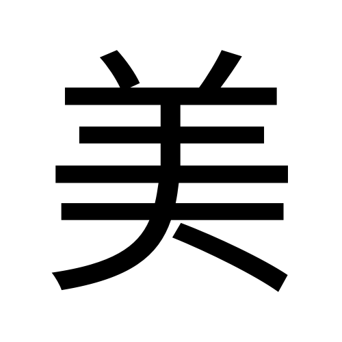 | Noto Sans TC 本機 render |
| 部首 | 羊部（部首編號 123） | 粵語審音配詞字庫／教育部重編國語辭典 |
| 部首外筆畫 | 3 畫 | 教育部重編國語辭典 |
| 總筆畫 | 9 畫 | 粵語審音配詞字庫／教育部重編國語辭典 |
| Unicode | U+7F8E | 中大字庫 |
| 大五碼 | ACFC | 粵語審音配詞字庫 |
| 倉頡碼 | 廿土大（TGK） | 粵語審音配詞字庫 |
| **部件組合** | **⿱𦍌大**（上下兩件；𦍌 U+2634C 是「羊」作上偏旁的形態） | CHISE IDS |
| 教部字號 | A02843 | 教育部異體字字典 |
| **粵音** | **mei5**（字音分類：**單讀音字**，無異讀） | 粵語審音配詞字庫（黃 p.20／周 p.134／李 p.214／何 p.142） |
| 國音 | ㄇㄟˇ měi | 教育部重編國語辭典（ID 1140） |
| 中古音 | 無鄙切；明母・脂韻・重紐三等開・止攝・**上聲** | 維基詞典（《廣韻》） |
| 上古音 | **\*mrəjʔ**（{\*[m]rəjʔ}） | 白一平-沙加爾(2011)，維基詞典轉載 |
| 異體字 | 羙（唯一有編碼者，結構是 𦍌＋火）；《玉篇》或作「媺」 | 教育部異體字字典／康熙字典 |
| 使用頻率 | 頻序 303／頻次 9051 | 粵語審音配詞字庫 |
| 英文義 | beautiful | 維基詞典 |

---

## 1. 結構層

### 1.1 字形演變

| 甲骨文 | 金文 | 簡帛 | 小篆 | 楷書 |
|:---:|:---:|:---:|:---:|:---:|
| 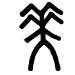 | 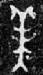 | 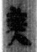 | 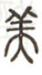 |  |

**【觀察】「美」是七張卡裡字形記錄最完整的一隻。** 中大字庫甲骨欄有 4 例、金文欄有 5 例（商代到戰國早期）、簡帛 18 例、其他 8 例。對比：「財」連甲骨金文都沒有，「靜」沒有甲骨。**要判斷「羊大」這個拆法成不成立，這隻字的材料是足夠的。**

**其餘字形（全部親眼看過）：**

| 甲骨・合集0210A | 甲骨・合集1074C | 金文・美宁鼎（商） | 金文・中山王方壺（戰國早） | 漢印・美陽丞印 | 汗簡古文 |
|:---:|:---:|:---:|:---:|:---:|:---:|
| 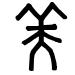 | 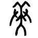 | 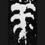 | 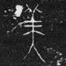 | 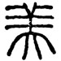 | 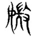 |

**【觀察】甲骨三件我看到的：**

- **合集 0210**：一個正面站立的人形——中間一條主豎，底下兩腳向左右分開成倒 V，中段一對手臂橫向伸出、末端微微下垂。**頭上**由主豎向上分出兩條斜線，每條再各自分出一條次級短枝。
- **合集 0210A**：結構相同，頭上兩條主枝加各一條次枝，人形的手臂更平直。
- **合集 1074C**：**這件最關鍵**。頭上的分枝更繁密，**左右各有兩至三條枝**，整團像一叢羽毛或多叉的飾物，而不是一對角。

**【觀察】甲骨的上半，跟獨立的「羊」對不上。** 我把「美」的甲骨與「羊」的甲骨並排看過：「羊」是**一對向上外彎的角**架在一條短豎上，角下另有一對小斜筆，**沒有手臂、沒有分開的雙腳**；「美」的上半是**多重分枝**，而且人形的中豎**一路貫穿上去**，頭飾是長在人身上的，不是另外放一個字上去。

**【觀察】金文開始向「羊」靠攏。** 美爵（西周早期）那件，頭上已經收成兩條短的上彎筆，中間出現橫畫；中山王方壺（戰國早期）更接近後世寫法。**但獨立的「羊」金文那對角是明顯捲曲的螺旋，「美」的上半沒有這種捲曲。**

**【觀察】到小篆就真的是羊了。** 見 1.3 的逐筆比對。

### 1.2 六書歸類 —— 【分歧】兩說，分歧點在「上半是不是羊」

**【原文】《說文解字．羊部》**：「美，甘也。从羊从大。羊在六畜主給膳也。美與善同意。」【臣鉉等曰：羊大則美，故从大。】〔無鄙切〕

→ **會意字**，羊＋大，理據是**味覺**：羊是六畜中主要供膳的，羊大則肥美。

**【原文】中大漢語多功能字庫略說**：「甲骨文從◎從「大」，象人頭戴羽毛、羊角之類裝飾物，表示漂亮、好看。」

**【原文】中大字庫詳解**：「于省吾認為這反映了古人以羊角為頭飾，現在部分少數民族仍保留頭戴角的習俗，反映了一種存古的審美標準。」

→ 也是**會意字**，但理據是**視覺**：大＝人，上半＝頭飾。

**【分歧】兩說的差別在哪裡：**

| | 《說文》（許慎、徐鉉） | 中大字庫／于省吾 |
|---|---|---|
| 上半是甚麼 | **羊**（牲畜） | **頭飾**（羽毛或羊角之類） |
| 下半「大」是甚麼 | **大小的大**（羊大則美） | **人**（正面站立） |
| 本義 | **甘**（味道好） | **漂亮、好看** |
| 依據的字形 | **小篆** | **甲骨文** |
| 兩者關係 | — | 頭飾可能本來就是羊角，所以後來寫成羊 |

**兩說都沒有被推翻，本卡兩說並列。** 但要看清楚一件事：**它們依據的不是同一個年代的字形**。《說文》是東漢的書，許慎看的是小篆；于省吾看的是甲骨。1.3 會用圖逐筆比對這一點。

### 1.3 部件分解 —— 三套拆法，第一層一致，理據不一致

**第一層：三套都說是「羊＋大」，但講法有微妙差別。**

| | 《說文》 | 教育部楷書寫法規範 | CHISE IDS |
|---|---|---|---|
| 拆成 | **羊** ＋ **大** | 上「羊」（作上偏旁之寫法）＋ 下「大」 | **⿱𦍌大** |
| 幾多件 | 2 件 | 2 件 | 2 件 |
| 上半寫法 | 未言 | **中豎下不出頭** | **𦍌**（U+2634C，不是羊 U+7F8A） |
| 理據 | 羊大則美（味覺） | 只講寫法，不講理據 | 只講視覺結構 |

**【原文】教育部異體字字典 A02843 說文釋形**（大徐本）：

> 美，甘也。从羊，从大。羊在六畜主給膳也。美與善同意。臣鉉等曰：「羊大則美，故从大。」（無鄙切）

**【原文】教育部異體字字典 A02843 字樣說明**：

> 此字《說文解字》篆形作「」，甘也。从羊、大。徐鉉曰：「羊大則美，故从大。」楷書寫法：上「羊」之中豎下不出頭，為「羊」作上偏旁時之寫法；下半作「大」，末筆改頓點，寫法參「大」字。「羹」、「鎂」、「渼」（B02161）等字偏旁同此。

**【觀察】官方這句話其實已經留了一手。** 它說上半是「羊」，但**特別註明是「羊」作上偏旁時的寫法，中豎下不出頭**。也就是說：**今天寫的那個上半，不是一個完整的「羊」字，是「羊」的偏旁變體。** 部件分解資料庫給的碼位 𦍌（U+2634C）也是同一件事——**它有自己的編碼，與羊 U+7F8A 是兩個字。**

#### 逐筆比對：小篆的上半到底是不是羊

我把「美」的小篆放大、加強對比，與獨立的「羊」小篆並排數過：

| | 上半的角 | 橫畫數目 | 中豎 |
|---|---|---|---|
| **獨立「羊」小篆** | 兩條向上外分的角 | **三橫** | 一條直豎，**下端伸出最低那一橫之下** |
| **「美」小篆上半** | 兩條向上外分的角 | **三橫** | 一條直豎，**不停在這裡，直接往下變成「大」的身體** |

**【觀察】小篆的上半，是一個完整的羊。** 角、三橫都齊，沒有省略。**唯一的分別是那條中豎不在這裡收筆，而是一路向下穿過去，變成下半「大」的身體。** 換句話說：**小篆的「美」是羊與大疊起來共用一條中豎。** 《說文》說「从羊从大」，**對小篆而言完全準確**。

**【觀察】但甲骨不是這樣。** 甲骨的上半是**多重分枝**（合集 1074C 左右各兩三條），不是「兩角加三橫」；而且那些分枝是從人的頭部長出去的，**沒有一個可以獨立看成「羊」字的部分**。

**所以我的判讀是**：「羊大」這個拆法**在小篆層面成立，在甲骨層面不成立**。《說文》沒有錯，它只是看不到甲骨。**這正是 1.2 兩說並存的原因——它們不是在爭同一個字形。**

> ⚠️ 這是我對圖的判讀，不是文字學論證。我沒有能力判斷那團分枝**是不是**羊角的寫實畫法——如果古人畫的頭飾本來就是羊角做的（于省吾的說法），那麼「上半後來寫成羊」就不是訛變，而是還原。**兩種可能我都沒有證據排除**（見存疑 3）。

#### 部件位置與角色

| 位置 | 部件 | Unicode | 獨立時是甚麼字 | 在「美」裡的角色 |
|---|---|---|---|---|
| 上 | 𦍌（羊之上偏旁） | U+2634C | 「羊」作上偏旁的形態 | 【分歧】羊（說文）／頭飾（于省吾） |
| 下 | 大 | U+5927 | **大**；本義是成年人 | 【分歧】大小之大（說文）／**人**（于省吾） |

**部件字形對照（我看過的圖）：**

| | 甲骨文 | 金文 | 大篆 | 小篆 | 楷書 |
|---|:---:|:---:|:---:|:---:|:---:|
| **羊** | 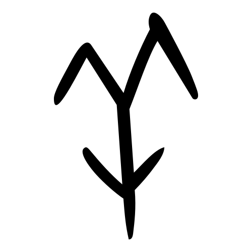 | 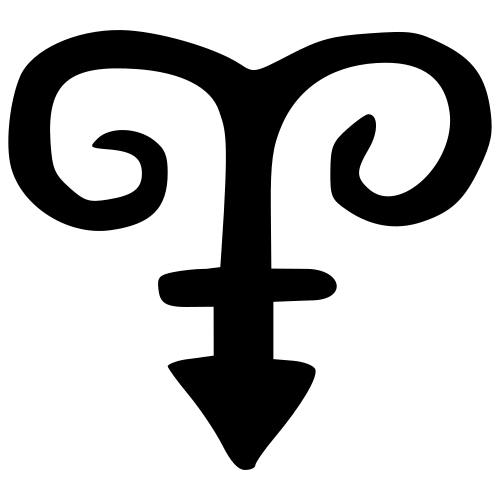 | 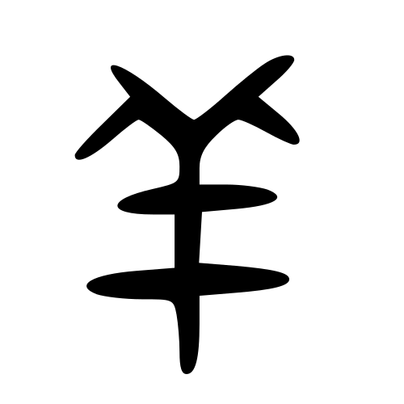 | 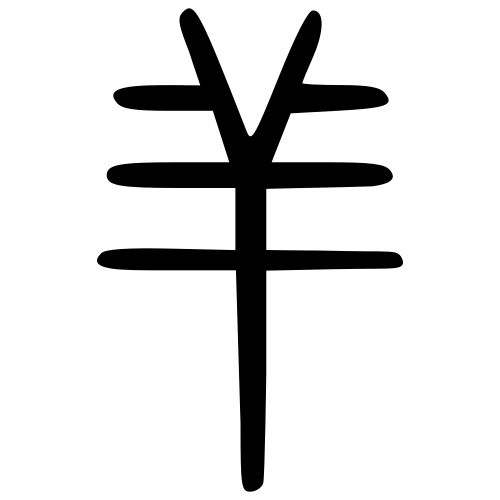 | 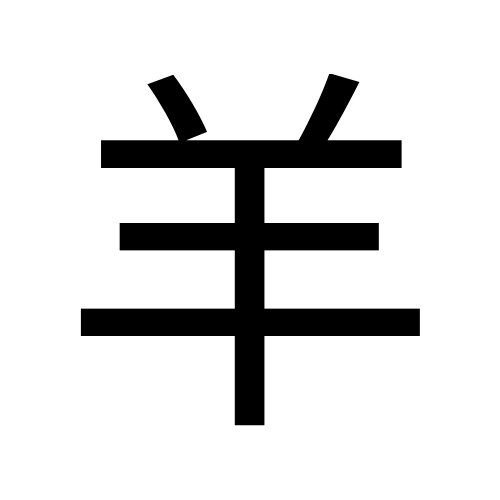 |
| **大** | 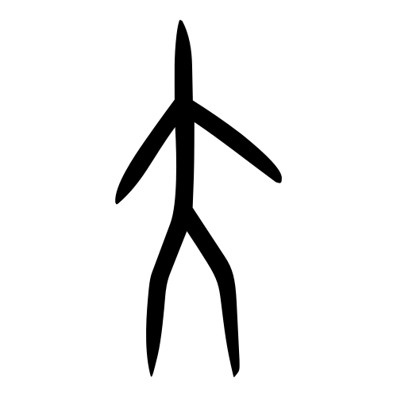 | 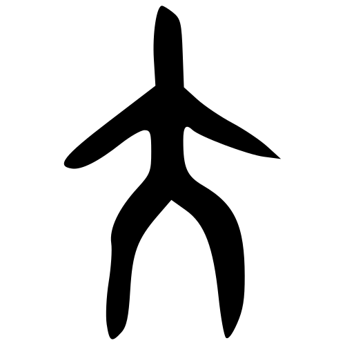 | 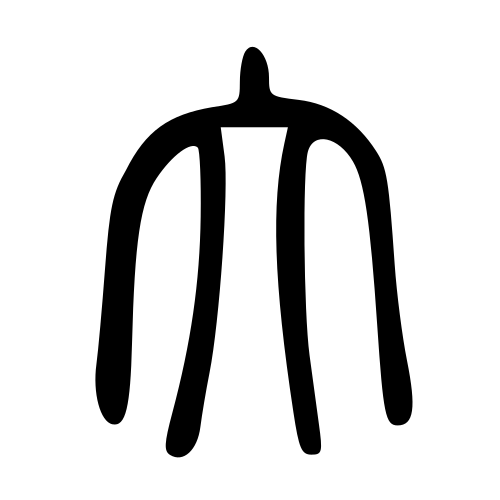 | 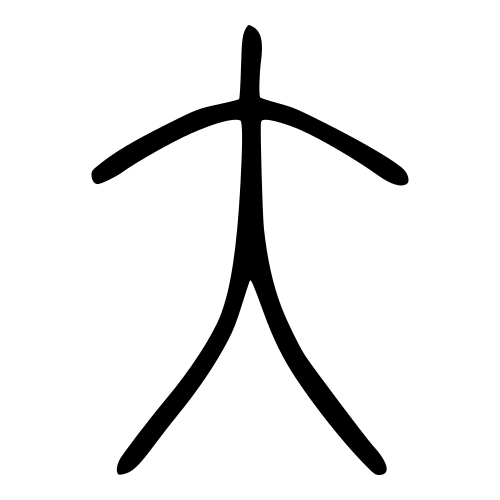 | 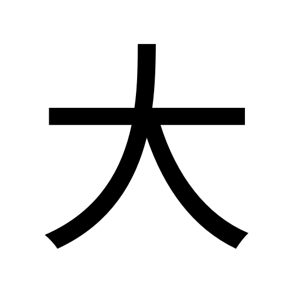 |

**【觀察】「羊」四期：** 甲骨是**一對向上外彎的角**架在短豎上，角下一對小斜筆；金文那對角變成**明顯的捲曲螺旋**，下面加橫畫，底部收成尖；大篆角仍外張、橫畫增加；小篆定型為**兩角＋三橫＋一直豎**；楷書即今形。**四期都沒有手臂、沒有分開的雙腳**——它是一個頭部的象形，不是全身。

**【觀察】「大」四期：** 甲骨是**一個正面站立的人**：一條橫畫作兩臂，中間一豎作身體，底下兩腳向左右分開。金文、大篆、小篆都保持這個結構，只是線條愈來愈圓轉。**中大字庫說「象人正面站立，雙臂下垂」，與圖完全對得上。**

**【觀察】把兩者疊起來試：** 「羊」沒有腳，「大」有腳；「美」有腳。**「美」下半的兩腳、兩臂與「大」逐筆對應**，這一點甲骨、金文、小篆三期都成立，**沒有任何一家有異議**。爭的從來只是上半。

### 1.4 部件橫向連結

**「羊」族（維基詞典系列#2183，節錄）**：羊｜佯｜詳｜垟｜咩｜徉｜洋｜样｜羘｜烊｜祥｜牂｜蛘｜絴｜觲｜鮮｜劷｜羏｜着｜鮺｜養｜鯗｜庠｜痒｜氧｜達

**【原文】中大字庫「羊」詳解**：「古人認為「羊」是吉祥的動物…所以從「羊」的漢字大都帶有美善吉祥的意義。」

**「大」族**：天、夭、太、夫、尖、奠、奕、奘、矢、类（類）等，**全部與人的姿態、大小有關**。

> **【觀察】兩族的語意區塊完全不重疊**：羊族是善、祥、養、義、美；大族是天、夭、尖、奠。**「美」剛好站在兩族的交界上**，而兩家的分歧正好各執一邊——《說文》取羊族（善），于省吾取大族（人）。

### 1.5 異體字

**【原文】教育部異體字字典 A02843** 收「美」為正字，另列**異體字 19 個**，其中**只有 1 個有 Unicode 編碼**：

| 異體 | Unicode | 分解（IDS） | 備註 |
|---|---|---|---|
| **羙** | U+7F99 | **⿱𦍌火** | 下半由「大」訛成「**火**」 |
| 另 18 個 | — | — | 教育部造字區，無 Unicode 編碼，此處無法列出 |

**【原文】《康熙字典》引《五經文字》**：「从犬从火者，譌。」

**【觀察】唯一有編碼的那個異體，正是唐代就已經被指出的錯字。** 《五經文字》是唐代的字樣書，它已經明說寫成「从犬」或「从火」是訛誤；而今天 Unicode 收的「羙」就是「从火」那一個。**一個被指認了一千兩百年的錯寫，仍然活在編碼表裡。**

《玉篇》另記「或作**媺**」——「媺」在戰國楚文字裡就是用來表示「美」的（中大字庫），也在 mei5 同音字表內（見 3.1）。

### 1.6 部件總表（拆到獨體象形為止）

| 層級 | 部件 | 獨立時是甚麼字 | 一句字典義 | 粵音 | 出處 |
|---|---|---|---|---|---|
| 一級 | **𦍌** | 「羊」作上偏旁之形 | 非獨立用字；分解式 ⿱䒑土 | — | CHISE IDS／教育部字樣說明 |
| 一級 | **大** | 大 | 【原文】《說文》「天大，地大，人亦大，故大象人形。」 | daai6 | 《說文》／中大字庫 |
| 二級 | **羊** | 羊 | 【原文】《說文》「祥也。从𦫳，象頭、角、足、尾之形。孔子曰：牛羊之字，以形舉也。」 | joeng4 | 《說文》／中大字庫 |
| 二級 | **人** | 人 | 「大」象人正面站立 | jan4 | 中大字庫 |

**兩個獨體終點**：羊（頭部象形）、大／人（全身象形）。兩個都親眼看過字形圖。

### 1.7 字族定位：兩條軸

> 「美」是**會意字，沒有聲符**，所以不能套形聲字那兩條軸。這裡改用**同上半／同下半**。

#### 一、組合方式

| 項目 | 內容 |
|---|---|
| 結構 | **上下**組合 |
| 比例 | 上「羊」略扁，下「大」向左右撐開 |
| 兩件的角色 | **都是義符**（會意），沒有聲符 |
| 層數 | **兩層**（羊＝⿱䒑⿻二丨，大＝⿻一人） |
| 有無省形 | **有**。上半用的是「羊」的偏旁形 𦍌，中豎不出頭 |

#### 二、兩條軸

**上半「𦍌」那一族**（全部【原文】《說文》）：

| 字 | 組合 | 《說文》 |
|---|---|---|
| **美** | 𦍌＋**大** | 【原文】「甘也。从羊从大。」 |
| **羔** | 𦍌＋**灬** | 【原文】「羊子也。从羊，照省聲。」 |
| **義** | 𦍌＋**我** | 【原文】「己之威儀也。从我、羊。」 |
| **養** | 𦍌＋**食** | 【原文】「供養也。从食，羊聲。」 |
| **羨** | 𦍌＋**㳄** | 【原文】「貪欲也。」 |

**下半「大」那一族**：

| 字 | 組合 | 《說文》 |
|---|---|---|
| **美** | **𦍌**＋大 | 【原文】「甘也。」 |
| **天** | **一**＋大 | 【原文】「顛也。至高無上。」 |
| **夭** | **丿**＋大 | 【原文】「屈也。」 |
| **尖** | **小**＋大 | 上小下大（後起字，《說文》未收） |

#### 三、這個交叉點告訴我們甚麼

**1. 兩條軸都長，而且語意區塊完全分開。** 上半那一族（羔、義、養、羨、善、羞）**幾乎全部圍住「美善吉祥」轉**——中大字庫說得很直接：【原文】「從「羊」的漢字大都帶有美善吉祥的意義。」下半那一族（天、夭、尖、奠）**全部關於人的姿態或大小**，沒有一個跟食物或善惡有關。

**2. 分歧的位置，剛好就是這個交叉點。** 《說文》站在羊族那一邊讀它（善、膳、甘），于省吾站在大族那一邊讀它（人、姿態、裝飾）。**兩邊各自都有一整族字撐腰，所以兩說都不容易被推翻。** 這與「靜」的情況同類——「靜」也是兩個部件都活躍，所以四說並列（見 [靜.md](靜.md) 1.7）。

**3. 但有一個不對稱。** 「羊」族裡「美善吉祥」那個語意，**本身可能就是從「美」這類字反推出來的**——中大那句話說的是「從羊的字大都帶美善義」，而「美」正是其中最具代表性的一個。**用這一族去證明「美」从羊表善，有循環論證的風險。** 我把這一點明白寫出來，不當成證據（見存疑 4）。

**【觀察】楷書並排：**

| 美 | 羊 | 大 | 羔 | 羹 | 善 |
|:---:|:---:|:---:|:---:|:---:|:---:|
|  |  |  |  | 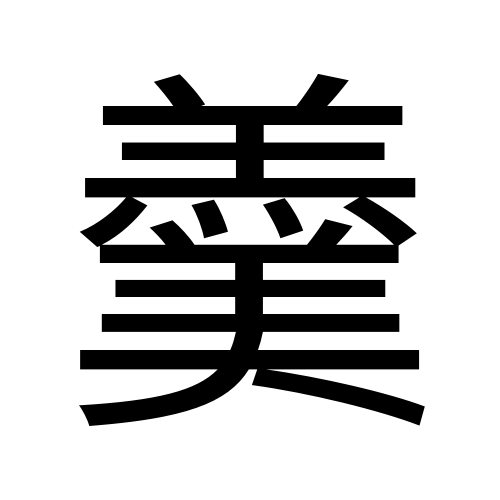 | 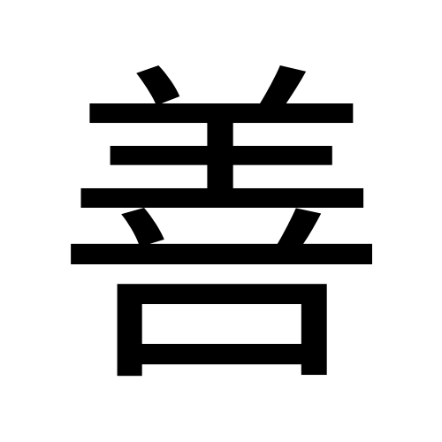 |
| 𦍌＋大 | 獨立 | 獨立 | 𦍌＋灬 | 羔＋美 | 羊＋䒑＋口 |

**【觀察】把「美」「羔」「善」放一起看，上半三個都是同一個 𦍌**，中豎都不出頭；而獨立的「羊」中豎明顯伸到最低一橫之下。**這個差別在楷書裡一眼看得到**，也就是教育部字樣說明講的那句話。

#### 四、部件在別的字裡的位置

| 位置 | 例字 | 形態 |
|---|---|---|
| **上**（字頭） | **美**、羔、義、養、善、羞 | 寫成 𦍌，中豎不出頭 |
| **左**（偏旁） | 洋、祥、群、羚 | 寫成「𣴎」形，末橫改提 |
| **獨立** | 羊 | 中豎出頭 |

### 1.8 這個字做部件時

> 1.7 問「美」站在哪些家族裡。這一節問**反方向**：**「美」自己做部件，走進了哪些字？**

用 CHISE 漢字部件分解資料庫（IDS，共 88,939 條）逐條檢查，分解式裡直接含「美」的字有 **62 個**。

**有內容的幾個：**

| 字 | 分解 | 釋義 |
|---|---|---|
| **媄** | ⿰女美 | 色好；**同音同調**，也在 mei5 表內 |
| **渼** | ⿰氵美 | 水名（渼陂）；**同音同調** |
| **鎂** | ⿰金美 | 金屬元素鎂；**同音同調** |
| **羹** | ⿱羔美 | 五味調和的濃湯。**注意**：《說文》的「羹」本作「𩱧」，【原文】「五味盉羹也。从𩰲从羔」，**本來沒有「美」** |
| **躾** | ⿰身美 | 日本國字，教養、禮儀 |
| **嵄** | ⿰山美 | 山名 |

**對比它自己的部件**（同一資料庫、同一數法）：

| 部件 | 進入幾多個字 |
|---|---:|
| **大** | **670** |
| **羊** | **322** |
| **美** | **62** |
| 對照：發 | 32 |
| 對照：靜 | 7 |
| 對照：財 | 2 |

**「美」不是終點。** 它進入 62 個字，是本 project 至今數過**最能產的一個成品字**——「財」只有 2 個、「靜」7 個、「發」32 個。

**兩點值得記：**

1. **mei5 十九個同音字裡，有三個（鎂、渼、媄）是「美」自己生出來的。** 也就是說：**同音表裡有一段，其實是它的下游。** 這與「財」的情況剛好相反——「財」的同音字全部是它的**上游**（才系）。
2. **「羹」這個字的「美」是後加的。** 《說文》的字頭是「𩱧」，从𩰲从羔，**與「美」無關**；今天寫的「羹」（羔＋美）是後起的寫法。**如果拿「羹」去證明「美」與食物有關，會踩空**——因為那個「美」不是原裝的。

**對術數層的意義**：「美」做部件時帶的是「好、漂亮」這一層，而且多數只作**聲符兼義**（媄、渼、鎂都讀 mei5）。要追它的**意思**來源，應該往上追「羊」（322 個字，多帶美善吉祥）或「大」（670 個字，多關人的姿態），不是往下追。

---

## 2. 意思層

### 2.1 整個字查字典

| 字典 | 原文／義項 |
|---|---|
| **《說文解字．羊部》** | 【原文】「美，甘也。从羊从大。羊在六畜主給膳也。美與善同意。」【臣鉉等曰：羊大則美，故从大。】〔無鄙切〕 |
| **中大漢語多功能字庫** | 【原文】「甲骨文從◎從「大」，象人頭戴羽毛、羊角之類裝飾物，表示漂亮、好看。」 |
| **《康熙字典》** | 【原文】「《廣韻》好色。《詩·邶風》匪女之爲美。」又引《五經文字》：「从犬从火者，譌。」 |
| **教育部重編國語辭典**（ID 1140） | 見下 |

**【原文】教育部重編國語辭典 ㄇㄟˇ（羊部+3畫 共9畫・常用字）：**

| 詞性 | # | 意思 | 書證 |
|---|---|---|---|
| 形 | 1 | **漂亮、好看** | 如「華美」「貌美」「美男子」 |
| 形 | 2 | **好、善** | 如「美德」「鮮美」「完美」「盡善盡美」 |
| 形 | 3 | 得意 | 如「少臭美了！」 |
| 名 | 1 | **漂亮的女子** | 《詩經．鄭風．野有蔓草》「有美一人，清揚婉兮。」 |
| 名 | 2 | 泛指好的德性、事物 | 如「君子有成人之美」。《管子．五行》「然後天地之美生。」 |
| 名 | 3–5 | 美育／美國／美洲的簡稱 | 如「德智體群美」「中美英法」「南美」 |
| 動 | 1 | **誇讚、褒獎** | 如「讚美」。《韓非子．五蠹》「然則今有美堯、舜、湯、武、禹之道於當今之世者…」 |
| 動 | 2 | 使變善變好 | 如「養顏美容」 |

**【分歧・字典之間】** 教育部把「**漂亮、好看**」列為第一義項，《說文》的「**甘**」則一個義項都沒有進入現代辭典。**《說文》給的本義，在今天的辭典裡完全消失了。**

**中大字庫所引的出土用例**（戰國至漢）：《睡虎地秦簡．秦律十八種》簡65「百姓市用錢，美惡雜之」（質量好壞）；《睡虎地秦簡．日書甲種》簡113正2「酒美」（味道好）、簡12正2「以生子，男女必美」（相貌好）；《馬王堆帛書．老子甲本》第128行「美與惡，其相去何若？」

**【觀察・用例】戰國秦漢的用例裡，「好看」與「味道好」兩種用法同時存在**（「男女必美」是相貌，「酒美」是味道）。**所以在出土文獻的層面，兩說都找得到落腳點。**

### 2.2 部件逐個查字典

**羊（U+7F8A）**

| 字典 | 內容 |
|---|---|
| 《說文解字》 | 【原文】「羊，祥也。从𦫳，象頭、角、足、尾之形。孔子曰：牛羊之字，以形舉也。凡羊之屬皆从羊。」〔與章切〕 |
| 中大字庫略說 | 【原文】「「羊」字甲金文象羊頭上長着一雙彎彎的角，本義是羊。」 |
| 中大字庫詳解 | 【原文】「古人認為「羊」是吉祥的動物…所以從「羊」的漢字大都帶有美善吉祥的意義。」 |

→ **羊 ＝ 羊（本義）→ 通「祥」→ 從羊之字多帶美善義**。《說文》第一句就是「祥也」——**它用聲訓把羊直接等同於祥**。

**大（U+5927）**

| 字典 | 內容 |
|---|---|
| 《說文解字》 | 【原文】「大，天大，地大，人亦大，故大象人形。」〔他達切〕 |
| 中大字庫略說 | 【原文】「「大」象成年人，本義是大人（與小童相對），引申為大。」 |
| 中大字庫詳解 | 【原文】「「大」字象人正面站立，雙臂下垂。本義是成年人，與「子」象小孩相對…因年紀較小孩大，故引申有大義。」 |
| 教育部重編國語辭典（ID 1919） | 【原文】「在體積、面積、容量、數量、強度、深度、力量等方面超過一般」；年長；尊敬之詞；姓；二一四部首之一 |

→ **大 ＝ 人（本義是成年人）→ 引申為大**。**注意次序：「人」在前，「大」在後。** 《說文》自己那句「故大象人形」已經說明白了。

**⚠️ 這裡有一個關鍵**：《說文》解「美」時說「羊大則美」，把「大」當成**大小的大**用；但《說文》解「大」時又說它**象人形**。**同一本書裡，「大」的本義是人，但在「美」字裡被當成大小。** 這個內部落差，正是于省吾一說的切入點（見 4.2）。

### 2.3 結構 → 意思推導鏈

```
【字形】 𦍌（上）+ 大（下）
   │
   ├─【說文這條路】羊（六畜主給膳）+ 大（大小）
   │        └→ 羊大則肥美 →【本義】甘（味道好）
   │                            └→ 引申：好、善 → 好看
   │
   └─【于省吾這條路】頭飾（羽毛／羊角）+ 大（人）
            └→ 人戴着裝飾 →【本義】漂亮、好看
                                └→ 引申：好、善 → 美味

**兩條路的終點一樣（好），起點相反（味覺／視覺）。**
```

**每一步的根據：**
- 「从羊从大」← 《說文》＋教育部字樣說明，兩家一致
- 「羊大則美」← 徐鉉（大徐本臣鉉等曰）
- 「象人頭戴裝飾」← 中大字庫略說，引于省吾
- 「大象人形」← 《說文》「大」字條自己說的
- 今義「漂亮」← 教育部辭典第一義項

**⚠️ 要提防的推論：**
1. **不可以**把「羊大為美」當成定論去推「所以中國人的審美來自吃」——那只是《說文》一家之說，而且只解釋得到小篆。
2. **不可以**反過來說「《說文》錯了」——小篆的上半確實就是完整的羊（1.3 已逐筆比對）。
3. **也不可以**用「從羊之字多帶美善義」去證明「美」从羊表善——**因為「美」本身就是那一族的代表字，這樣論證會繞回自己**（見 1.7 第 3 點）。

---

## 3. 同音層（粵音 mei5）

**【原文】粵語審音配詞字庫 mei5 全部同音同調字（19 個）：**

> 美、尾、鎂、靡、弭、娓、敉、渼、媺、艉、葞、濔、亹、瀰、羋、浘、灖、媄、斖

### 3.1 同音同調字表

**關係類別**四選一：同源（同聲符）｜通假／聲訓（文獻有記）｜民俗諧音（有出處）｜純諧音（只是讀音相撞）

#### A 組：「美」自己的下游字（3 個）

| 同音字 | 字典義（一句） | 結構 | 關係類別 | 來源 |
|---|---|---|---|---|
| **鎂** | 金屬元素鎂 | 金＋**美** | **同源**（以「美」為聲符） | CHISE IDS／教育部辭典 |
| **渼** | 水名（渼陂） | 氵＋**美** | **同源** | CHISE IDS |
| **媄** | 色好、美好 | 女＋**美** | **同源** | CHISE IDS |

#### B 組：曾經就是「美」的字（1 個）

| 同音字 | 字典義（一句） | 關係類別 | 來源 |
|---|---|---|---|
| **媺** | 美好 | **通假／異體**——【原文】中大字庫：「戰國楚文字以「媺」來表示「美」」；《玉篇》「美，或作媺」 | 中大字庫／康熙字典引《玉篇》 |

#### C 組：繞回「羊」的一個（1 個）

| 同音字 | 字典義（一句） | 關係類別 | 來源 |
|---|---|---|---|
| **羋** | 羊叫聲；楚國姓氏 | **純諧音**，但它从「羊」——**與「美」的上半同源，與「美」本身不同源** | 教育部辭典 |

#### D 組：純諧音（其餘 14 個）

尾、靡、弭、娓、敉、艉、葞、濔、亹、瀰、浘、灖、斖

這一批與「美」沒有結構關係，只是讀音相撞。當中「尾」「靡」是常用字，其餘多為冷僻字。

**十九個字裡，三個是「美」的下游、一個曾經就是「美」、一個繞回「羊」，其餘十四個純諧音。**

> **與「財」對照很有意思**：「財」的同音字全部是它的**上游**（才、材、裁都在才系）；「美」的同音字有三個是它的**下游**。**一個字是被造出來的終點，另一個是造字的起點。**

### 3.2 同音異調字（mei 系其他聲調，只列名，不引申）

**mei1**（陰平）：咪、瞇
**mei4**（陽平）：眉、微、薇、楣、糜、嵋、湄、麋、黴、猸、瑂
**mei6**（陽去）：味、未、媚、魅、寐、沬、袂

> ⚠️ 留意：**「眉」在 mei4**，與「美」只差一個聲調。古書裡「眉」「美」時有相通之說，但我**沒有查到可靠書證**，所以這裡只列名，不作引申（見存疑 6）。

### 3.3 引申

> 以下全部是【引申】＝同音推想，**不是字典考據**。拿去用之前請先看清楚類別。

**由 A、B 組（同源）出發——最實：**

- 【引申】美 ↔ **媺**。→ **這一條最實**：戰國楚人寫「美」就是寫「媺」，有出土文字為證。**同一個意思，兩個字身。**
- 【引申】美 ↔ **媄**（色好）。→ 可引申為：**美的本體是人**，加個「女」旁只是把它指向具體的人。
- 【引申】美 ↔ **鎂**。→ 純粹是近代造新字借音，**與意思無關**，不要當成「金屬之美」。

**由 C 組出發：**

- 【引申】美 ↔ **羋**（羊叫）。→ 可引申為：**羊的聲音也叫 mei**。這一條很有戲劇性——**如果「美」真的从羊，那麼羊的形、羊的聲、美的音三樣就串在一起了**。但要說清楚：**這是純諧音，「羋」與「美」上古音不同韻，不是同源**（見存疑 5）。

**由 D 組出發——最鬆：**

- 【引申】美 ↔ **尾**。→ 孔雀開屏，尾即是美。純諧音。
- 【引申】美 ↔ **靡**（倒下、奢靡）。→ **反向引申**：美到極處就是靡。純諧音。

---

## 4. 交叉核對

### 4.1 結構 ↔ 意思：推導鏈有沒有斷？

**沒有斷，但有兩條，而且它們指向相反的感官。**

- **《說文》那條**：羊（膳）＋大（肥）→ 甘。鏈是通的，但**終點「甘」在現代辭典裡一個義項都沒有留下**。
- **于省吾那條**：頭飾＋人 → 漂亮。鏈也是通的，而且**終點正是今天的第一義項**。
- **結論**：**以「解釋得到今義」這個標準衡量，于省吾那條路走得通，《說文》那條走不到終點。** 但這不等於《說文》錯——它解釋的是小篆，而小篆的上半確實是羊。

> 與「靜」對比：「靜」是**兩條路都走不到今義**（見 [靜.md](靜.md) 4.1）。「美」是**一條走得到，一條走不到**。

### 4.2 字典 ↔ 字典：有沒有打架？

**打架的地方有三處。**

**第一處：本義是甘還是好看。**《說文》說「甘也」，中大字庫說「表示漂亮、好看」。**教育部辭典站在中大那一邊**——它的第一義項是「漂亮、好看」，而「甘」完全沒有收。

**第二處：《說文》自己內部不一致。**

| 《說文》在哪裡 | 「大」是甚麼 |
|---|---|
| 「大」字條 | 【原文】「天大，地大，人亦大，故**大象人形**。」→ **大＝人** |
| 「美」字條 | 【原文】「羊在六畜主給膳也」＋徐鉉「**羊大則美**」→ **大＝大小** |

**同一本書，「大」的本義是人，但在「美」字裡被當成大小用。** 這不是致命矛盾（一個部件本來就可以取引申義），但它說明：**「羊大則美」這個解釋，用的不是「大」的本義。** 而于省吾那一說，用的正正是本義。

**第三處：中大連「羊」字都不肯寫。** 中大字庫的略說原文是「甲骨文從**◎**從「大」」——**它用一個符號代替上半**。對比它寫「財」時直接寫「從貝從才」。**這個寫法上的分別是有意的**：它不承認上半在甲骨階段已經是「羊」。

### 4.3 同音 ↔ 結構

**1. 同音表裡有三個是「美」自己生的字。** 鎂、渼、媄都以「美」為聲符，讀音自然相同。**這說明「美」在後世是一個活躍的聲符**，與「財」（同音字全是上游）方向相反。

**2. 「媺」是同音層與結構層的交會點。** 它既是同音字，又是戰國楚文字裡「美」的實際寫法，還被《玉篇》記為異體。**三重身分。**

**3. 「羋」提供一個有趣但不可當真的巧合。** 「羋」从羊，讀 mei5，意思是羊叫。**如果「美」从羊成立，那麼羊的形、羊的叫聲、美這個音就湊在一起了。** 但這是**純諧音**：上古音「美」*mrəjʔ，「羋」屬歌部，不同韻，**不是同源**。我把它列出來是因為它好記，不是因為它是證據。

### 4.4 一句總結

**「美」最硬的證據鏈：** 上「羊」（作上偏旁寫成 𦍌）＋下「大」（正面站立的人）→ **【分歧】兩說**：《說文》讀作羊大則甘（味覺），于省吾讀作人戴頭飾（視覺）。**兩說依據的不是同一年代的字形**——我逐筆比對過，**小篆的上半是完整的羊（兩角三橫俱全，只與「大」共用中豎），甲骨的上半卻是多重分枝的頭飾**。所以《說文》對小篆的描述準確，于省吾對甲骨的描述也準確，**真正的分歧是「那團分枝後來寫成羊，是訛變還是還原」，這一點我沒有證據判斷。** 今義「漂亮好看」由于省吾那條路解釋得到，《說文》那條走不到。**最值得拿去用的一點：「美」進入 62 個字，是本 project 至今最能產的成品字，而它的同音字裡有三個正是它自己生的。**

---

## 5. 來源清單

| # | 來源 | URL／位置 |
|---|---|---|
| 1 | 中大漢語多功能字庫 · 美 | https://humanum.arts.cuhk.edu.hk/Lexis/lexi-mf/search.php?word=美 |
| 2 | 中大漢語多功能字庫 · 羊／大／羹 | 同上，word=羊／大／羹 |
| 3 | 粵語審音配詞字庫 · 美 | https://humanum.arts.cuhk.edu.hk/Lexis/lexi-can/search.php?q=%AC%FC |
| 4 | 粵語審音配詞字庫 · mei5 同音字 | https://humanum.arts.cuhk.edu.hk/Lexis/lexi-can/pho-rel.php?s1=m&s2=ei&s3=5 |
| 5 | 教育部重編國語辭典 · 美／羊／大 | ID 1140／7212／1919 |
| 6 | 教育部異體字字典 · 美 A02843 | https://dict.variants.moe.edu.tw/search.jsp?QTP=0&WORD=美 |
| 7 | 維基詞典 · 美（白一平-沙加爾上古音、系列#1240、康熙字典引文） | https://zh.wiktionary.org/wiki/美 |
| 8 | CHISE 漢字部件分解資料庫（IDS） | https://raw.githubusercontent.com/cjkvi/cjkvi-ids/master/ids.txt |
| 9 | 字形圖 · 美（甲骨×3、金文×3、簡帛、小篆、漢印、汗簡） | 中大字庫原圖，出處已逐張標明 |
| 10 | 字形圖 · 羊／大 各期、美 甲骨金文摹寫 | Wikimedia Commons `羊-/大-oracle,bronze,bigseal,seal.svg`、`美-oracle/bronze.svg` |

楷書圖：本機用 Noto Sans TC render（`fonts/NotoSansTC-Regular.otf`）。

---

## 6. 存疑／未驗證

1. **于省吾的說法我是經中大字庫轉引**，沒有查《甲骨文字釋林》原書。中大的原文只有一句話，我沒有看到他完整的論證。
2. **教育部異體字字典的 18 個造字區異體我列不出。** 該字典 A02843 共列 19 個異體字，只有「羙」有 Unicode 編碼，其餘 18 個是字典自造字形，我無法顯示，也沒有取得字形圖。
3. **1.3 那個判讀（小篆成立、甲骨不成立）是我對圖的判斷，不是文字學論證。** 我無法判斷甲骨那團分枝**是不是**羊角的寫實畫法。如果古人的頭飾本來就是羊角做的，那麼「後來寫成羊」就不是訛變而是還原——**這兩種可能我都沒有證據排除**。
4. **「從羊之字多帶美善義」有循環論證的風險。** 這個語意概括本身，很可能部分是從「美」「善」「義」這幾個字反推出來的；再用它去證明「美」从羊表善，等於用結論證明前提。我已在 1.7 第 3 點標明，沒有把它當證據用。
5. **「羋」的上古音我沒有查到構擬。** 3.3 說它與「美」不同韻、不是同源，**依據只是它屬歌部這個一般認識**，我沒有取到鄭張或白沙的具體構擬。
6. **「眉」「美」相通之說我查不到書證。** 3.2 只列名不引申，就是因為這個。
7. **「羹」的字形演變我只查到《說文》字頭是「𩱧」（从𩰲从羔）**，沒有追查「羔＋美」這個寫法從甚麼時候開始通行。1.8 說「美是後加的」，依據只有《說文》字頭與今形的對比。
8. **1.8 的數字全部來自 CHISE IDS 一個資料庫**，數法是「分解式直接含該字」，不展開巢狀分解。換一個資料庫或數法，數字會不同，但 670／322／62 這幾個量級的關係不會翻轉。
9. **中大字庫甲骨欄 4 例、金文欄 5 例，我只取了其中 3 例甲骨、3 例金文**（連同 Wikimedia 摹寫各一）。其餘幾例我沒有逐一看過。
10. **「美」的中古音我取自維基詞典轉引的《廣韻》**，沒有直接查中大字庫的廣韻欄。
