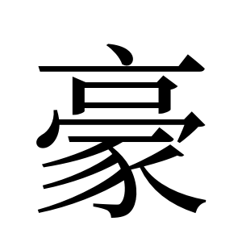
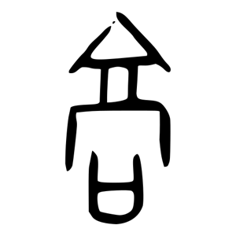
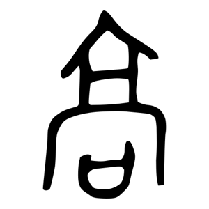
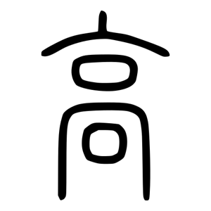
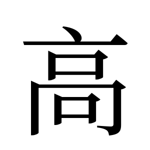

# 豪

> 字卡格式：**結構層**（點砌）→ **意思層**（點解）。每個判斷後面括號註明來源。
> 標記：`【原文】`＝字典／古籍原文照抄 ｜ `【觀察】`＝我親眼睇字形圖得出 ｜ `【分歧】`＝各家講法不一

---

## 0. 基本資料

| 項目 | 內容 | 來源 |
|---|---|---|
| 楷書 |  | Noto Serif CJK 本機 render |
| 部首 | **豕部** | 教育部重編國語辭典 |
| 部首外筆畫 | 7 畫 | 教育部重編國語辭典 |
| 總筆畫 | 14 畫 | 教育部重編國語辭典 |
| Unicode | U+8C6A | 教育部異體字字典 |
| 教部字號 | A03916 | 教育部異體字字典 |
| 粵音 | hou4 | 中大漢語多功能字庫 |
| 國音 | ㄏㄠˊ háo | 教育部重編國語辭典 |
| 說文本字 | 𩫚（《玉篇》作此）／𩫞 | 中大字庫、《康熙字典》引《說文》 |
| 籀文／篆文 | 𩫕（从豕者） | 《說文》大徐本 |

**⚠️ 第一件要知嘅事：「豪」個部首就係「豕」，即係豬部。** 唔使拆字都已經歸咗入豬嗰邊。

---

## 1. 結構層

### 1.1 字形演變

| 甲骨文 | 金文 | 大篆／籀文 | 小篆 | 楷書 |
|:---:|:---:|:---:|:---:|:---:|
| **無** | **無** | **無** |  |  |

**【觀察】「無」唔係搵唔到，係真係冇。** 我喺 Wikimedia Commons 逐個試過 `豪-oracle.svg`、`豪-bronze.svg`、`豪-bigseal.svg`，全部 404；中大字庫「豪」條亦冇任何金文拓片連結（對比「家」有 8 條、「豕」有 8 條）。**呢個空白本身就係證據：「豪」係後起字**，商周古文字階段未見，要到小篆先有標準字形。呢點同「家」（甲骨文已有）成強烈對比。

**【觀察】小篆「豪」睇到啲咩：**
- **上半**：一個尖頂 + 下面一個扁框（口形）+ 再下一橫。
- **下半**：一隻完整嘅「豕」——一橫（頭）、彎背脊、左邊撇（足）、右邊落筆到底。
- 上下清楚分成兩截，唔係一體象形。

**【觀察】楷書「豪」**：亠（尖頂）+ 口 + 冖 + 豕。下半同獨立「豕」楷書**逐筆對應**。

### 1.2 部件分解 —— 上半到底係咩？

我拎「高」嘅古文字嚟對比：

| 高 甲骨文 | 高 金文 | 高 小篆 | 高 楷書 | **豪 小篆** |
|:---:|:---:|:---:|:---:|:---:|
|  |  |  |  |  |

**【觀察】對比結果：** 「高」係一座**兩層樓台建築**嘅側視圖——尖屋頂 + 上層一個口 + 下層一個口。「豪」嘅上半，同「高」嘅**上半截**（尖頂 + 第一個口 + 一橫）完全對應，但**冇咗最底嗰個口**。呢個就係文字學所講嘅「**高省**」——攞「高」嘅一部分嚟用。

所以：

| 位置 | 部件 | 獨立時係咩字 | 角色 |
|---|---|---|---|
| 上 | 高省（亠+口+冖） | 高 ＝ 樓台高聳 | **聲符**（表音 háo／hou4） |
| 下 | **豕** | **豬** | **形符**（表意：呢個字講緊一種豬） |

【觀察】留意「豪」同「家」啱啱相反：
- 「家」＝ 屋（形符）在上 + 豬（聲符）在下 → **豬表音**
- 「豪」＝ 高（聲符）在上 + 豬（形符）在下 → **豬表意**

同一隻豬，喺兩個字入面做緊完全相反嘅工。

### 1.3 六書歸類

**形聲字**（形符豕 + 聲符高省）。呢點三個來源一致，冇爭議。

**【分歧】但《說文》本字唔係「豪」：**

**【原文】《說文解字·㣇部》**：「𩫚，豕鬣如筆管者，出南郡。从㣇高聲。𩫕，籒文从豕。」

拆解呢句：

| 部分 | 意思 |
|---|---|
| 豕鬣如筆管者 | 一種豬，佢啲鬣毛粗硬得好似筆管咁 |
| 出南郡 | 產於南郡（漢郡名，約今荊州府北至襄陽府一帶） |
| 从㣇高聲 | **形符係「㣇」**（yì，長毛獸）**，聲符係「高」** |
| 𩫕，籒文从豕 | 籀文寫法改**从「豕」** |

**即係話**：《說文》正篆嘅形符係「㣇」（長毛獸），到籀文／今楷先改成「豕」（豬）。段玉裁校改「籒文」為「篆文」（因為㣇部字頭本身已屬籀文系統，重文不得再標籀文）——呢個係段注中一處著名嘅改字。

**兩個形符都指向同一件事**：㣇＝長毛獸、豕＝豬，而本義係「豪豬」——一種長硬毛嘅豬。所以形符點揀都好，個字都係講緊豬。

### 1.4 部件橫向連結：「豕」呢隻豬

同 [家.md](家.md) 共用同一個部件網絡：

| 字 | 結構 | 豕嘅角色 | 同豬嘅關係 |
|---|---|---|---|
| **豕** | 獨體象形 | 本體 | **豬**（本義） |
| **豪** | 上高省 + 下豕 | **形符** | **豪豬（箭豬）**——本義就係一種豬 |
| **豬** | 左豕 + 右者 | 形符 | 豬 |
| **豭** | 左豕 + 右叚 | 形符 | 公豬 |
| **家** | 上宀 + 下豕 | 聲符（主流） | 屋 + 豬 → 見 [家.md](家.md) |
| 豚 | 肉 + 豕 | 形符 | 小豬 |
| 逐 | 辵 + 豕 | 形符 | 追趕（本義：追豬） |

**小篆並排：**

| 豕 | 豪 | 豬 | 豭 | 家 |
|:---:|:---:|:---:|:---:|:---:|
|  |  |  |  |  |

**【觀察】** 「豪」同「家」下半嘅豕形，喺小篆階段幾乎一模一樣；「豬」「豭」嘅豕做左偏旁就壓窄咗。呢個再次印證：**同一個「豕」，做下部件保持完整、做左偏旁就變窄**。

### 1.5 異體字／相關分化字

| 字 | 關係 | 說明 |
|---|---|---|
| 𩫚 / 𩫞 | 說文本字 | 从㣇高聲 |
| 𩫕 | 籀文（段改「篆文」） | 从豕 → 即今「豪」之所本 |
| **毫** | 分化字 | 【原文】徐鉉按語：「今俗別作毫，非是」。後世分工：**从豕者作「豪俊」字，从毛者作「豪毛」字** |
| **𠢕** | 段玉裁認為係「豪傑」本字 | 【原文】段注：「健也。健者、伉也。此豪傑眞字。自叚豪爲之、而𠢕廢矣。豪、豕鬛如筆管者。」从力敖聲 |

**⚠️ 呢點好重要**：段玉裁認為，今日講「豪傑」嗰個「豪」係**假借**。本字係「𠢕」（訓「健」），借用得耐咗，本字就廢咗。「豪」自己嘅本義**淨係豪豬**。

---

## 2. 意思層

### 2.1 成隻字查字典

| 字典 | 原文／內容 |
|---|---|
| **《說文解字》** | 【原文】「𩫚，豕鬣如筆管者，出南郡。从㣇高聲。𩫕，籒文从豕。」讀若乎刀切 |
| **《說文解字注》（段玉裁）** | 補「𩫒豕」二字，指明係**豕名**，即《西山經》之「豪彘」、〈長楊賦〉之「豪豬」。本是豕名，因其鬣如筆管，遂以之名其鬣；凡「豪俊」「豪毛」皆係**引申義** |
| **《山海經·西山經》**（段注引） | 竹山有獸，狀如豚而白毛，大如筓而黑端；郭璞注為「貆豬」，能以脊上豪射物 |
| **《玉篇》** | 【原文】「豪，豬，毛如笄而端黑也。」又訓「俊」 |
| **《廣韻》** | 胡刀切；《集韻》《韻會》《正韻》乎刀切，音毫 |
| **《穆天子傳》**（康熙引） | 「天子之豪馬、豪牛、豪羊」，注：「豪，猶髭也」 |
| **中大漢語多功能字庫** | 本義：**豪豬**（一種野豬）；「豪」乃「𩫕」之省體 |
| **維基詞典** | Baxter-Sagart 上古音構擬註明原義為 "porcupine; shaggy animal"（豪豬／長毛獸） |

**教育部重編國語辭典（ID 4804）ㄏㄠˊ háo：**

| 詞性 | # | 意思 | 例 |
|---|---|---|---|
| 名 | **1** | **參見「豪豬」條** ← 排第一位 | 豪豬 |
| 名 | 2 | 才能卓越的人物 | 英豪、文豪 |
| 名 | 3 | 領導者、首領 | — |
| 名 | 4 | 有權勢之人 | 富豪、土豪劣紳 |
| 名 | 5 | 細長毛髮，**通「毫」** | — |
| 名 | 6 | 姓氏 | — |
| 形 | 1 | 爽朗不拘 | 豪邁、豪放 |
| 形 | 2 | 勢大量多 | 豪雨 |
| 形 | 3 | 奢華 | 豪華 |
| 副 | — | 強橫蠻橫之狀 | — |

**留意**：教育部辭典將「豪豬」放喺名詞第一義項——即係現代權威辭典都仍然認本義。

### 2.2 部件逐個查字典

**豕（U+8C55）** ← 同 [家.md](家.md) 2.2 節相同

| 字典 | 內容 |
|---|---|
| 《說文解字》 | 【原文】「豕，彘也。竭其尾，故謂之豕。象毛足而後有尾。」 |
| 教育部重編國語辭典（ID 8750） | **豬**，一種家畜。214 部首之一 |
| 維基詞典 | 【原文】「小豬，或直接代表豬」；英譯 "boar / swine" |

→ **豕 ＝ 豬**。

**高（U+9AD8）**

| 字典 | 內容 |
|---|---|
| 字形 | 象樓台高聳之形（見 1.2 節圖：尖頂 + 兩層口） |
| 喺「豪」入面 | 淨係借音，唔帶「高」嘅意思 |

**㣇（U+38C7）**（說文正篆嘅形符）

| 字典 | 內容 |
|---|---|
| 《說文》㣇部 | 長毛獸之通稱 |
| 喺「𩫚」入面 | 形符：表示呢個字講緊一種長毛嘅獸 |

### 2.3 結構 → 意思推導鏈

```
【字形】 高省（聲：háo）+ 豕（形：豬）
                          │
                          ↓
              【本義】豪豬 ＝ 鬣毛硬如筆管嘅豬
              （《說文》「豕鬣如筆管者，出南郡」）
                          │
        ┌─────────────────┴─────────────────┐
        ↓                                   ↓
【引申A：由豬 → 講毛】              【引申B：由毛 → 講人】
 豪 ＝ 細長硬毛                      毛硬挺 → 出眾、突出
 （段注：因其鬣如筆管，              → 才能卓越者
   遂以之名其鬣）                      英豪、文豪
        │                                   │
        ↓                                   ↓
   後世分化寫「毫」                 → 有權勢者：富豪、土豪
   （毫毛、毫米）                   → 性格爽朗：豪邁、豪放
                                    → 程度大：豪雨、豪華
                                    → 強橫：豪奪
```

**⚠️ 段玉裁嘅異議**：段認為「豪傑」呢層意思其實係借用，本字係「𠢕」（健）。即係話上圖【引申B】呢條線，段玉裁唔認為係引申，而認為係**假借**。兩種講法我都列出。

**每一步嘅根據：**
- 「豕＝豬」← 《說文》「彘也」+ 教育部辭典
- 「本義＝豪豬」← 《說文》原文 + 段注 + 《玉篇》+ 中大字庫 + 教育部辭典義項1（五個來源一致）
- 引申A ← 段注「因其鬣如筆管，遂以之名其鬣」
- 「毫」分化 ← 徐鉉按語「今俗別作毫，非是」
- 引申B ← 教育部辭典義項 2–4；但段注主張係假借「𠢕」

---

## 3. 來源清單

| # | 來源 | URL |
|---|---|---|
| 1 | 中大漢語多功能字庫 · 豪 | https://humanum.arts.cuhk.edu.hk/Lexis/lexi-mf/search.php?word=豪 |
| 2 | 中大漢語多功能字庫 · 豕 | https://humanum.arts.cuhk.edu.hk/Lexis/lexi-mf/search.php?word=豕 |
| 3 | 教育部重編國語辭典 · 豪 | https://dict.revised.moe.edu.tw/dictView.jsp?ID=4804 |
| 4 | 教育部重編國語辭典 · 豕 | https://dict.revised.moe.edu.tw/dictView.jsp?ID=8750 |
| 5 | 教育部異體字字典 · 豪 A03916 | https://dict.variants.moe.edu.tw/search.jsp?QTP=0&WORD=豪 |
| 6 | 維基詞典 · 豪 | https://zh.wiktionary.org/wiki/豪 |
| 7 | 說文解字線上（豪／𠢕 段注） | https://www.shuowen.org/view/9197 |
| 8 | 字形圖 | Wikimedia Commons `豪-seal.svg`、`高-oracle.svg`、`高-bronze.svg`、`高-seal.svg`、`豕-*.svg` |

楷書圖：本機用 Noto Serif CJK SC render。

---

## 4. 存疑／未驗證

1. **「豪」冇甲骨金文，我係用「搵唔到」嚟推論「後起字」。** 證據係 Wikimedia 三個檔全部 404 + 中大字庫豪條冇金文連結。呢個係**否定性證據**，強度不如正面出土材料。要落實應查《金文編》《甲骨文編》有冇收。
2. **段玉裁原文我係經二手轉述**（搜尋結果引段注），未直接讀《說文解字注》㣇部原文。
3. **㣇（U+38C7）我冇搵到字形圖**，1.3 節關於㣇嘅描述純靠文字來源，唔係親眼睇字形。
4. **「高省聲」定「高聲」**：《說文》原文寫「从㣇高聲」（唔係「高省聲」），但今楷「豪」上半明顯係高之省形。我喺 1.2 節嘅「高省」判斷係**基於字形對比嘅觀察**，同《說文》原文措辭有出入——因為《說文》講緊嘅係本字「𩫚」，唔係今字「豪」。
