# 財

## 總覽

### 查字典的解釋

- 本義是**財物**。【原文】《說文》：「財，人所寶也。从貝，才聲。」
- 王鳳陽指出：先秦的「財」**範圍比後代窄**，主要指人的衣食所需，後來才擴大成物資和貨幣的總稱。
- 教育部辭典另收三個**通假義**：通「才」（才能）、通「裁」（裁斷）、通「纔」（僅），中大字庫再補一個通「材」。
- 也就是說，這個字今天最常用的「錢財」義，是**由窄變闊**的結果，不是一開始就這麼大。

### 不同部份結構解釋

- 左「貝」是**形符**，右「才」是**聲符**。說文、中大字庫兩家一致，**沒有爭議**。
- 「貝」本是海貝，古人用作貨幣，所以从「貝」的字一般都與財貨買賣有關。
- 「才」的本義**有分歧**：《說文》說是草木初生，現代古文字學界（陳劍等）認為象木樁、橛杙之形。
- 無論採哪一說，「才」在「財」裡面**都不表意**，純粹表音——這是本卡最需要提防附會的一點。
- 「財」自己**沒有甲骨文、沒有金文**；中大字庫所見最早的字形例是**漢代**的馬王堆帛書與北大漢簡。

### 同族字

- 「財」是**左右組合**，左「貝」右「才」，兩邊各佔一半，沒有哪一邊被省略。
- 它同時屬於兩個家族：**橫軸**是同形符換聲符（貝＋才＝財、貝＋化＝貨、貝＋有＝賄、貝＋次＝資），**縱軸**是同聲符換形符（貝＋才＝財、木＋才＝材、豸＋才＝豺）。
- **兩軸長短懸殊**：「貝」是極能產的形符，《說文》貝部收字極多；「才」是弱聲符，真正的派生字只有材、財、豺三個。
- **橫軸上有一個怪現象**：《說文》釋「財」為「人所寶也」、釋「貨」為「財也」、釋「賄」為「財也」、釋「資」為「貨也」——**四個字互相定義，誰都沒有給出獨立的定義。**
- 組合只有**一層**：貝和才本身都是獨體象形，拆無可拆。對比「靜」＝青（生＋丹）＋爭（又＋又＋力），有兩層。

### 做部件時

- 反過來問：**「財」自己做部件，去了哪些字？** 答案是**幾乎沒有**。
- 整個漢字部件分解資料庫（CHISE IDS，88,939 條）裡，只有 **2 個字**用「財」做部件：𣺠（氵＋財）、𫞭（疒＋財）。
- **兩個都沒有釋義**——維基詞典沒有條目，Unihan 沒有 kDefinition。它們基本上是字書裡的影子。
- 對比它自己的兩個部件：「貝」進入 **685** 個字，「才」進入 **39** 個。
- 也就是說：**「財」由兩個能產的部件造出來，自己卻是一個終點。** 對比「發」進入 32 個字（廢、撥、潑、醱…），「靜」進入 7 個。

### 引申義

- 由「人所寶也」擴大為**一切物資與貨幣**：《周禮》鄭玄注「財，謂泉穀」。
- 由「值得珍惜的東西」引申到**人的才能**（通「才」）：《孟子》「有成德者，有達財者」。
- 由「量度物資而分配」引申到**裁斷、節制**（通「裁」）：《荀子．天論》「財非其類以養其類」。
- **不可以**說「財＝貝＋才＝有才能就有錢」。「才」在這裡是啞的聲符，這樣講是拿讀音當意思，屬於附會。

### 同音字引申

- 粵音 coi4 同音同調**只有五個字**：才、材、財、纔、裁。這是本 project 至今遇過**最小的一個同音集合**。
- 五個之中**四個是「才」系**（才、材、財、裁），只有「纔」不是（从毚聲）。
- **最值得注意的一點**：「財」的四個通假對象，剛好就是其餘四個字，**一個不多一個不少**。
- 通假本來就靠讀音相同，所以同音是機制；但**四個全中**這件事本身，說明這五個字在漢代是一個高度互通的集合。

### 其他結果

- 結構只解釋到「與財貨有關」，**解釋不到為甚麼是「人所寶」而不是別的貨物義**，本義仍要靠《說文》一句話立起來。
- 「才」的本義兩說並列，但因為它在「財」裡只表音，**這個分歧不影響「財」的解讀**——這與「靜」剛好相反。
- 「貝」的小篆上方變成封閉方框，與中大字庫說的「角狀在戰國時期逐漸線條化」**對得上，圖已核實**。
- 整個 coi 音節分成兩族：coi2、coi3 幾乎全是「采」系，coi4 幾乎全是「才」系。
- 教育部異體字字典列「財」為正文字（A03930），另有附收字 3 個，**我未能取得字形**。

## 詳細考證

> 以下是完整的原始資料：字典原文、字形分析、同音字表、來源清單與存疑事項。
> 標記：`【原文】`＝字典／古籍原文照抄 ｜ `【觀察】`＝作者親眼看過字形圖之後寫的 ｜ `【分歧】`＝各家講法不一 ｜ `【引申】`＝同音推想，**不是考據**

---

## 0. 基本資料

| 項目 | 內容 | 來源 |
|---|---|---|
| 楷書 | 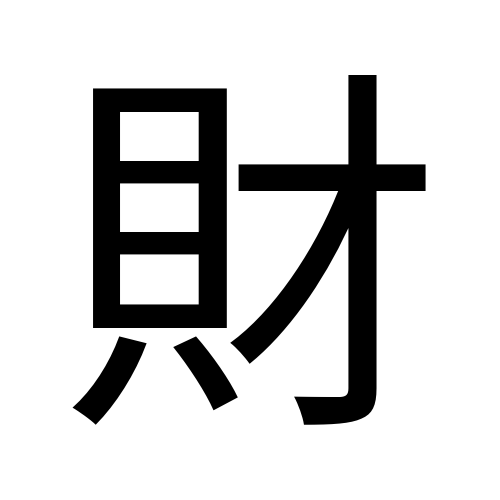 | Noto Sans TC 本機 render |
| 部首 | 貝部（部首編號 154） | 粵語審音配詞字庫／教育部重編國語辭典 |
| 部首外筆畫 | 3 畫 | 教育部重編國語辭典 |
| 總筆畫 | 10 畫 | 粵語審音配詞字庫／教育部重編國語辭典 |
| Unicode | U+8CA1 | 中大字庫／維基詞典 Unihan |
| 大五碼 | B05D | 粵語審音配詞字庫 |
| 倉頡碼 | 月金木竹（BCDH） | 粵語審音配詞字庫／中大字庫 |
| 四角號碼 | 6480.0 | 中大字庫 |
| 教部字號 | A03930 | 教育部異體字字典 |
| **粵音** | **coi4**（字音分類：**單讀音字**，無異讀） | 粵語審音配詞字庫（黃 p.37／周 p.167／李 p.21／何 p.266） |
| 國音 | ㄘㄞˊ cái | 教育部重編國語辭典（ID 9758） |
| 中古音 | 昨哉切；從母・全濁・齒音・**平聲**・蟹攝・咍韻・開口・一等 | 《廣韻》p.99（中大字庫） |
| 上古音 | **\*dzˁə**（{\*[dz]ˁə}） | 白一平-沙加爾(2011)，維基詞典轉載 |
| 異體字 | 财（簡化字）；維基詞典另列 㒲、才 | 維基詞典 |
| 使用頻率 | 頻序 A 619／B 1033；頻次 A 3885／B 718 | 中大字庫 |
| 英文義 | wealth, money; property; valuables; bribes | 中大字庫 |
| 其他頁碼 | 《漢語大字典》（一版）3624／（二版）3864；《康熙字典》1132；Matthews 6662 | 中大字庫 |

---

## 1. 結構層

### 1.1 字形演變

| 甲骨文 | 金文 | 大篆／籀文 | 簡帛（最早） | 小篆 | 楷書 |
|:---:|:---:|:---:|:---:|:---:|:---:|
| ✗ 無 | ✗ 無 | ✗ 無 | 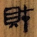 | 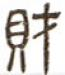 |  |

**【觀察】「財」是後起字，而且比「偉」還要晚。** 中大字庫「財」字條的甲骨欄與金文欄**都只有「部件樹」連結、沒有任何字例**，小篆 1 例、簡帛 15 例、其他 5 例。也就是說：**現存最早的「財」字形，是漢代的**——馬王堆帛書與北大漢簡。這與文獻情況形成落差：「財」在《墨子》《左傳》等先秦典籍裡早就用開，但**先秦的字形實物，在這個資料庫裡一個都沒有**。

> 與其他卡對比：「偉」連金文都沒有、最早是小篆；「靜」最早是西周金文；「發」由甲骨一路到金文都有。**「財」是六張卡裡字形記錄最晚的一隻。**

**其餘字形（全部親眼看過）：**

| 簡帛・馬王堆五十二病方 | 簡帛・馬王堆老子甲本 | 漢印・宜財 | 傳抄古文・集篆古文韻海 |
|:---:|:---:|:---:|:---:|
| 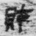 | 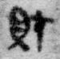 | 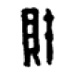 | 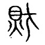 |
| 西漢 | 西漢 | 漢 | 傳抄 |

**【觀察】四種漢代寫法看到甚麼：**

- **北大漢簡．老子．193**：左右分明，左窄右寬。左邊「貝」是一個扁方框，框內兩橫把腹部分格，框下兩筆向下分開。右邊「才」是一橫加一條拉得很長的豎，豎的上端穿過橫畫。
- **馬王堆．五十二病方．24**：筆畫肥厚，**隸意最重**。「貝」的框壓得更扁，下面兩足縮成兩短撇；「才」的橫畫寫得很長並向右上挑，整個字呈橫勢——這正是隸書「橫張縱斂」的樣子。
- **馬王堆．老子甲本．146**：「貝」框內兩橫連成一筆，看起來像「日」加兩點；「才」的橫畫起筆重、收筆挑出，豎筆帶弧度。
- **漢印．宜財**：為了填滿印面，整個字被壓成**窄長方形**，筆畫粗肥、轉角方折。「貝」壓成一條窄框，「才」的豎筆拉得又直又長。這是繆篆的處理，不能當成日常寫法。
- **傳抄古文．集篆古文韻海**：**與其他幾種都不同**——左邊的「貝」不是方框，而是一個**圓形**，圓內兩橫，下面兩腳向外撇開；線條纖細婉轉。它把「貝」寫得比小篆更象形，但這是宋代以後傳抄的古文，**不是出土實物**，證據級別要與前面幾種分開看。

### 1.2 六書歸類 —— 無爭議

**【原文】《說文解字．貝部》**：「財，人所寶也。从貝，才聲。」〔昨哉切〕

**【原文】中大漢語多功能字庫略說**：「從「貝」，「才」聲。本義是財物。」

兩個來源完全一致：**形聲字，从貝，才聲**。沒有任何一家提出異議。

> 對比：「靜」有四家四說（見 [靜.md](靜.md) 1.2），「家」有三說並列。「財」沒有——因為它是後起的形聲字，造字意圖清楚，而且聲符「才」在字義上完全不參與。

### 1.3 部件分解

| 位置 | 部件 | Unicode | 獨立時是甚麼字 | 在「財」裡的角色 |
|---|---|---|---|---|
| 左 | 貝 | U+8C9D | **海貝**；古代用作貨幣 | **形符**（表意）：與財貨有關 |
| 右 | 才 | U+624D | 【分歧】草木初生（《說文》）／木樁、橛杙（陳劍） | **聲符**（表音）coi4 |

**部件字形對照（我看過的圖）：**

| | 甲骨文 | 金文 | 大篆 | 小篆 | 楷書 |
|---|:---:|:---:|:---:|:---:|:---:|
| **貝** | 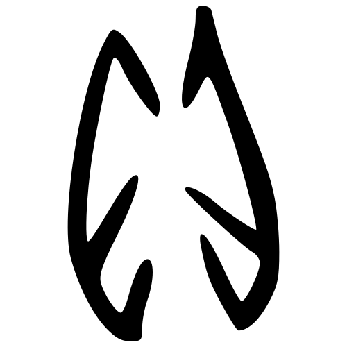 | 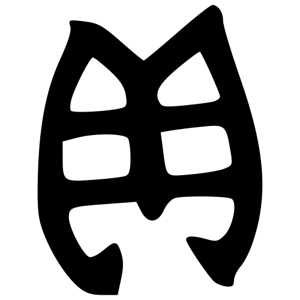 | 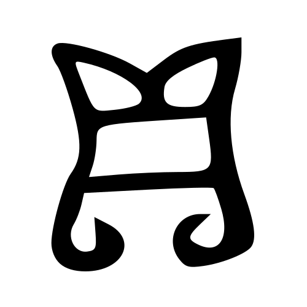 | 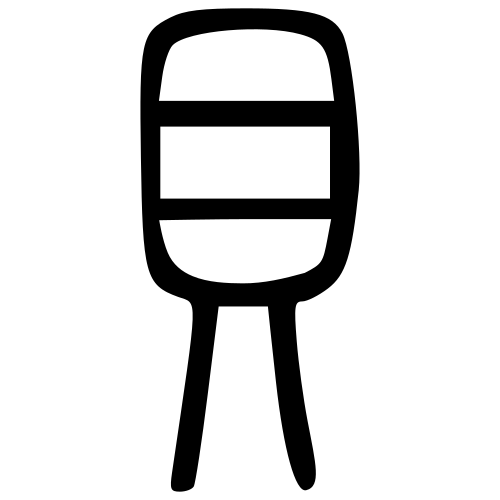 |  |
| **才** |  |  | 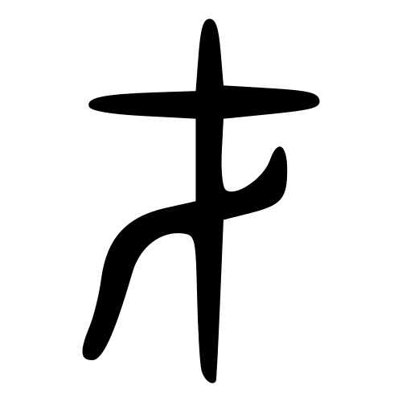 | 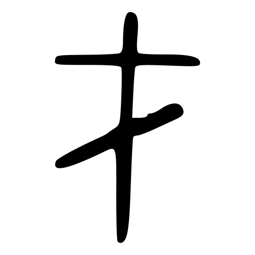 | 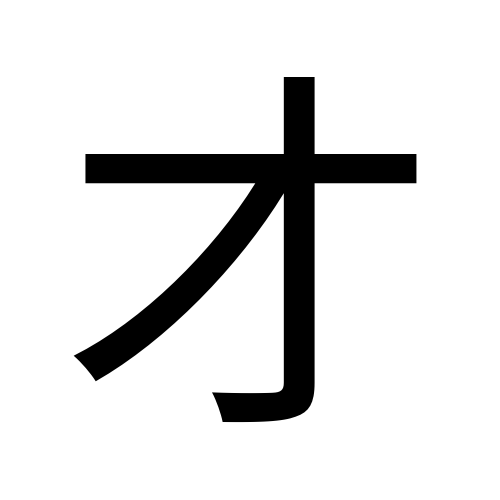 |

**【觀察】「貝」的四期演變：**

- **甲骨文**：一個上下尖、中間寬的橢圓輪廓，中央有一條縱向裂縫，裂縫兩側各有斜向短線——**海貝腹面那道開口和兩旁的齒紋**。整體像一枚立起來的貝殼。
- **金文**：輪廓變寬，上端裂成**兩個向外翹的尖角**；腹部用兩道橫線分成三格；下端兩側各伸出一小筆。
- **大篆**：上端兩角更誇張、向外翻捲；下端兩筆明顯向外撇出，末端帶圓鉤。
- **小篆**：**上方那兩隻角不見了，變成一個封閉的方框**，框內兩橫；下方兩條腳分開、細而直地垂下。
- **楷書**：框內兩橫定型為「目」形，下面兩腳收成一撇一點。

**【觀察】這一條正好印證中大字庫的說法。** 中大說「字形上方的角狀則在戰國時期逐漸綫條化，變成一橫筆」——我在圖上看到的，正是甲骨、金文、大篆三期都有的尖角，到小篆整個收成一條橫線、把上方封成方框。**文字描述與字形實物對得上。**

**【觀察】「才」的四期演變：**

- **甲骨文**：一條垂直長豎貫穿全字，上端露頭；豎的中上部橫過一道向兩邊張開、末端微微上翹的筆畫；橫豎相交處下方有一個**實心的倒三角小塊**。整體像一支**上端削尖、下端插進地裡的木樁**。
- **金文**：結構相同但更粗壯，橫畫成一條兩端上翹的弧線，中央相交處變成一團濃墨，豎筆下端收成尖鋒。
- **大篆**：橫畫變直並向右延長；中央那團墨**變成一條向左下彎出的鉤**，已經有今天「才」字那一撇的雛形。
- **小篆**：橫畫更長更平，中央的鉤成為一條自右上向左下的斜筆，與豎筆交叉。三筆結構定型。
- **楷書**：一橫、一豎鉤、一撇。

**【觀察】關於「才」的兩說，圖能說甚麼、不能說甚麼。** 《說文》講「从丨上貫一」（豎穿過一橫），這一點我在甲骨、金文、大篆、小篆**四期都看到了**，描述準確。但《說文》接着說「將生枝葉」「一，地也」，即把它解成草木從地面長出——**我看到的下端是收尖的，像要插進地裡，不像向下生根**，而橫豎相交處那個實心塊也不像枝葉。單看字形，陳劍「象木樁、橛杙」的講法與圖更貼近。**不過這只是我對圖的判讀，不是定論**，兩說都列出（見 1.6 與存疑 3）。

**【觀察】「財」的兩個部件，有沒有被壓縮或省略？**

我把「財」小篆左右兩半分別裁出來，與獨立的「貝」「才」小篆並排比對：

- **左半＝完整的「貝」**，結構逐件對得上：上面方框、框內兩橫分三格、下面兩腳。**但明顯被壓窄了**：獨立的「貝」方框接近正方、兩腳向外八字分開；「財」裡的「貝」框壓成窄長條，兩腳收攏、幾乎平行向下。
- **右半＝完整的「才」**，三筆結構（貫穿的長豎、上部橫畫、自右上向左下的斜筆）與獨立字**完全一致，沒有省略**。

> ⚠️ 這裡我改過一次判斷。第一次在原尺寸（65×75 像素）比對時，我以為「財」右半那條斜筆方向與獨立「才」相反；**放大並加強對比之後看清楚，兩者方向相同**，先前的印象是解析度太低造成的。記下來提醒自己：拓本或掃描圖太小的時候，不要在原尺寸下判斷筆畫走向。

**通則**：「貝」做左偏旁時壓窄、兩腳收攏；獨立時框闊、腳外撇。這與「豕」做左偏旁會壓窄的情況一致（見 [家.md](家.md) 1.4）。

### 1.4 部件橫向連結

**【原文】維基詞典「字形拆解／相關派生漢字」系列#0140（才）**：

> 才｜犲｜材｜财｜財｜豺｜釮｜鼒｜闭｜閉｜团

**【原文】維基詞典「字形拆解／相關派生漢字」系列#0056（貝）**，完整 30 字：

> 貝｜垻｜唄｜狽｜浿｜孭｜珼｜梖｜蛽｜賏｜鋇｜鼰｜郥｜敗｜鵙｜贁｜負｜貵｜筫｜賫｜賷｜齎｜贔｜閴｜屓｜賔｜貳｜鎻｜蕆｜濵

> ⚠️ 這兩張系列表是**按字形拆解**編的，不是按聲符編的。所以「閉」（《說文》以「才」為門閂，不表音）和「团」（「團」的簡化字，與「才」無關）也會列進「才」系。用的時候要自己再過濾一次。

「才」系裡真正以「才」為聲符的：

| 字 | 結構 | 才的角色 | 意思 |
|---|---|---|---|
| **才** | 獨體 | 本體 | 【分歧】草木初生／木樁 |
| **材** | 木 + 才 | **聲符** | 木料、原料、資質 |
| **財** | 貝 + 才 | **聲符** | 財物 |
| **豺** | 豸 + 才 | 聲符 | 豺狼 |
| **閉** | 門 + 才 | **不是聲符**（《說文》以為門閂） | 關閉 |

「貝」系的字，絕大多數都與**財貨、買賣、價值**有關：敗、負、貳、賏、齎…… 這正是中大字庫說的「因此從「貝」之字一般與財貨和買賣有關」。

**字形並排比對（楷書）：**

| 財 | 材 | 裁 | 貨 |
|:---:|:---:|:---:|:---:|
|  | 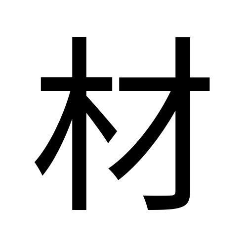 | 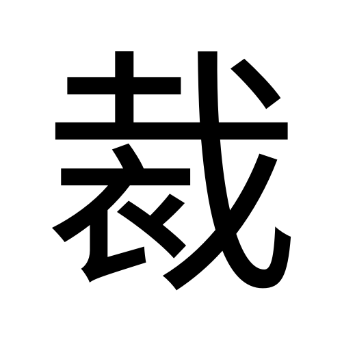 | 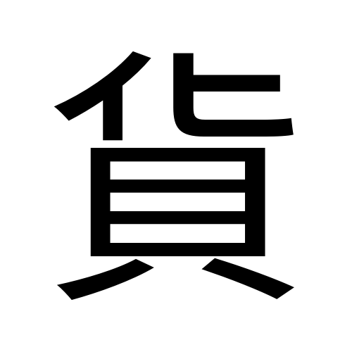 |
| 貝 + 才 | 木 + 才 | 衣 + 𢦏 | 貝 + 化 |

**【觀察】「財」與「材」是同一個造字公式換一個形符**：同一個聲符「才」，配「貝」就是財貨，配「木」就是木料。兩個字的右半在楷書裡逐筆相同。而「裁」的聲符是「𢦏」（戈 + 才），**隔了一層**，所以它不在「才」系的系列表內。

### 1.5 異體字

| 異體 | 結構差異 | 備註 |
|---|---|---|
| **财** | 贝 + 才 | 簡化字。「貝」簡化為「贝」，聲符不變 |
| **㒲** | 才 + 貝（上下或左右易位） | 維基詞典列為異體字 |
| **才** | — | 維基詞典列為異體字；即上面說的通假關係反過來被當成異體 |

教育部異體字字典列「財」為**正文字 A03930**，另有**附收字 3 個**（我未能取得字形，見第 6 節）。

### 1.6 部件總表（拆到獨體象形為止）

| 層級 | 部件 | 獨立時是甚麼字 | 一句字典義 | 粵音 | 出處 |
|---|---|---|---|---|---|
| 一級 | **貝** | 貝 | 【原文】「有甲殼的軟體動物」；古代用貝殼做貨幣，稱為「貝貨」；樂器名；貝多羅樹簡稱；姓；二一四部首之一 | bui3 | 教育部重編國語辭典 ID 174 |
| 一級 | **才** | 才 | 【原文】「天賦的能力、稟性」；力量智慧（通「材」）；有才能的人；方、始；僅 | coi4 | 教育部重編國語辭典 ID 9756 |

**兩個獨體終點**：貝（海貝之象形）、才（【分歧】草木初生之象形／木樁之象形）。兩個都親眼看過字形圖。

**注意**：「財」只有兩層，**是六張卡裡最淺的一隻**。「偉」要拆到囗、止；「靜」要拆到生、丹、井、又、力。「財」的兩個部件本身就是獨體象形，拆無可拆。

### 1.7 字族定位：兩條軸

> 這一節問的是：**「財」站在哪些家族裡？** 一個形聲字同時屬於兩個家族——
> 同形符的一族、同聲符的一族。拆開講每個部件是 1.3 的事。
> 反方向的問題（「財」自己做部件去了哪裡）在 1.8。

#### 一、組合方式

| 項目 | 內容 |
|---|---|
| 結構 | **左右**組合 |
| 比例 | 左右各佔約一半，左「貝」略窄（見 1.3 的並排比對） |
| 形符 | 左・**貝**（圈定範圍：與財貨有關） |
| 聲符 | 右・**才**（只表音，不表意） |
| 層數 | **一層**。貝、才本身都是獨體象形，拆無可拆 |
| 有無省形 | **沒有**。兩個部件都是完整形態，只有「貝」被壓窄 |

**與其他卡對比層數**：「財」一層；「偉」兩層（韋＝囗＋止）；「靜」兩層（青＝生＋丹，爭＝又＋又＋力）；「發」兩層（癹＝癶＋殳）。**「財」是七張卡裡組合最淺的一隻。**

#### 二、兩條軸

一個形聲字同時屬於兩個家族。把「財」放在交叉點上看：

**橫軸 —— 同形符「貝」，換聲符**（全部【原文】《說文》）：

| 字 | 組合 | 《說文》 | 粵音（審音配詞字庫） |
|---|---|---|---|
| **財** | 貝＋**才** | 【原文】「人所寶也。从貝，才聲。」 | coi4 |
| **貨** | 貝＋**化** | 【原文】「財也。从貝，化聲。」 | fo3／fo6 |
| **賄** | 貝＋**有** | 【原文】「財也。从貝，有聲。」 | fui2／kui2 |
| **資** | 貝＋**次** | 【原文】「貨也。从貝，次聲。」 | zi1 |
| **販** | 貝＋**反** | 【原文】「買賤賣貴者。从貝，反聲。」 | faan3／faan5 |
| **購** | 貝＋**冓** | 【原文】「以財有所求也。从貝，冓聲。」 | gau3／kau3 |

**縱軸 —— 同聲符「才」，換形符**：

| 字 | 組合 | 《說文》 | 粵音 |
|---|---|---|---|
| **財** | **貝**＋才 | 【原文】「人所寶也。从貝，才聲。」 | coi4 |
| **材** | **木**＋才 | 【原文】「木梃也。从木，才聲。」 | coi4 |
| **豺** | **豸**＋才 | 【原文】「狼屬，狗聲。从豸，才聲。」 | **caai4** |
| 閉 | **門**＋才 | 《說文》以「才」為門閂，**不是聲符** | bai3 |
| 裁 | **衣**＋𢦏（𢦏 从才聲） | 【原文】「制衣也。」**隔一層** | coi4 |

#### 三、這個交叉點告訴我們甚麼

**1. 兩條軸長短懸殊。** 「貝」是極能產的形符，《說文》貝部收字極多，上表只是抽樣；「才」是弱聲符，真正以它為聲符的派生字**只有材、財、豺三個**（「閉」的「才」不表音，「裁」隔了一層）。**同一個字，一邊站在大家族裡，另一邊站在小家族裡。**

**2. 橫軸上，《說文》是互訓的。** 這是做組合分析才看得出來的東西：

```
財 →「人所寶也」
貨 →「財也」      ┐
賄 →「財也」      ├─ 都指回「財」
資 →「貨也」      ┘ 指向「貨」，而「貨」又指回「財」
```

**四個字互相定義，繞成一個圈，誰都沒有給出一個獨立於其他三個的定義。** 也就是說：「貝」這個形符圈出了一個範圍，範圍之內的字**靠彼此區分，而不是靠各自的定義**。真正把它們分開的是用例（王鳳陽指出先秦「財」偏指衣食所需），不是訓詁。

> 對比橫軸的另外兩個：「販」（買賤賣貴者）和「購」（以財有所求也）**有獨立定義**，因為它們是動作，不是物。**同一個形符之下，名詞互訓、動詞各自獨立。**

**3. 縱軸上，讀音已經分家。** 「材」「財」今讀 coi4，但「豺」讀 **caai4**（《廣韻》士皆切，與「財」的昨哉切不同韻）。**同一個聲符，今天已經帶不出同一個音。** 這與「偉／韋」只差一個聲調、「靜／爭」完全讀不到一起，構成三種不同程度的聲符失效。

**4. 「財」與「材」是同一條公式換一個形符。** 兩者《說文》的句式完全平行——「材，木梃也。从木，才聲」／「財，人所寶也。从貝，才聲」。**同一個聲符配木就是木料，配貝就是財貨。** 這是形聲造字最乾淨的示範，也解釋了為甚麼兩者在文獻裡可以通假（見 3.1）。

**【觀察】楷書並排（我看過的圖）：**

| 財 | 材 | 裁 | 貨 |
|:---:|:---:|:---:|:---:|
|  |  |  |  |
| 貝 + 才 | 木 + 才 | 衣 + 𢦏 | 貝 + 化 |

「財」與「材」的右半在楷書裡**逐筆相同**；「裁」的「才」被包在「𢦏」裡面、再被「衣」拆開，已經看不出是同一個聲符；「貨」與「財」的左半「貝」寫法完全一樣，只是「貨」的「貝」在下、「財」的「貝」在左——**同一個部件，位置變了，形態也跟著變**（見下）。

#### 四、部件在別的字裡的位置與變形

| 位置 | 例字 | 「貝」的形態 |
|---|---|---|
| **左**（偏旁） | **財**、販、購、賄 | **壓窄**，兩腳收攏幾乎平行 |
| **下**（字底） | 貨、買、賞、貴 | 保持較闊，兩腳可以向外撇 |
| **右** | 則、敗 | 壓窄，同做左偏旁相似 |

**【觀察】** 這與「豕」的情況一致：做左右偏旁要壓窄，做上下部件可以保持完整形態（見 [家.md](家.md) 1.4）。**這是漢字方塊字框架下的通則，不是「貝」獨有。**

#### 五、換位異體

維基詞典列「**㒲**」為「財」的異體字，即「才」與「貝」**易位**。這說明在某些寫法裡，左右兩個部件的位置**不是固定的**——形符在左還是在右，並不影響字的身分。同類情況如「群／羣」「峰／峯」。

> ⚠️ 我沒有取到「㒲」的字形圖，也沒有找到它的使用書證，只有維基詞典一條列舉（見存疑 10）。

### 1.8 這個字做部件時

> 1.7 問「財」站在哪些家族裡（向上、向旁）。這一節問**反方向**：
> **「財」自己做部件，走進了哪些字？**

#### 一、答案：幾乎沒有

用 CHISE 漢字部件分解資料庫（IDS，共 88,939 條）逐條檢查，
分解式裡直接含「財」的字**只有兩個**：

| 字 | Unicode | 分解 | 釋義 |
|---|---|---|---|
| **𣺠** | U+23EA0 | ⿰氵財 | **無**（維基詞典無條目，Unihan 無 kDefinition） |
| **𫞭** | U+2B7AD | ⿸疒財 | **無**（同上） |

兩個都在 CJK 擴展區，都是字書裡的影子字——**沒有釋義、沒有書證、日常不會遇到**。

#### 二、對比：它自己的部件走得多遠

同一個資料庫、同一個數法：

| 部件 | 進入幾多個字 | 說明 |
|---|---:|---|
| **貝** | **685** | 極能產的形符。財、貨、賄、資、販、購、買、賣、賞、貴…… |
| **才** | **39** | 中等。材、財、豺、閉…（當中不少是字形巧合，見 1.4 的提醒） |
| **發** | 32 | 廢、撥、潑、醱、鏺…（見 [發.md](發.md)） |
| **爭** | 30 | 淨、竫、諍… |
| **靜** | 7 | 瀞，其餘六個都在擴展區 |
| **青** | 108 | 清、情、精、請、晴、靜… |
| **財** | **2** | 兩個都無釋義 |

**「財」由兩個能產的部件造出來，自己卻是一個終點。**

#### 三、這說明甚麼

- **造字是有方向的。** 「貝」「才」是零件，「財」是成品；成品一般不再做零件。這在漢字裡是常態，不是「財」的特例。
- **但程度差很遠。**「發」同樣是成品，卻仍然生出 32 個字，其中「廢」「撥」「潑」都是常用字。所以「成品不再造字」只是傾向，不是規律。
- **可能的原因（我的推測，非考據）**：「財」本身已經是「形符＋聲符」的完整組合，筆畫多、結構滿；再加一個形符會變得臃腫。而「發」雖然也是組合字，但它表示一個**動作**，動作容易再細分（撥、潑、廢都是動作的分支），所以還有造字空間。**這一條我沒有任何文字學論著支持，只是觀察到的落差加上一個解釋，見存疑 12。**

**對術數層的意義**：如果你要找「財」這個部件在別的字裡帶甚麼意思，**答案是它幾乎不出現在別的字裡**。要往下追，應該追它的部件「貝」（685 個字，全部與財貨買賣有關），不是追「財」本身。

---

## 2. 意思層

### 2.1 整個字查字典

| 字典 | 原文／義項 |
|---|---|
| **《說文解字．貝部》** | 【原文】「財，人所寶也。从貝，才聲。」〔昨哉切〕 |
| **中大漢語多功能字庫** | 【原文】「從「貝」，「才」聲。本義是財物。」 |
| **《周禮．地官．大司徒》鄭玄注** | 【原文】「財，謂泉穀。」 |
| **教育部重編國語辭典**（ID 9758） | 見下 |

**【原文】教育部重編國語辭典 ㄘㄞˊ（貝部+3畫 共10畫・常用字）：**

| 詞性 | # | 意思 | 書證 |
|---|---|---|---|
| 名 | 1 | **金玉、布帛、粟米等錢幣貨物的總稱** | 如「理財」「生財有道」。《禮記．聘義》「此輕財而重禮之義也。」《三國志．卷二四．魏書．高柔傳》「夫農廣則穀積，用儉則財畜。」 |
| 名 | 2 | **才能。通「才」** | 《孟子．盡心上》「有成德者，有達財者。」 |
| 動 | — | **裁斷。通「裁」** | 《荀子．天論》「財非其類以養其類，夫是之謂天養。」《史記．卷一〇七．魏其武安侯傳》「所賜金…輒令財取為用。」 |
| 副 | — | **僅。通「纔」** | 《史記．卷一〇．孝文本紀》「太僕見馬遺財足，餘皆以給傳置。」《漢書．卷五四．李廣傳》「初，上遣貳師大軍山，財令陵為助兵。」 |

**中大字庫另外補一個通假：通「材」。**【原文】《逸周書．太子晉》「分均天財」，朱右曾集訓校釋：「財與材通。」又《禮記．祭法》：「山林、川谷、丘陵，民所取財用也。」北大漢簡《老子．六十八章》簡193：「物無棄財（材）。」

**中大字庫引王鳳陽的重要提醒**：【原文】「先秦時的「財」內涵較後代為小，主要指人的衣食所需。」書證如《墨子．尚賢下》「不若其親一危弓、罷馬、衣裳、牛羊之財與？」〈明鬼下〉「是以不共其酒醴、粢盛、犧牲之財」。「財」是**後來才擴大成為物資和貨幣的總稱**。

**配搭點**（中大字庫）：帛、產、錢、閥、富、摟、理、勞、掊、破、徇、貪、仗、斂 → 財帛、財產、錢財、財閥、財富、理財、斂財
**成語**：仗義疏財、勞民傷財、愛財如命、見財起意、謀財害命（中大字庫收 135 條）

### 2.2 部件逐個查字典

**貝（U+8C9D）**

| 字典 | 內容 |
|---|---|
| 《說文解字》 | 【原文】「貝，海介蟲也。居陸名猋，在水名蜬。象形。古者貨貝而寶龜，周而有泉，至秦廢貝行錢。凡貝之屬皆从貝。」〔博蓋切〕 |
| 教育部重編國語辭典（ID 174） | 【原文】「有甲殼的軟體動物。如蛤類、螺類等」；「古代用貝殼做貨幣，稱為『貝貨』」；樂器名；貝多羅樹簡稱；姓；部首 |
| 中大字庫略說 | 【原文】「甲金文象貝殼之形。」 |
| 中大字庫詳解 | 【原文】「古人以「貝」為貨幣。因此從「貝」之字一般與財貨和買賣有關。」又：西周金文「貝」字下引出兩短豎筆，字形上方的角狀則在戰國時期逐漸綫條化，變成一橫筆 |
| 郭沫若（中大轉引） | 【原文】「古人最初用貝殼為頸飾，後來才演化為貨幣。」 |

→ **貝 ＝ ①海貝（本義）→ ②貨幣 → ③從貝之字多與財貨有關**。「財」用的是第三層。

> 中大另提兩個容易混的地方：甲骨文「貝」與「心」形近；金文「貝」與「鼎」易混。

**才（U+624D）**

| 字典 | 內容 |
|---|---|
| 《說文解字》 | 【原文】「才，艸木之初也。从丨上貫一，將生枝葉。一，地也。凡才之屬皆从才。」【徐鍇曰：上一，初生歧枝也；下一，地也。】〔昨哉切〕 |
| 中大字庫略說 | 【原文】「「才」字《說文》指種子破土而出。陳劍認為「才」、「弋」本一字，象木橛，在古文字中借來表示「在」，指所在、存在，引申為剛才。」 |
| 中大字庫詳解 | 【原文】「現代學者多認為甲金文「才」象木樁、橛杙之形。」又：「才」與「弋」（「杙」的初文）是一字之分化；後被借來表示存在動詞，並疊加「士」為聲符而造「在」字 |
| 教育部重編國語辭典（ID 9756） | 【原文】「天賦的能力、稟性」；力量智慧（通「材」）；有才能的人；方、始；僅 |

→ **才 ＝【分歧】①草木初生（《說文》）／②木樁橛杙（陳劍等）→ 借為「在」→ 引申「剛才」→ 今義「才能」**。

**⚠️ 注意一件容易搞混的事**：教育部辭典給「才」的第一個義項是「天賦的能力」，但這是**後起義**，不是本義。如果拿這個義項去解「財」的結構，就會得出「有才能所以有錢」——這正是下面 2.3 要防的附會。

### 2.3 結構 → 意思推導鏈

```
【字形】 貝（形符）+ 才（聲符）
   │
   ├─ 形符「貝」：海貝 → 貨幣 → 圈定範圍＝同財貨有關
   │
   └─ 聲符「才」：coi ── 只表音，不表意
                    │
                    ↓
              【本義】人所寶也 ← 《說文》
                    │
                    ↓
              【先秦】範圍較窄：衣食所需（王鳳陽）
                    │
                    ↓
              【後代】擴大為物資和貨幣的總稱 ←《周禮》鄭注「財，謂泉穀」
                    │
      ┌─────────────┼─────────────┬─────────────┐
      ↓             ↓             ↓             ↓
  通「才」        通「材」        通「裁」       通「纔」
  才能            木料原料        裁斷節制       僅、只
```

**每一步的根據：**
- 「貝＝形符」← 《說文》「从貝」＋ 中大字庫略說，兩家一致
- 「才＝聲符」← 《說文》「才聲」＋ 中大字庫略說，兩家一致
- 「本義＝人所寶」← 《說文》
- 「先秦範圍較窄」← 王鳳陽（中大字庫轉引），有《墨子》兩條書證
- 四個通假 ← 教育部辭典三條（才、裁、纔）＋ 中大字庫一條（材），全部有書證

**⚠️ 要提防的推論：** 因為「才」在這裡是**純聲符**，所以**不可以**說「財＝貝＋才＝有才能就有財」，也**不可以**說「財要靠才」。字典層面，「才」對「財」的意思**沒有貢獻**。（但同音層另有發現，見 3.3 與 4.3。）

---

## 3. 同音層（粵音 coi4）

**【原文】粵語審音配詞字庫 coi4 全部同音同調字（5 個）：**

> 才、材、財、纔、裁

**這是本 project 至今遇過最小的一個同音集合**（對比：「偉」wai5 有 28 個，「靜」zing6 有 11 個）。

### 3.1 同音同調字表

**關係類別**四選一：同源（同聲符）｜通假／聲訓（文獻有記）｜民俗諧音（有出處）｜純諧音（只是讀音相撞）

#### A 組：同源 —— 共用「才」聲符（3 個）

| 同音字 | 字典義（一句） | 《說文》 | 關係類別 | 來源 |
|---|---|---|---|---|
| **才** | 天賦的能力、稟性；方始；僅 | 【原文】「艸木之初也。从丨上貫一，將生枝葉。一，地也。」〔昨哉切〕 | **同源＋通假**（教育部辭典明記「財，通『才』」，《孟子．盡心上》） | 教育部 ID 9756 |
| **材** | 木料、原料、資質、有才能的人 | 【原文】《說文》未見於本次查證；教育部辭典引《孟子．梁惠王上》「材木不可勝用也」 | **同源＋通假**（中大字庫：「財與材通」，《逸周書》朱右曾集訓校釋） | 教育部 ID 9757 |
| **裁** | 剪裁、削減、決斷、控制 | 【原文】「裁，制衣也。」（教育部辭典引《說文解字．衣部》） | **同源（隔一層）＋通假**（教育部辭典：「財，通『裁』」，《荀子．天論》） | 教育部 ID 9759 |

> 「裁」从「衣」、「𢦏」聲，而「𢦏」从「戈」、「才」聲——**隔了一層**，所以維基詞典的「才」系列表沒有收它。它與「財」同音，是這條間接聲符鏈的結果。

#### B 組：純諧音（不同聲符，1 個）

| 同音字 | 字典義（一句） | 聲符 | 關係類別 | 來源 |
|---|---|---|---|---|
| **纔** | 方、始、剛剛；僅、只 | **毚** | **純諧音＋通假**（教育部辭典：「財，通『纔』」，《史記．孝文本紀》） | 教育部 ID 9760 |

**五個字裡，三個直接同源、一個隔一層同源、一個純諧音。**
**而四個非「財」的字，全部都是「財」的通假對象——一個不多，一個不少。**

### 3.2 同音異調字（coi 系其他聲調，只列名，不引申）

**coi1**（陰平）：啋

**coi2**（陰上）：採、彩、采、綵、睬、茞、寀、跐、跴、婇

**coi3**（陰去）：賽、菜、塞、蔡、埰、縩、棌、采、寀

**coi5／coi6**：**有音無字**（粵語審音配詞字庫原文）

> ⚠️ 留意：coi2 與 coi3 幾乎全是「**采**」系（採、彩、綵、睬、埰、棌、寀），而 coi4 幾乎全是「**才**」系。**整個 coi 音節由兩個聲符家族瓜分**，中間沒有交叉。

### 3.3 引申

> 以下全部是【引申】＝同音推想，**不是字典考據**。拿去用之前請先看清楚類別。

**由 A 組（同源）出發——有聲符關係撐住，最實：**

- 【引申】財 ↔ **才**（才能）。→ 可引申為：**才能就是一個人身上的財產**。這一條在**文獻上是通假關係**（《孟子》「有達財者」），所以它不只是諧音，是古人真的這樣互寫。但要分清楚：通假是**借字**，不等於兩個字意思相同。
- 【引申】財 ↔ **材**（木料、原料）。→ 可引申為：**財是可供取用的材料**。同樣有通假書證（《禮記．祭法》「民所取財用也」）。
- 【引申】財 ↔ **裁**（裁斷、節制、削減）。→ 可引申為：**有財就要懂得節制分配**。《荀子．天論》「財非其類以養其類」正是「量度而分配」的意思。這一條把「財」由名詞拉去動詞，是四個裡面最有戲的一條。
- 【引申】財 ↔ **纔**（僅、只）。→ **反向引申**：**財再多，用起來也只是「僅僅夠」**。純諧音而已，但「財」與「纔」在《史記》《漢書》裡真的互寫。

**由部件出發（不是同音，是結構）：**

- 【引申】「財」的形符是一枚**海貝**。→ 可引申為：**財的原型是一件從海裡撿回來、本身不能吃不能穿的東西**——它的價值完全來自眾人同意。這一條的根據是「貝」的字形與《說文》「古者貨貝而寶龜」，**屬結構層而非同音層**，但它是這張卡最值得想的一點。

---

## 4. 交叉核對

### 4.1 結構 ↔ 意思：推導鏈有沒有斷？

**沒有斷，但只走了一半。**

- 「貝」→「與財貨有關」：**通**。「財」的全部本義與引申義（財物、物資、貨幣）都在「貝」圈定的範圍內，形符落實了。
- 「才」→ 意思：**空白**。兩家字典都說是純聲符，沒有一家說它表意。
- **結論**：「財」是典型的形聲字，**結構解釋到「甚麼範圍」，解釋不到「具體是甚麼」**。由「貝」推不出「人所寶也」這個具體定義——貨、賄、賂、贓、賞也都从貝。

> 與「偉」的情況幾乎一樣（見 [偉.md](偉.md) 4.1）：形符只圈範圍，聲符是啞的，本義要靠書證。但「財」比「偉」好一點——「偉」的形符「人」範圍極寬，「貝」的範圍窄得多。

### 4.2 字典 ↔ 字典：有沒有打架？

**「財」本身：零衝突。** 說文、中大、教育部三家都說「从貝，才聲」，本義「財物」。

**但兩個部件各有各的爭議：**

| | 《說文解字》 | 現代古文字學界（中大轉引） |
|---|---|---|
| **貝** | 海介蟲也。象形 | 象貝殼之形（一致，**沒有衝突**） |
| **貝的用途** | 古者貨貝而寶龜 | 郭沫若：**最初是頸飾**，後來才變貨幣（**次序不同**） |
| **才** | 艸木之初也，从丨上貫一 | 陳劍等：**象木樁、橛杙**，與「弋」本一字（**完全不同**） |

**【分歧】兩處**：

1. **「貝」是先做飾物還是先做貨幣。** 《說文》「古者貨貝而寶龜」直接說貝是貨幣；郭沫若認為先是頸飾。這個分歧**不影響「財」的解讀**——無論哪一說，到造「財」字的時候，「貝」已經是財貨的代表。
2. **「才」的本義。** 《說文》草木初生 vs 陳劍木樁橛杙。這個分歧**同樣不影響「財」**——因為「才」在「財」裡只表音。

> **這正是「財」與「靜」最大的分別。**「靜」的兩個部件都能表音，所以「誰表意」的分歧直接動搖整個字的解讀（見 [靜.md](靜.md) 4.1）。「財」的分工清楚，部件自己的爭議被隔離在外，傳不到「財」身上。

**還有一處值得記下的資料落差**：中大字庫的字形資料裡，「財」**最早只到漢代**；但同一個資料庫的詳解引的書證，《墨子》《左傳》都是**先秦**。**文獻用例比字形實物早了幾百年。** 這是資料庫收錄範圍的問題，還是「財」真的晚出，我無法判斷（見存疑 2）。

### 4.3 同音 ↔ 結構：四個通假對象，剛好就是四個同音字

**這一節是本卡最硬的一段。**

**1. coi4 只有五個字，而「財」通假了其餘全部四個。**

| 同音字 | 是不是「才」系 | 「財」有沒有通假過去 | 書證出處 |
|---|:---:|:---:|---|
| **才** | ✓ 直接 | ✓ | 《孟子．盡心上》（教育部辭典） |
| **材** | ✓ 直接 | ✓ | 《逸周書．太子晉》朱右曾集訓校釋（中大字庫） |
| **裁** | ✓ 隔一層（𢦏） | ✓ | 《荀子．天論》（教育部辭典） |
| **纔** | ✗ 毚聲 | ✓ | 《史記．孝文本紀》（教育部辭典） |

**四個全中。** 通假本來就靠讀音相同，所以「通假對象是同音字」不奇怪；**奇怪的是沒有漏網**——這五個字在漢代構成一個高度互通的小集合。

**2. 反過來看，通假的方向也不是單向的。** 「材」也通「裁」（教育部辭典：材，處置、安排，通「裁」，《國語．鄭語》），「裁」也通「纔」（《戰國策．燕策一》「雖大男子，裁如嬰兒」）。**五個字互相之間至少有六組通假關係。**

**3. 「纔」是唯一一個外人，但它借得最徹底。** 「纔」的《說文》本義是帛的一種顏色，與「財」毫無關係，聲符也不同（毚）。但今天我們寫「剛才」的「才」，**本字正是「纔」**——它被「才」取代了。也就是說：**這個小集合裡讀音最像、意思最無關的一個，反而被吸收得最完全。**

**4. 上古音佐證。** 白一平-沙加爾(2011)：「財」\*dzˁə，「才」\*dzˁə（帶 \*(Cə.) 前綴）。**兩者聲母、韻母完全相同**，只差一個前置成分。這是「才」做「財」聲符的直接音理證據。

> ⚠️ 我只取到白沙一套。鄭張尚芳那一套我在維基詞典「財」條沒有找到（「貝」條有鄭張的貝系表，「才」條沒有）。所以這個對比**沒有第二套系統可以核對**（見存疑 4）。

### 4.4 一句總結

**「財」最硬的證據鏈：** 貝（形符・海貝→貨幣）+ 才（聲符・\*dzˁə，只表音）→ 本義「人所寶也」（《說文》）→ 先秦指衣食所需（王鳳陽）→ 後代擴大為物資貨幣總稱。**結構解釋到「與財貨有關」，解釋不到「人所寶」這個具體定義。** 兩個部件自己都有本義爭議，但因為分工清楚（一個表意一個表音），爭議都傳不到「財」身上。**最值得拿去用的一點：粵音 coi4 只有五個字，而「財」通假了其餘四個，一個不多一個不少。**

---

## 5. 來源清單

| # | 來源 | URL／位置 |
|---|---|---|
| 1 | 中大漢語多功能字庫 · 財 | https://humanum.arts.cuhk.edu.hk/Lexis/lexi-mf/search.php?word=財 |
| 2 | 中大漢語多功能字庫 · 貝 | https://humanum.arts.cuhk.edu.hk/Lexis/lexi-mf/search.php?word=貝 |
| 3 | 中大漢語多功能字庫 · 才 | https://humanum.arts.cuhk.edu.hk/Lexis/lexi-mf/search.php?word=才 |
| 4 | 粵語審音配詞字庫 · 財 | https://humanum.arts.cuhk.edu.hk/Lexis/lexi-can/search.php?q=%B0%5D |
| 5 | 粵語審音配詞字庫 · coi4／coi1／coi2／coi3／coi5／coi6 同音字 | https://humanum.arts.cuhk.edu.hk/Lexis/lexi-can/pho-rel.php?s1=c&s2=oi&s3=4 |
| 6 | 教育部重編國語辭典 · 財 | https://dict.revised.moe.edu.tw/dictView.jsp?ID=9758 |
| 7 | 教育部重編國語辭典 · 才／材／裁／纔／貝 | ID 9756／9757／9759／9760／174 |
| 8 | 教育部異體字字典 · 財 A03930 | https://dict.variants.moe.edu.tw/search.jsp?QTP=0&WORD=財 |
| 9 | 維基詞典 · 財（白一平-沙加爾上古音、系列#0140） | https://zh.wiktionary.org/wiki/財 |
| 10 | 維基詞典 · 貝（鄭張尚芳貝系表、系列#0056） | https://zh.wiktionary.org/wiki/貝 |
| 11 | 維基詞典 · 才 | https://zh.wiktionary.org/wiki/才 |
| 12 | 字形圖 · 財（小篆、簡帛、漢印、傳抄古文） | 中大字庫原圖：kangxiArchaic.php／silk／archaic 各條，出處已逐張標明 |
| 13 | 字形圖 · 貝／才 各期 | Wikimedia Commons `貝-oracle/bronze/bigseal/seal.svg`、`才-oracle/bronze/bigseal/seal.svg` |

楷書圖：本機用 Noto Sans TC render（`fonts/NotoSansTC-Regular.otf`）。

---

## 6. 存疑／未驗證

1. **教育部異體字字典的 3 個附收字我取不到。** 查詢結果頁明確顯示「正文 1 字，附收字 3 字」，但附收字清單由 JavaScript 另外載入，我只取到正文一條（財 A03930）。所以 1.5 節的異體字表**只有簡化字「财」與維基詞典所列的「㒲」「才」**，未必齊全。
2. **「財」的字形記錄只到漢代，這一點只憑中大字庫一個資料庫。** 該庫甲骨欄與金文欄都沒有字例，簡帛最早是馬王堆與北大漢簡（西漢）。但**文獻用例（《墨子》《左傳》）是先秦的**。究竟是「財」真的晚出，還是這個資料庫沒有收到戰國的字例，我**沒有用第二個資料庫核對過**，不應當作定論。
3. **「才」的本義我傾向陳劍一說，但這只是我對圖的判讀。** 1.3 節我寫「下端收尖、像要插進地裡」，是看圖得出的印象，不是文字學論證。《說文》「从丨上貫一」在圖上確實成立。兩說我都列出，沒有替讀者決定。
4. **上古音只取到白一平-沙加爾一套。** 維基詞典「財」條只有白沙 2011，沒有鄭張尚芳。所以 4.3 第 4 點的「聲母韻母完全相同、只差前置成分」**沒有第二套構擬可以核對**。
5. **王鳳陽「先秦內涵較小」是經中大字庫轉引**，我未查原書。書證（《墨子》兩條）是中大字庫所引。
6. **《說文》「材」條我未取得原文。** 3.1 表中「材」一欄我只能引教育部辭典所引的《孟子》，沒有《說文》原文可對。
7. **「纔」被「才」取代**這一點（4.3 第 3 點）是常識性陳述，我沒有引任何一家文字學論著作背書，只有教育部辭典把「纔」與「才」的義項並列可以旁證。
8. **傳抄古文那一張（集篆古文韻海）不是出土實物**，是宋代以後傳抄的字書材料。我在 1.1 已標明，但使用時要與馬王堆、北大漢簡那幾張分開看待。
9. **「㒲」我只有維基詞典一條列舉。** 1.7 第五節說它是「才」「貝」易位的異體，
   但我**沒有取得它的字形圖，也沒有找到使用書證**。換位這件事本身是合理的（群／羣同類），
   但「㒲」這個具體例子的證據只有一條。
10. **1.7 兩條軸上的字是抽樣，不是窮盡。** 「貝」部字極多，我只取了《說文》有明確
   「从貝，X聲」的六個；「才」聲系我取了維基詞典系列#0140 過濾之後的全部。
   說「才的派生字只有材、財、豺三個」，指的是**這個系列表過濾後的結果**，
   不是查遍所有字書的結論。
11. **1.8 的數字全部來自 CHISE IDS 一個資料庫。** 數法是「分解式直接含該字」，
   不展開巢狀分解。換一個資料庫或換一個數法，數字會不同。
   我沒有用第二個來源核對過，但兩個數量級的落差（685 vs 2）不會因為數法而翻轉。
12. **1.8 第三節那個「動作容易再細分」的解釋是我自己的推測**，
   沒有任何文字學論著支持。數字是事實，解釋不是。
13. **「閉」「团」不屬「才」聲系**，是我依《說文》與簡化字來歷判斷後從系列表剔除的，未逐字查證每一個系列表成員。
