# 靜

> 字卡格式 v2：**結構層**（怎麼組成）→ **意思層**（怎麼解釋）→ **同音層**（粵音怎麼相通）→ **交叉核對**。
> 標記：`【原文】`＝字典／古籍原文照抄 ｜ `【觀察】`＝我親眼看過字形圖之後寫的 ｜ `【分歧】`＝各家講法不一 ｜ `【引申】`＝同音推想，**不是考據**
>
> ※ 本卡依用戶指定，內文改用**中文現代書面語**撰寫（其餘字卡為廣東話）。專有名詞、古籍引文一律保持原文。

---

## 0. 基本資料

| 項目 | 內容 | 來源 |
|---|---|---|
| 楷書 | 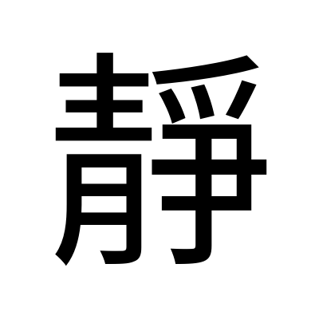 | Noto Sans TC 本機 render |
| 部首 | 青部（部首編號 174） | 粵語審音配詞字庫／教育部重編國語辭典 |
| 部首外筆畫 | 8 畫 | 教育部重編國語辭典 |
| 總筆畫 | 16 畫 | 粵語審音配詞字庫／教育部重編國語辭典 |
| Unicode | U+975C | 粵語審音配詞字庫／維基詞典 Unihan |
| 大五碼 | C052 | 粵語審音配詞字庫 |
| 倉頡碼 | 手月月尸木（QBBSD） | 粵語審音配詞字庫／維基詞典 |
| 四角號碼 | 5225.7 | 維基詞典 |
| 教部字號 | A04502 | 教育部異體字字典 |
| **粵音** | **zing6**（字音分類：**單讀音字**，無異讀） | 粵語審音配詞字庫（黃 p.28／周 p.192／李 p.174,205／何 p.203） |
| 國音 | ㄐㄧㄥˋ jìng | 教育部重編國語辭典（ID 5973） |
| 中古音 | 疾郢切；從母・全濁・齒音・**上聲**・梗攝・清／靜韻・開口・三等 | 《廣韻》p.317（中大字庫） |
| 上古音 | **\*zleŋʔ** | 鄭張尚芳(2003)，維基詞典「青」條轉載 |
| 異體字 | 静（日本新字體／中國大陸印刷體）；維基詞典另列 靖、竫、竧、𩇕、㣏、𫕼、靚 | 維基詞典 |
| 使用頻率 | 頻序 894／頻次 2203 | 中大字庫 |
| 英文義 | quiet, still, motionless; gentle | 中大字庫 |
| 其他頁碼 | 《漢語大字典》p.4049；《康熙字典》p.1310.030 | 中大字庫 |

---

## 1. 結構層

### 1.1 字形演變

| 甲骨文 | 金文 | 大篆／籀文 | 小篆 | 楷書 |
|:---:|:---:|:---:|:---:|:---:|
| ✗ 無 | 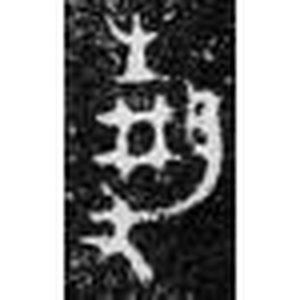 | ✗ 無 | 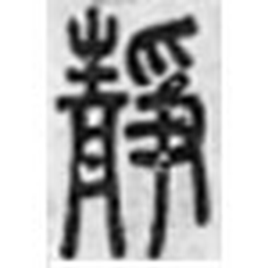 |  |

**【觀察】「靜」有金文、沒有甲骨文。** 中大字庫「靜」字條的甲骨欄**完全空白**（我逐段檢查過 HTML，甲骨那一格沒有任何字例），金文欄則有 **10/23 例**，簡帛 15/22 例，其他（傳抄古文）2/2 例，小篆 2/2 例。也就是說：**「靜」這個字目前所見最早出現在西周金文**，要再往上追，必須拆開來經「青」和「爭」去追——這兩個部件都有甲骨文。

> 與「偉」對比：「偉」連金文都沒有，是後起形聲字（見 [偉.md](偉.md) 1.1）。「靜」的情況介乎「家」（有甲骨）與「偉」（只有小篆）之間。

**其餘字形（全部親眼看過）：**

| 金文・靜卣 | 金文・靜弔鼎 | 金文・秦公鎛 | 簡帛・上博緇衣 | 傳抄古文・汗簡 |
|:---:|:---:|:---:|:---:|:---:|
|  | 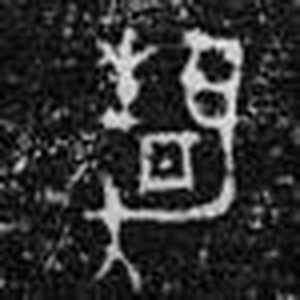 | 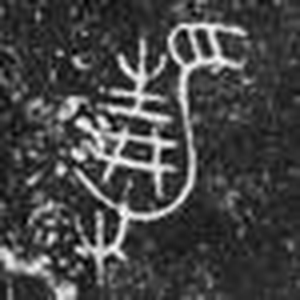 | 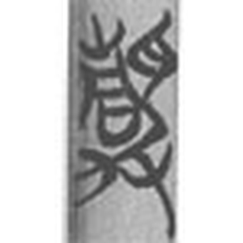 | 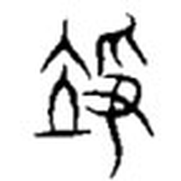 |
| 西周早期 | 西周 | 春秋早期 | 戰國楚系 | 傳抄 |

**【觀察】三件金文拓本我看到什麼：**

- **靜卣（西周早期）**：整個字分左右兩堆。**左邊由上而下兩層**：上層是一枝草木抽芽的形狀——一條中豎、兩側各分出斜枝，底下再加一橫（即「生」）；下層是一個**方框，框內有一點**。**右邊**是一條又長又彎、往下拖的筆畫，上端還連著一個像手掌的形狀。左下角另有一隻手形。
- **靜弔鼎（西周）**：左邊同樣是上「生」下方框，但框內不是一點，而是**再套一個小方框**（框中框）。右邊那條長彎筆更明顯，整條像一支往下垂的鉤，鉤的上端有個圓頭。
- **秦公鎛（春秋早期）**：**這件最清楚**。左邊上層是「生」（中豎＋兩斜枝＋兩道橫畫），下層是一個**標準的「井」字——兩豎兩橫交叉，中間不帶點**。右邊上方是一隻**三指朝下的手（爪）**，中間一條長彎鉤往下拉，左下角另有一隻手形。

**【觀察】三件放在一起，看出兩件事：**

1. **「青」下面那一塊，金文可以寫成「框中一點」（靜卣）、「框中套框」（靜弔鼎），也可以寫成「井」（秦公鎛）。** 三種寫法在同一個字裡自由替換——這正好是中大字庫說的「『丹』、『井』形近，作為部件通用」（見 2.2、4.2）。**我不是從文字描述推的，是三張拓本擺在一起看出來的。**
2. **右半「爭」，在金文裡是「兩隻手＋一條長彎鉤」。** 秦公鎛上方那隻手的三根指頭朝下、下方那隻手的指頭朝上，兩隻手一上一下，中間夾住那條長彎鉤。這條彎鉤獨立出來，跟「力」的甲骨文（見 1.3 圖）是同一個形狀。

**【觀察】小篆：** 左右兩豎行。左行上「生」下「丹」——「丹」是一個直立長方框，框內橫著一小畫。右行上面是一隻**倒垂的三指手（爪）**，中間橫出一隻手（又），再由右上往左下拖出一條長豎鉤。**左邊整整齊齊兩層，右邊三層，字形已經完全線條化，看不出金文那條「長彎鉤是農具」的味道了。**

**【觀察】簡帛（上博楚竹書．緇衣．2）：** 竹簡上的毛筆字，筆畫圓轉。左邊仍是上「生」下方框，右邊仍是「手＋彎鉤」，但兩堆互相傾側穿插，已經不是金文那種左右平行的排法。

**【觀察】汗簡（傳抄古文）——這一格最值得看：** 我看到的字形，**左邊根本不是「青」**，而是一個**站在一條橫線（地面）上的人形**：上端一個「Λ」形（頭與雙臂），中間一條窄身，底下一道長橫。這是「**立**」。右邊才是「爭」（上面一隻爪、下面一隻手、一條長彎鉤往下拖）。**即這個「靜」的傳抄古文，寫出來其實是「竫」（立＋爭）。** 中大字庫「詳解」正好說：【原文】「『靜』字汗簡古文作『竫』」。**圖與文字記載對得上，這是本卡少數能用圖直接印證文獻的地方**，而且它直接關係到段玉裁的判斷（見 2.1、4.1）。

### 1.2 六書歸類 —— 有分歧

**【原文】《說文解字·青部》**：「靜，審也。从青，爭聲。」【徐鍇曰：丹青，明審也。】〔疾郢切〕

**【原文】中大漢語多功能字庫略說**：「金文『靜』從『青』、『爭』，皆是聲符，劉洪濤指出『靜』是『耕』的初文，指耦耕（二人合耕），借為『靜』。張世超認為『靜』即是無爭而安。」

**【原文】中大漢語多功能字庫詳解**：「金文從『青』、『爭』，『青』、『爭』皆是聲符，『青』、『爭』、『靜』古韻同。劉洪濤指出『靜』是『耕』的初文，本義是耦耕，即二人並耕。張世超認為『爭』是義符，『靜』即是無爭而安，聊備一說。」

**【分歧】四種講法，關鍵分別在「誰表音、誰表意」：**

| | 主張 | 「青」的角色 | 「爭」的角色 | 六書 | 本義 |
|---|---|---|---|---|---|
| **A** | 《說文》許慎 | **形符**（義符） | **聲符** | 形聲 | **審**（詳審、采色分佈得宜） |
| **B** | 中大字庫（主說） | **聲符** | **聲符** | **雙聲符**（兩聲字） | 未明言 |
| **C** | 劉洪濤 | 聲符 | 義符（耕具） | 會意 | **耦耕**（二人並耕）→「靜」是「耕」的初文，後借為安靜 |
| **D** | 張世超（中大標為「聊備一說」） | — | **義符** | 會意 | **無爭而安** |

**四家全部並列，不挑一個當定論。** 但要指出幾件事實供判斷：

- 支持 A 的：這是《說文》原文，也是「靜」歸入《說文·青部》的依據（中大字庫「部居」欄作「青」，我核對過）。
- 支持 B 的：「青」「爭」「靜」**上古韻部相同**（中大字庫明言）。鄭張尚芳(2003) 構擬：青 \*sʰleːŋ、爭 \*ʔsreːŋ、靜 \*zleŋʔ——三個都收 -eŋ。兩個部件都能表音，是硬事實。
- 支持 C 的：金文「爭」確實是**兩手拉一件農具**（見 1.3 字形圖），而「耕」正好從「耒」「井」聲（《說文》），跟「靜」的兩個部件（爭＝農具、青＝從井）在**意象上**都對得上。
- 支持 D 的：中大字庫自己標明「聊備一說」，即編者不視為定論。

**⚠️ 提防**：C 說（靜＝耕之初文）在**字形與意象**上說得通，但**音理上有缺口**：鄭張構擬「耕」\*kreːŋ（見母）、「靜」\*zleŋʔ（從母），**韻同而聲母差得遠**。我沒有看到劉洪濤原文怎麼處理這一點（見第 6 節）。

### 1.3 部件分解

| 位置 | 部件 | Unicode | 獨立時是什麼字 | 在「靜」裡的角色 |
|---|---|---|---|---|
| 左 | 青 | U+9752 | 草木生長之色；東方色 | **【分歧】**《說文》＝形符；中大＝聲符；上古 \*sʰleːŋ |
| 右 | 爭 | U+722D | 奪取、競爭（本義是耕作） | **【分歧】**《說文》＝聲符；張世超／劉洪濤＝義符；上古 \*ʔsreːŋ |

**部件字形對照（以下每一張圖我都親眼看過）：**

| | 甲骨文 | 金文 | 大篆／傳抄 | 小篆 | 楷書 |
|---|:---:|:---:|:---:|:---:|:---:|
| **青** | 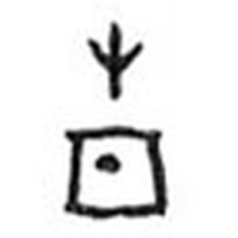 | 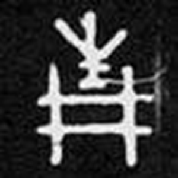 |  |  | 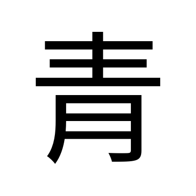 |
| **爭** | 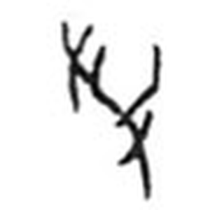 | ✗ 無獨立字例 |  |  | 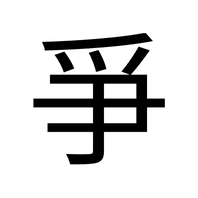 |

青：甲骨＝簠室殷契徵文．22（中大原拓）；金文＝史牆盤．西周中期（中大原拓）；大篆／小篆＝Wikimedia。
爭：甲骨＝續甲骨文編．五七七（中大原拓）；大篆／小篆＝Wikimedia。

**【觀察】「青」四期演變：**

- **甲骨文（簠室殷契徵文．22，只此一見）**：上下兩截，**互不相連**。上截是一枝小草——一條短豎，左右各分出一撇（即「屮」）。下截是一個**接近正方的框，框的正中有一顆明顯的圓點**。這顆點又圓又實，是整個字最搶眼的部分。
- **金文（史牆盤）**：上截由「屮」變成「**生**」——多了底下那一橫（地面）。下截那個框**變成了一個乾乾淨淨的「井」字：兩豎兩橫交叉，中間那顆點不見了**。
- **大篆／傳抄古文**：上截仍是「生」；下截的框變成圓角長方形，**框內那一點拉長成一道短橫**。
- **小篆**：定型。上「生」下「丹」——「丹」是一個直立的框，**框內一道短橫**。今天寫「青」，下面那個被楷書寫成「月」的部件，就是這個框。

**【觀察】「青」最值得記的一點：** 甲骨那一顆**圓點**，到金文變成**井字的空心**，到小篆再變回**一道短橫**。這顆點的存廢，正是「丹」與「井」在這個字裡換來換去的痕跡（見 4.2）。我另外看了中大收的**《說文》古文「青」（𡷉）**：上面是三叉的草芽，下面是一個**菱形框，框心一顆實心圓點**，兩側再拖出長腳——**這是我看到的所有字形裡，「坑／井中有一粒丹砂」這個畫面最清楚的一張。**

| 《說文》古文 青（𡷉） | 金文 青（青鼎・商代） |
|:---:|:---:|
| 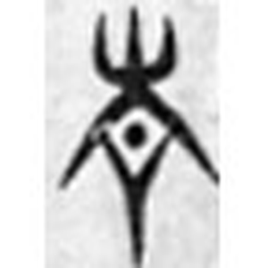 |  |

**【觀察】青鼎（商代）那一件**：上截草芽分出好幾條斜枝，比甲骨那枝茂盛；下截是一個略呈圓角的框，**框內一顆點**。時代最早，畫得也最像圖畫。

**【觀察】「爭」：**

- **甲骨文（續甲骨文編．五七七）**：我看到**兩隻手**——各是一條短杆加三根短指——**一上一下，中間夾住一件斜插下來的東西**，那件東西往下收成尖。兩隻手的指頭都朝向中間那件東西。中大另一件（六中．一五一）是同一個結構，只是筆畫更瘦長。
- **大篆／傳抄古文**：一條中軸，兩側伸出多道短畫，已經看不出「手」和「工具」的分別。
- **小篆**：上面一隻**倒垂的爪**（三指向下），中間橫出一隻手（又），右上到左下拖一條長豎鉤。**《說文》說是「从𠬪、𠂆」（𠬪＝上下兩隻手，𠂆＝被拖的東西），跟我在小篆圖上看到的完全吻合；但甲骨圖上那件被夾住的東西明顯是有尖頭的實物，不只是一道抽象的筆畫。**

**【觀察】把「爭」的甲骨文和「力」的甲骨文並排看**（下表），兩者中軸的長彎鉤形狀幾乎一樣：都是一條上端微曲、中段帶一道短橫（踏腳橫木）、下端收尖的杆。**這就是中大字庫說「『靜』字所從的『爭』字，從二『又』從『力』，『力』象農具之形」的圖像根據。**

| 爭・甲骨（中大原拓・五七七） | 爭・甲骨（中大原拓・六中一五一） | 爭・甲骨（Wikimedia 摹寫） | 力・甲骨 | 又・甲骨 |
|:---:|:---:|:---:|:---:|:---:|
|  | 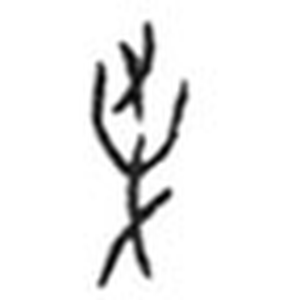 |  |  |  |

**【觀察】** Wikimedia 那張摹寫圖把兩隻手畫得更清楚：**左上一隻手（三指），右下一隻手，中間一條由右上往左下的長杆**，杆的下端往左彎。跟中大原拓是同一個結構，只是摹寫本線條乾淨。**「力」的甲骨文**：一條長杆，上端彎成鉤，中段偏左伸出一道短橫——這道短橫就是裘錫圭說的「踏腳的橫木」。**「又」的甲骨文**：一條斜杆分出三根指，就是一隻右手。

### 1.4 部件橫向連結：「青」族與「爭」族

**【原文】維基詞典「青」條衍生字**（26 字）：

> 倩、凊、啨、埥、婧、崝、情、掅、清、猜、晴、腈、棈、𭴼、睛、碃、精、綪（𬘬）、蜻、請（请）、錆（锖）、郬、寈、菁、箐、圊

**【原文】維基詞典「爭」條衍生字**（18 字）：

> 凈、𠲜、崢、𢛵、掙、淨、猙、琤、睜、竫、𠬉、諍、錚、**靜**、𦽰、𤔷、𨘱、箏

**注意：「靜」被列在「爭」那一組，不在「青」那一組**——因為維基詞典按《說文》的「爭聲」歸類。但「靜」的部首又是「青」。**同一個字，被兩個部件各拉去一半，這在 28 個目標字裡是少見的。**

揀重點的列表：

| 字 | 結構 | 上古音（鄭張2003） | 粵音 | 與「靜」的關係 |
|---|---|---|---|---|
| **青** | 生 + 丹／井 | \*sʰleːŋ | cing1／ceng1 | 「靜」的左半、部首 |
| **爭** | 又 + 又 + 力 | \*ʔsreːŋ | zang1／zaang1／caang1 | 「靜」的右半 |
| **靖** | 立 + **青**聲 | \*zleŋʔ | zing6 | **與「靜」上古同音**；金文「靜」表鎮撫，典籍多作「靖」 |
| **竫** | 立 + **爭**聲 | \*zreŋʔ | zing6 | **與「靜」同一反切（疾郢切）**；段玉裁認為「安靜」本字是它 |
| **淨** | 水 + **爭**聲 | \*zeŋs | zing6 | 本義是魯國北城門的護城河 |
| **瀞** | 水 + **靜**聲 | — | zing6（中大字庫列，pho-rel 表未列） | 「淨」的古字 |
| **情** | 心 + **青**聲 | \*zleŋ | cing4 | 與「靜」聲母韻部同，只差聲調 |
| **清** | 水 + **青**聲 | \*sʰleŋ | cing1 | |
| **精** | 米 + **青**聲 | \*ʔsleŋ | zing1 | |
| **睛** | 目 + **青**聲 | \*ʔsleŋ | zing1 | |
| **耕** | 耒 + **井**聲 | \*kreːŋ | gaang1 | 劉洪濤主張「靜」是「耕」的初文 |
| **阱** | 阜 + **井**（亦聲） | \*sɡeŋʔ | zing6 | 「井」是「阱」的初文（中大字庫） |

**小篆並排比對：**

| 靜 | 青 | 爭 | 耕 | 精 |
|:---:|:---:|:---:|:---:|:---:|
|  |  |  |  |  |

**【觀察】小篆並排看出三件事：**

1. **「靜」的左半與獨立的「青」逐筆同形**——上「生」下「丹」，沒有省略、沒有壓縮，只是整體拉窄。
2. **「靜」的右半與獨立的「爭」也是逐筆同形**——爪、又、長豎鉤三件都在。**即「靜」是兩個完整的字並排，不是誰遷就誰。** 這一點跟「偉」的右半保留完整「韋」（見 [偉.md](偉.md) 1.4）是同一現象：**兩個部件都是窄長形，並排時互不擠壓。**
3. **「耕」的右半是「井」，「靜」的左下也是（金文階段的）「井」。** 兩個字在小篆階段已經分道揚鑣——「耕」保留了井，「靜」的井已經變回帶一橫的「丹」框。**單看小篆，看不出劉洪濤說的「靜＝耕之初文」；要看金文（秦公鎛那件明顯從井）才看得出他的著眼點。**

### 1.5 異體字

| 異體 | 結構差異 | 備註 |
|---|---|---|
| **静** | 右半「爭」寫作「争」 | 日本新字體／中國大陸印刷通行體。**Unicode 是另一個碼位 U+9759**，不是簡化字關係 |
| **竫** | 立 + 爭 | 《說文》另立一字（「亭安也」）。**汗簡古文「靜」即寫作此形**（1.1 已用圖印證）；秦公鎛「靜公」，《史記．秦本紀》作「竫公」 |
| **靖** | 立 + 青 | 《說文》另立一字（「立竫也」）。金文「靜」表鎮撫、平定，後世典籍多作「靖」 |
| **靚** | 見 + 青 | 《說文》另立一字（「召也」）。教育部重編國語辭典：【原文】「沉靜。通『靜』。」 |
| 竧、𩇕、㣏、𫕼 | — | 維基詞典所列，我未取得字形，也未查到出處 |

**教育部異體字字典的「附收字 3 字」是什麼**（「偉」那一張卡沒能查出來的同類問題，這次查到了）：
我逐一檢查過三個附收字條目，**三個的 Unicode 全部都是 U+975C，即「靜」本身**，分別收在「**台**」（臺灣閩南語）、「**客**」（客語）、「**姓**」（姓氏）三個附錄裡。**所以這裡沒有未知的異體字形**——「附收字 3 字」指的是三個附錄各收了一次，不是三個不同寫法。

### 1.6 部件總表（拆到獨體象形為止）

| 層級 | 部件 | 獨立時是什麼字 | 一句字典義 | 粵音 | 出處 |
|---|---|---|---|---|---|
| 一級 | **青** | 青 | 【原文】「東方色也。木生火，从生丹。」 | cing1／ceng1 | 《說文·青部》 |
| 一級 | **爭** | 爭 | 【原文】「引也。从𠬪、𠂆。」 | zang1／zaang1／caang1 | 《說文·𠬪部》 |
| 二級 | **生** | 生 | 【原文】「進也。象艸木生出土上。」 | sang1／saang1 | 《說文·生部》 |
| 二級 | **丹** | 丹 | 【原文】「巴越之赤石也。象采丹井，一象丹形。」 | daan1 | 《說文·丹部》 |
| 二級※ | **井** | 井 | 【原文】「八家一井，象構韓形。•，𦉥之象也。」 | zeng2／zing2 | 《說文·井部》 |
| 二級 | **又** | 又 | 【原文】「手也。象形。三指者，手之列多，略不過三也。」 | jau6 | 《說文·又部》 |
| 二級 | **力** | 力 | 【原文】「筋也。象人筋之形。」（中大：甲骨象古農具） | lik6 | 《說文·力部》 |
| 三級 | **屮** | 屮 | 草木初生之形（「生」的上半） | cit3 | 中大字庫「生」條 |

※ 「井」只在**金文階段**的「青」裡出現（秦公鎛那件我親眼看過），小篆已改回「丹」。兩套都列，由你揀。

**部件字形對照（下列每張圖我都親眼看過）：**

| | 甲骨文 | 金文 | 小篆 | 楷書 |
|---|:---:|:---:|:---:|:---:|
| **生** |  |  |  | 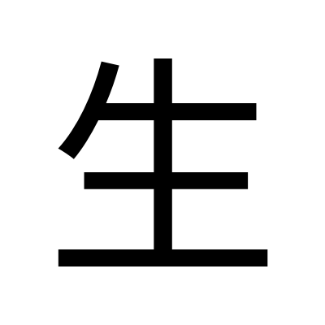 |
| **丹** |  |  |  | 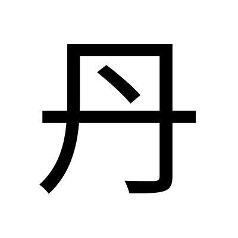 |
| **井** |  |  |  | 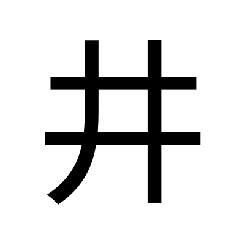 |
| **又** |  |  |  | 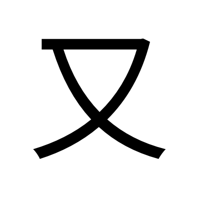 |
| **力** |  | — |  | 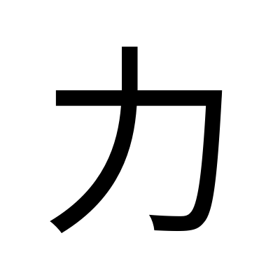 |

**【觀察】五個獨體逐個看：**

- **生**：甲骨是一條中豎，左右各分一斜枝，**底下一道長橫**——草從地面長出來。金文把中豎加粗成三角形（枝葉更飽滿），小篆把兩斜枝拉成對稱的彎弧。**三期都保留底下那一橫（地面），這一橫就是「生」跟「屮」的唯一分別。**
- **丹**：甲骨是**兩條豎邊夾住一個橫向的框，框內一個小記號**。金文的框變扁、變寬，框內那一點拉成一小橫。小篆是一個直立長方框，**框內橫著一畫**——已經完全看不出是「井」還是「盤」。
- **井**：甲骨是**兩豎兩橫交叉的「#」，中間空心**，跟今天寫法一樣。金文同形，筆畫變粗。**小篆這一張要留意——中間那個空格裡多了一顆點（即「丼」）。** 《說文》原文自己解釋了這顆點：【原文】「•，𦉥之象也」，即那顆點是汲水的瓦罐。**這顆點，讓小篆的「井」和「丹」在視覺上幾乎變成同一件東西。**
- **又**：甲骨是一條斜杆分出三根指。小篆把三指簡化成兩撇一橫的交叉。**《說文》自己說明了為什麼只有三根指：【原文】「三指者，手之列多，略不過三也」——不是真的三根，是省略。**
- **力**：甲骨是一條長杆，上端彎鉤，**中段偏左伸出一道短橫**。小篆把彎鉤收緊，短橫變成左上的一撇。**《說文》說「象人筋之形」，但我在甲骨圖上看到的是一件工具（有踏腳橫木），不是筋。中大字庫引裘錫圭：那道短畫「象踏腳的橫木」，整個字是「由原始農業中挖掘植物或點種用的尖頭木棒發展而成的一種發土工具」。圖支持中大／裘錫圭，不支持《說文》。**

**五個獨體象形終點**：生（草出土）、丹（采丹井中一粒丹砂）、井（井欄）、又（右手）、力（耒耜類農具）。**五個全部親眼看過字形圖。**

---

## 2. 意思層

### 2.1 整個字查字典

| 字典 | 原文／義項 |
|---|---|
| **《說文解字·青部》** | 【原文】「靜，審也。从青，爭聲。」【徐鍇曰：丹青，明審也。】〔疾郢切〕 |
| **段玉裁《說文解字注》** | 【原文】「采色詳審得其宜謂之靜。」（教育部異體字字典引）；另【原文】「安靜本字當从立部之竫。」（中大字庫引） |
| **《廣韻》p.317** | 【原文】「靜，安也，謀也，和也，息也。疾郢切。十。」 |
| **中大漢語多功能字庫** | 金文用法有二：一、安靜；二、鎮撫、平定 |
| **教育部異體字字典**（A04502） | 七個義項，見下 |
| **教育部重編國語辭典**（ID 5973） | 見下 |

**【原文】教育部異體字字典 A04502 釋義（七項，原文照抄）：**

> 1. 采色分佈疏密有章。《說文解字．青部》：「靜，審也。」清．段玉裁．注：「采色詳審得其宜謂之靜。」
> 2. 止、安定。與「動」相對。《韓詩外傳》卷九：「樹欲靜而風不止，子欲養而親不待也。」《文明小史》第二四回：「次日出口，風平浪靜，兩人憑欄看看海中景緻。」
> 3. 平和、安寧。晉．袁宏《後漢紀》卷一九：「商疾邊吏失和，使羌戎不靜。」元．宮大用《七里灘》第三折：「投至得帝業興，家業成，四邊平靜，經了幾千場虎鬥龍爭。」
> 4. 恬淡、平和。唐．崔融〈報三原李少府書〉：「撤函敷紙，恬神靜諷。」唐．杜甫〈送孔巢父謝病歸遊江東兼呈李白〉詩：「蔡侯靜者意有餘，清夜置酒臨前除。」
> 5. 安謐。《後漢書．卷一六．鄧寇列傳．鄧禹》：「檢敕宗族，闔門靜居。」
> 6. 緘默無聲。唐．王昌齡〈西宮春怨〉詩：「西宮夜靜百花香，欲捲珠簾春恨長。」明．陸采《懷香記》第二齣：「牛羊已下山徑靜，鳥鵲爭歸林木擾。」
> 7. 端莊、不佻達。《詩經．邶風．靜女》：「靜女其姝，俟我於城隅。」

**【原文】教育部重編國語辭典 ㄐㄧㄥˋ（青部+8畫 共16畫・常用字）：**

| 詞性 | # | 意思 | 書證 |
|---|---|---|---|
| 動 | — | **止、安定。與「動」相對** | 如「樹欲靜而風不止，子欲養而親不在。」《墨子．非攻下》「卿制大極，而神民不違，天下乃靜。」《淮南子．本經》「哀斯憤，憤斯怒，怒斯動，動則手足不靜。」 |
| 形 | 1 | **安定不動的** | 如「風平浪靜」 |
| 形 | 2 | **緘默無聲** | 如「安靜」「寧靜」「更深夜靜」。明．陸采《懷香記》第二齣「牛羊已下山徑靜，鳥鵲爭歸林木擾。」 |
| 形 | 3 | **烈**（原文如此，疑有缺字，見第 6 節） | 《詩經．邶風．靜女》「靜女其姝，俟我於城隅。」唐．方干〈書桃花塢周處土壁〉詩「自學古賢修靜節，唯應野鶴識高情。」 |
| 形 | 4 | **恬淡、平和** | 唐．崔融〈報三原李少府書〉「撤函敷紙，恬神靜諷。」唐．杜甫〈送孔巢父謝病歸遊江東兼呈李白〉詩「蔡侯靜者意有餘，清夜置酒臨前除。」 |
| 副 | — | **安謐** | 《後漢書．卷一六．鄧寇列傳．鄧禹》「檢敕宗族，闔門靜居。」 |

**【原文】中大字庫金文書證：**

> 金文除用作人名外，用法有二：一，安靜，師訇簋：「民亡(無)不康靜」。二，鎮撫、平定，後世典籍多作「靖」，班簋：「三年靜東或(國)」，秦公簋：「鎮靜不廷，虔敬朕祀」。

> 戰國至漢的簡帛書中，「靜」又通讀為「爭」，《上博楚竹書．緇衣》：「上好(仁)，則下之為(仁)也靜(爭)先」。《馬王堆漢帛書．老子甲本》：「夫唯不靜，故无尤」，乙本及通行本皆作「爭」。

> 此外，「靜」同「竫」，「靜」字汗簡古文作「竫」，秦公鎛：「靜公」，《史記．秦本紀》作「竫公」。

**配搭點**（中大字庫）：六、止、平、冷、夜、屏、幽、恬、背、風、悄、氣、動、寂、清、肅、寧、僻、凝、穆、謐、鎮、巉、嫺
**詞例**（粵語審音配詞字庫）：靜止、靜脈、動靜皆宜、靜坐、靜態、靜電、靜觀其變、靜悄悄、靜養、靜物畫、靜修、靜穆

### 2.2 部件逐個查字典

**青（U+9752）**

| 字典 | 內容 |
|---|---|
| 《說文·青部》 | 【原文】「青，東方色也。木生火，从生丹。丹青之信言象然。凡青之屬皆从青。𡷉，古文青。」〔倉經切〕 |
| 教育部重編國語辭典（ID 6592） | 【原文】顏色：(1)綠色（劉禹錫〈陋室銘〉「苔痕上階綠，草色入簾青」）(2)藍色（《荀子．勸學》「青取之於藍，而青於藍」）(3)黑色（如「玄青」）；又：綠色的草木山脈、竹皮（汗青）、地名簡稱、年輕的（青年、青春）、二一四部首之一 |
| 中大字庫略說 | 【原文】「『青』從『生』從『丹』，構形初義不明，疑象草木生長時的青色。」 |
| 中大字庫詳解 | 【原文】「甲骨文只一見，從『屮』從『丹』……金文從『生』從『丹』，丹或作『井』，『生』象草木生長，『青』本義是指草木生長之青色(林義光)。《釋名》：『靑，生也。象物之生時色也。』馬敍倫則認為丹是石名，『青』本義是石之青色。按前說較合理。草木生長之色常青，而丹石未必是青色。『生』、『井』作為聲符，與『青』古韻同屬耕部。『丹』、『井』形近，作為部件通用，金文『靜』所從之『青』多從『井』作。晚期金文『青』下加『口』為飾筆。」 |
| 維基詞典字源 | 【原文】形聲漢字（上古 \*sʰleːŋ）：聲符「生」（上古 \*sʰleːŋ, \*sreŋs）＋ 聲符「井」（上古 \*skeŋʔ）（引張富海 2022） |

→ **青 ＝ ①草木生長之色（中大、林義光）／②石之青色（馬敍倫）→ 綠、藍、黑三色皆可稱青 → 年輕。** 六書歸類本身也有【分歧】：《說文》＝會意（从生丹）；維基詞典引張富海＝形聲（生＋井，兩個都是聲符）。

**爭（U+722D）**

| 字典 | 內容 |
|---|---|
| 《說文·𠬪部》 | 【原文】「爭，引也。从𠬪、𠂆。」【臣鉉等曰：𠂆，音曳；𠬪，二手也，而曳之，爭之道也。】〔側莖切〕 |
| 教育部重編國語辭典（ID 7931） | 【原文】[動] 奪取、互不相讓；較量、競爭；辯論；相差、差別；規勸（同「諍」）。[副] 如何（同「怎」） |
| 中大字庫略說 | 【原文】「甲骨文『爭』表示把犁而耕，會兩隻手(代表兩個人)拖動一個犁鏵耕作的樣子。本表示耕作，假借為爭奪之義。」 |
| 中大字庫詳解 | 【原文】「甲骨文『爭』字從二『又』從◎，象犁耕之形(劉洪濤)，或認為象耦耕之形(賈文)。◎下呈三角形，象農耕用的犁……本來表示耕作，假借為爭奪的『爭』，耕作之本義已廢。……金文無『爭』字，只用作偏旁，『靜』字所從的『爭』字，從二『又』從『力』，『力』象農具之形，與『犁』的初文作為義符可通用。」 |
| 維基詞典字源 | 【原文】「象形漢字 — 兩隻手放在犁上。」 |

→ **爭 ＝ ①本義「耕作／兩手拉犁」（中大、維基、劉洪濤、賈文）→ ②假借作「爭奪」，本義已廢。** 《說文》「引也」（拉扯）是就假借義立訓，沒有提到農具。**四家（中大、維基、劉洪濤、賈文）對「兩手拉一件東西」沒有異議，分歧只在那件東西叫「犁」還是「耦耕」。**

**生（U+751F）**

| 字典 | 內容 |
|---|---|
| 《說文·生部》 | 【原文】「生，進也。象艸木生出土上。凡生之屬皆从生。」〔所庚切〕 |
| 中大字庫略說 | 【原文】「甲骨文『生』會草(即『屮』)從泥土裏長出來之意，本義是生出、生長。」 |
| 教育部重編國語辭典（ID 9046） | 【原文】[動] 長出、生長；生產、生育；發生、產生；生存、活存；製造、新創。[名] 生存生活；量詞（三生三世）；生命；泛指生物；生計；讀書人；學習者；戲劇角色；姓；二一四部首之一。[形] 未成熟；沒煮熟；罕見不熟悉；未加工 |

**丹（U+4E39）**

| 字典 | 內容 |
|---|---|
| 《說文·丹部》 | 【原文】「丹，巴越之赤石也。象采丹井，一象丹形。凡丹之屬皆从丹。」〔都寒切〕「𠮚，古文丹。㣋，亦古文丹。」 |
| 中大字庫略說 | 【原文】「甲金文從『凡』從一點，『凡』象盤形，但於『丹』字中所指應與盤無關。甲骨文或從『井』，構形本義不明。或說一點象丹砂之形，象礦井中有丹砂，表示採丹井。」 |
| 中大字庫詳解（關鍵一句） | 【原文】「按『丹』字作為部件，與『井』形通用，參見『青』、『靜』字。」 |
| 教育部重編國語辭典（ID 2002） | 【原文】[名] 赤色的礦石，可以製成顏料；精煉配製的藥劑（仙丹）；姓。[形] 紅色的（丹楓、丹脣）；赤誠的（丹心） |

→ **丹 ＝ 採丹砂的礦井（框）＋ 井中一粒丹砂（點）**。《說文》原文「象采丹井，一象丹形」自己就把這兩件說清楚了。

**井（U+4E95）**

| 字典 | 內容 |
|---|---|
| 《說文·井部》 | 【原文】「井，八家一井，象構韓形。•，𦉥之象也。古者伯益初作井。凡井之屬皆从井。」〔子郢切〕 |
| 中大字庫略說 | 【原文】「甲金文象井口之形，徐中舒認為象井欄兩根直木兩根橫木相交之形，中間一小方象井口。」 |
| 中大字庫詳解 | 【原文】「後期金文於井口中加一點，作『丼』，當為飾筆。徐中舒則認為一點是汲水之器。『丼』為小篆字形所本。」；又：「古代的井又用作陷阱，以捕捉野獸、敵人等。故『井』又是『阱』的初文。」；又：「因為井欄交錯有序，故又引申出井井有條、井然有序等詞語。」 |
| 教育部重編國語辭典（ID 5951） | 【原文】[名] 汲水的深洞；像井的坑洞（鹽井、油井）；人口聚居的地方（市井）；家鄉（鄉井）；周代田制百畝為一井；《易經》卦名；姓。[形] 整齊的樣子（井井有條） |

**又（U+53C8）**

| 字典 | 內容 |
|---|---|
| 《說文·又部》 | 【原文】「又，手也。象形。三指者，手之列多，略不過三也。凡又之屬皆从又。」〔于救切〕 |
| 中大字庫略說 | 【原文】「甲金文象一隻右手，本義是右手。」 |
| 教育部重編國語辭典（ID 10941） | 【原文】[副] 表示重複或反覆；加強語氣；更進一層；轉折。[連] 連結平列詞意；先後連接；數目附加。[名] 二一四部首之一 |

**力（U+529B）**

| 字典 | 內容 |
|---|---|
| 《說文·力部》 | 【原文】「力，筋也。象人筋之形。治功曰力，能圉大災。凡力之屬皆从力。」〔林直切〕 |
| 中大字庫略說 | 【原文】「甲骨文象古農具，用農具耕作需要力氣，引伸指有力氣。」 |
| 中大字庫詳解 | 【原文】「甲骨文象古代農耕工具，是由原始農業中挖掘植物或點種用的尖頭木棒發展而成的一種發土工具，字形裡的短畫象踏腳的橫木(裘錫圭)。使用農具耕作需要力氣，引伸為有力氣之意。」 |
| 教育部重編國語辭典（ID 3447） | 【原文】[名] 改變物體運動狀態（靜止或運行速度）的效能；筋肉運動產生的效能；事物的效能作用；才能；權勢；僮僕；姓；二一四部首之一。[副] 盡力、拚命 |

→ **力 ＝【分歧】《說文》「象人筋之形」 vs 中大／裘錫圭「象發土農具」。字形圖支持後者。** 順帶一提，教育部辭典解釋「力」的第一義時，用的例正是「**靜**止」——兩個字在現代物理術語裡又碰頭了，但這是巧合，不是字源關係。

### 2.3 結構 → 意思推導鏈

```
【字形】 青（生 + 丹／井） + 爭（又 + 又 + 力）
   │
   ├─【分歧 A：說文】青＝形符（丹青→明審），爭＝聲符
   │       └→【本義】審 ──「采色詳審得其宜謂之靜」（段玉裁）
   │              │
   │              └→ 引申：分佈疏密有章 → 端莊不佻達（《詩．靜女》）
   │
   ├─【分歧 B：中大主說】青、爭皆聲符（雙聲符），本義未明言
   │
   ├─【分歧 C：劉洪濤】爭＝義符（兩手拉犁）＋ 青（從井）
   │       └→【本義】耦耕（二人並耕）→「靜」是「耕」的初文
   │              └→ 假借 → 安靜（本義全廢）
   │
   └─【分歧 D：張世超・聊備一說】爭＝義符
           └→【本義】無爭而安 → 安靜

   ↓（不論走哪一條，西周金文已見的實際用法只有兩個）

【金文用法一】安靜 ──── 師訇簋「民亡(無)不康靜」
【金文用法二】鎮撫平定 ─ 班簋「三年靜東或(國)」、秦公簋「鎮靜不廷」
                          └→ 後世典籍多改寫作「靖」

   ↓（傳世文獻再往下分）

止、安定（與「動」相對）→ 緘默無聲 → 恬淡平和 → 端莊 → 安謐
```

**每一步的根據：**
- 「青、爭」的角色 ← 《說文》／中大字庫略說＋詳解／維基詞典，**四說並列**
- 「審」是本義 ← 《說文》「審也」＋段玉裁注，但**只有這一條文獻，沒有書證**
- 金文用法一、二 ← 中大字庫詳解所引師訇簋、班簋、秦公簋
- 傳世義項 ← 教育部異體字字典七項＋重編國語辭典六項

**⚠️ 要提防的推論（本卡最重要的一段警告）：**

**不可以**直接說「靜 ＝ 青（青色、安寧）＋ 爭（爭鬥）＝ 爭鬥平息就安靜了」。這個講法**恰好就是張世超那一說（D）**，而中大字庫自己標明它是「**聊備一說**」——即編者不當定論。更重要的是：**「爭」的本義是耕作，不是爭鬥**（爭鬥是假借義，見 2.2）。**用一個假借義去解釋字形，是倒果為因。**

同樣地，**不可以**說「靜 ＝ 心如止水、清心寡欲」之類——那是**詞義**層面的文學引申，不是**字形**層面的結構。

---

## 3. 同音層（粵音 zing6）

**【原文】粵語審音配詞字庫 zing6 全部同音同調字（11 個）：**

> 靜、淨、凈、阱、靖、靚、凊、婧、竫、剩、請

**【分歧・資料本身】** 中大字庫「靜」字條的「同音字」欄另外多列了一個「**瀞**」（全欄為：請、淨、剩、靖、凊、婧、阱、靚、瀞、凈、竫）。**同一個機構的兩個資料庫，一個 11 字、一個 11 字但成員差一個。** 兩份都列出來，不替它們決定誰對。

### 3.1 同音同調字表

**關係類別**四選一：同源（同聲符）｜通假／聲訓（文獻有記）｜民俗諧音（有出處）｜純諧音（只是讀音相撞）

#### A 組：同源 —— 共用「青」聲符（5 個）

| 同音字 | 字典義（一句） | 《說文》 | 上古音（鄭張2003） | 關係類別 | 來源 |
|---|---|---|---|---|---|
| **靖** | 平定；治理；恭敬；安定 | 【原文】「立竫也。从立，青聲。」〔疾郢切〕 | \*zleŋʔ | **同源＋通假**（金文「靜」表鎮撫，典籍多作「靖」——中大字庫） | 教育部 ID 5968 |
| **靚** | 漂亮；**沉靜（通「靜」）** | 【原文】「召也。从見，青聲。」〔疾正切〕 | \*zleŋs | **同源＋通假**（教育部辭典明記「通『靜』」） | 教育部 ID 5969 |
| **凊** | 寒冷 | 【原文】「寒也。从仌，青聲。」〔七正切〕 | \*sʰleŋs | **同源** | 教育部 ID 5966 |
| **婧** | 竦立；有才；（女子）身材細長 | 【原文】「竦立也。从女，青聲。一曰：有才也。」〔七正切〕 | \*ʔsleŋ／\*zleŋs／\*zleŋʔ | **同源** | 《說文·女部》；重編國語辭典未收 |
| **請** | 懇求；邀約；問候（zing6 對應的是「通『情』」那個讀音） | 【原文】「謁也。从言，青聲。」〔七井切〕 | \*sʰleŋʔ／\*zleŋs／\*zleŋ | **同源** | 教育部 ID 6615／6609 |

#### A 組（續）：同源 —— 共用「爭」聲符（3 個）

| 同音字 | 字典義（一句） | 《說文》 | 上古音（鄭張2003） | 關係類別 | 來源 |
|---|---|---|---|---|---|
| **竫** | 亭安；杜撰；**靜（通「靜」）** | 【原文】「亭安也。从立，爭聲。」**〔疾郢切〕** | \*zreŋʔ | **同源＋通假**（與「靜」**同一反切**；段玉裁：安靜本字當从立部之竫；汗簡古文「靜」即作「竫」；秦公鎛「靜公」＝《史記》「竫公」） | 教育部 ID 5972 |
| **淨** | 清潔；純粹（本義是護城河） | 【原文】「魯北城門池也。从水，爭聲。」〔士耕切，又才性切〕 | \*zeŋs | **同源** | 教育部 ID 5971 |
| **凈** | 「淨」的異體／同義 | — | \*sʰreːŋ | **同源** | 維基詞典「爭」條衍生字 |

#### A 組（再續）：同源 —— 從「靜」得聲（1 個，僅中大字庫列）

| 同音字 | 字典義（一句） | 《說文》 | 關係類別 |
|---|---|---|---|
| **瀞** | 無垢穢；是「淨」的古字 | 【原文】「無垢薉也。从水，靜聲。」〔疾正切〕 | **同源**（直接以「靜」為聲符） |

#### B 組：其他聲符（2 個）

| 同音字 | 字典義（一句） | 聲符 | 上古音 | 關係類別 | 來源 |
|---|---|---|---|---|---|
| **阱** | 為捕獸挖的坑洞（陷阱） | **井**（《說文》「从𨸏从井，井亦聲」） | \*sɡeŋʔ／\*sɡeŋs（鄭張2003） | **【分歧】看你信哪一說**：若採《說文》「青从生丹」，則「阱」與「靜」只是純諧音；若採張富海／維基詞典「青＝生＋**井**聲」，則兩者**同源**（見 4.3） | 教育部 ID 5952 |
| **剩** | 多餘的、餘留 | **乘** | \*Cə.ləŋ-s（白一平-沙加爾2011）；中古 zyingH（蒸韻） | **純諧音**（中古屬蒸韻，與「靜」的清／靜韻不同韻攝） | 教育部 ID 9062 |

**11 個字裡面，9 個同源（含 3 個有文獻通假書證）、1 個看學說而定、1 個純諧音。**
**這個比例在本 project 至今做過的字裡是最高的**（對比「偉」：28 個 wai5 字裡 14 個同源，剛好一半）。原因很直接：「靜」的兩個部件都是活躍聲符，而 zing6 這個音節本身收字少。

### 3.2 同音異調字（zing 系其他聲調，只列名，不引申）

**zing1**（陰平）：正、精、睛、菁、蒸、徵、征、晶、偵、貞、怔、癥、禎、旌、鼱、楨、烝、眐、旍、湞、遉、鉦、箐、鶄、症、鯖、赬、寊、姃、媜、脀、炡、聇、篜

**zing2**（陰上）：整、井、丼、晸

**zing3**（陰去）：正、政、證、症、証、幀、癥、鉦、氶

**zing4／zing5**：**有音無字**（粵語審音配詞字庫原文）

> ⚠️ 留意三點：
> 1. **「井」「丼」在 zing2**——即「靜」的祖父輩部件（若採張富海說）跟「靜」同聲母同韻母，只差聲調。
> 2. **「精」「睛」「菁」在 zing1**，都是「青」聲符——即整個「青」族在粵語裡散落在 zing1／zing6／cing1／cing4 幾個音節。
> 3. **「爭」本身不在任何 zing 調**（讀 zang1／zaang1／caang1）——**聲符跟被諧的字在今天粵語裡已經讀不到一起了**，這跟「偉／韋」只差一個聲調的情況很不同。

### 3.3 引申

> 以下全部是【引申】＝同音推想，**不是字典考據**。拿去用之前請先看清楚類別。

**由 A 組（同源）出發——有聲符關係撐住，最實：**

- 【引申】靜 ↔ **靖**（平定、鎮撫）。→ 可引申為：**「靜」不是被動的沒有聲音，而是主動把局面按下來**。這一條有金文書證撐（班簋「三年靜東國」），在所有引申裡**證據最硬**。
- 【引申】靜 ↔ **竫**（亭安）。→ 可引申為：**安定下來、停在一個地方**。同一反切、段玉裁認為是本字，也有出土與傳世雙重書證（秦公鎛／《史記》）。
- 【引申】靜 ↔ **淨／凈／瀞**（清潔、無垢）。→ 可引申為：**靜＝乾淨、無雜質**。留意「淨」的《說文》本義是護城河，「清潔」義是後起的；但粵語「乾淨」「靜」同音，這個聯想在口語層面非常自然。
- 【引申】靜 ↔ **靚**（漂亮）。→ 可引申為：**靜＝好看**。粵語「靚」是日常高頻字，這一條的民俗聯想力最強；而且**文獻上「靚」真的通「靜」**（《文選．揚雄．甘泉賦》「稍暗暗而靚深」），所以它同時是同源、通假、又是活生生的口語諧音。
- 【引申】靜 ↔ **凊**（寒冷）。→ 可引申為：**靜＝冷**。「冷靜」這個現代詞恰好把兩個字並在一起，但要留意：「冷靜」的「冷」是「冷」不是「凊」，兩者只是同音，不是同一個字。
- 【引申】靜 ↔ **婧**（竦立、有才）。→ 可引申為：**靜＝站得直、有才而不張揚**。跟義項 7「端莊、不佻達」（《詩．靜女》）呼應。
- 【引申】靜 ↔ **請**（懇求、邀約）。→ **反向引申**：「靜」是不出聲，「請」是開口求人。同音而行為相反。

**由 B 組出發——較鬆：**

- 【引申】靜 ↔ **阱**（陷阱）。→ 可引申為：**看似平靜的地方底下有坑**。這一條在諧音層面很有戲劇性，但**它是不是同源，要看你接受哪一派的「青」字結構**（見 4.3），不要當成已定的考據。
- 【引申】靜 ↔ **剩**（剩餘）。→ 可引申為：**都走光了，剩下的就是靜**。純諧音，中古音本不同韻，是粵語演變後才撞在一起的。

**由部件出發（不是同音，是結構）：**

- 【引申】「靜」的右半是**兩隻手拉一件農具**。→ 可引申為：**靜不是不動，是「一起做同一件事、動作合拍」**（耦耕）。這條的根據是劉洪濤、賈文、中大字庫對「爭」字形的解讀，**屬於結構層而非同音層**，但因為它跟一般人對「靜」的印象差距最大，放在這裡提醒一次。

---

## 4. 交叉核對

### 4.1 結構 ↔ 意思：推導鏈有沒有斷？

**斷了一截，而且斷在最關鍵的位置。**

- **《說文》給的本義「審」，在傳世文獻裡幾乎找不到書證。** 教育部異體字字典把「采色分佈疏密有章」列為義項 1，但它引的「書證」就是《說文》自己和段玉裁的注——**即這個義項是靠訓詁書立起來的，不是靠用例立起來的**。相比之下，義項 2「止、安定」有《韓詩外傳》《文明小史》，義項 7「端莊」有《詩經》。
- **段玉裁自己指出了這個缺口。** 【原文】「安靜本字當从立部之竫。」——即段玉裁認為：今天大家寫的「安靜」的「靜」，本字應該是「竫」；「靜」被借去用了。**而《說文》「竫，亭安也」正好就是「安靜」。**
- **金文的實際用法，跟《說文》的訓解對不上。** 西周金文「靜」的兩個用法（安靜、鎮撫）**都不是「審」**。也就是說：**現存最早的「靜」字用例，就已經是「安靜」義了**，「審」這個本義沒有出土文獻支持。
- **結論**：「靜」的字形能解釋它讀 zing6（兩個部件都是聲符），**但解釋不了它為什麼解「安靜」**。《說文》給的答案（審）與文獻用法脫節，劉洪濤給的答案（耦耕→假借）承認本義已廢，張世超給的答案（無爭而安）被中大標為聊備一說。**三條路都走不到「安靜」這個今義，只能說它很早就這樣用了。**

> 與「偉」對比：「偉」的結構只解釋到一半（人），另一半是啞的聲符，但《說文》的本義「奇也」有《管子》《莊子》書證撐住。**「靜」的情況更麻煩——連本義本身都沒有用例。**

### 4.2 字典 ↔ 字典：有沒有打架？

**打架的地方有三處，一處比一處深。**

#### 第一處：「靜」本身的六書歸類 ——【分歧】

已在 1.2 列出四說（A 說文形聲／B 中大雙聲符／C 劉洪濤會意・耕之初文／D 張世超會意・無爭而安）。**四家並列，不挑。**

#### 第二處：「青」下面那一塊是「丹」還是「井」 ——【分歧】

| | 《說文》（許慎） | 中大字庫 | 維基詞典（引張富海2022） |
|---|---|---|---|
| 「青」的結構 | 从**生**、**丹**（會意） | 從「生」從「丹」，**丹或作井** | **生**聲 ＋ **井**聲（形聲，雙聲符） |
| 「丹／井」的角色 | **形符**（丹＝顏料） | 形符為主，但註明「生、井作為聲符，與青古韻同屬耕部」 | **純聲符** |
| 六書 | 會意 | 未定（「構形初義不明」） | 形聲 |

**【觀察】我看圖之後的判斷：** 我親眼看過的五張「青」字形（甲骨、金文史牆盤、金文青鼎、大篆、小篆）加上《說文》古文，下半那一塊呈現三種樣子：**框中一點**（甲骨、青鼎、說文古文）、**乾淨的井字**（史牆盤）、**框中一橫**（大篆、小篆）。再加上 1.1 那三件「靜」的金文——靜卣是框中一點、靜弔鼎是框中套框、秦公鎛是井。

**也就是說：在我親眼看過的九張圖裡，「丹」和「井」確實在同一個位置自由替換。** 中大字庫那句【原文】「『丹』、『井』形近，作為部件通用，金文『靜』所從之『青』多從『井』作」——**跟圖完全對得上，這一點我可以確認。**

**但「通用」不等於「哪個才是原本」。** 兩邊都有道理：

- 支持《說文》（丹）的：《說文》自己講明「象采丹井，一象丹形」——**丹本來就是一個井形加一點**。所以「丹」和「井」形近，根本就是因為丹**就是**一種井。這樣看，寫成「井」不過是把那一點省掉。
- 支持張富海（井聲）的：「井」\*skeŋʔ 與「青」\*sʰleːŋ 韻部相同（耕部），**音理上「井」可以作聲符，「丹」\*taːn 不可以**（元部，差得遠）。如果「青」是形聲字，聲符只能是「生」或「井」，不會是「丹」。
- **我的判斷**：兩說的落差，來自它們在回答不同的問題。《說文》答的是「這個部件畫的是什麼」（一口丹砂井），張富海答的是「這個部件在字裡起什麼作用」（表音）。**「丹」本身就是「井＋一點」，所以兩個答案可以並存**——但我沒有看到任何一家明白地這樣調和過，**這是我自己的推想，不是引述**（見第 6 節）。

#### 第三處：「爭」畫的是什麼 ——【分歧】，但分歧很小

| | 《說文》（許慎） | 中大字庫／劉洪濤 | 賈文 | 維基詞典 |
|---|---|---|---|---|
| 拆法 | 从𠬪、𠂆 | 二又 + ◎（犁） | 二又 + ◎（耦耕之形） | 兩隻手 + 犁 |
| 那件東西 | 𠂆，音曳（被拖的東西，抽象） | **犁**（農具） | **耦耕**（強調兩人） | **犁** |
| 本義 | **引**（拉扯） | **耕作** | **耦耕** | 耕作 |

**【觀察】我看甲骨圖之後怎麼看：** 續甲骨文編那兩件，中間被夾住的東西**下端明顯收成尖**，不是一條平直的線；而它的輪廓跟「力」的甲骨文（一條帶踏腳橫木的尖頭杆）非常接近。**圖支持「農具」那一邊，不支持《說文》「𠂆，音曳」那種純抽象筆畫的講法。** 但也要說句公道話：許慎看到的是小篆，**小篆那條長豎鉤確實已經看不出是農具了**（我看小篆圖時也看不出來）——**許慎沒有錯，他只是沒有甲骨文可看。**

#### 沒有打架的地方

「靜」的**讀音**四家完全一致：《廣韻》疾郢切、中大中古音從母上聲清韻、粵語 zing6 單讀音字、國音 ㄐㄧㄥˋ。**連一個異讀都沒有**，這在 28 個目標字裡算乾淨的。

### 4.3 同音 ↔ 結構：zing6 那 11 個字，剛好照「靜」的兩個部件分成兩族

**這一節是本卡最硬的一段。**

**1. zing6 同音字表，可以按聲符切成兩半，而這兩半正好就是「靜」的左半和右半。**

| 聲符 | zing6 同音字 | 上古音（鄭張2003） |
|---|---|---|
| **青**（＝「靜」的左半） | 靖、靚、凊、婧、請 | \*zleŋʔ、\*zleŋs、\*sʰleŋs、\*ʔsleŋ、\*sʰleŋʔ |
| **爭**（＝「靜」的右半） | 竫、淨、凈 | \*zreŋʔ、\*zeŋs、\*sʰreːŋ |
| **靜**（本字，以「靜」為聲符） | 瀞 | — |
| 井 | 阱 | \*sɡeŋʔ |
| 乘 | 剩 | \*Cə.ləŋ-s（白沙2011） |

**11 個字裡，8 個直接來自「靜」的兩個部件，1 個直接來自「靜」本身。** 這不是巧合——「靜」是一個雙聲符字，它的兩個聲符各自帶出一批同音字，而「靜」正好站在兩批的交點上。**在整個 project 至今做過的字裡，這是第一個「同音字表本身就把字形結構畫出來」的例子。**

**2.「靜」和「竫」是同一個反切。**

《說文》：靜〔**疾郢切**〕、竫〔**疾郢切**〕。兩個字中古完全同音。再加上：

- 段玉裁：【原文】「安靜本字當从立部之竫。」
- 汗簡古文「靜」寫作「竫」（**我親眼看過那張圖，見 1.1**）
- 秦公鎛「靜公」，《史記．秦本紀》作「竫公」

**同音 + 同義 + 出土書證 + 傳世書證 + 傳抄字形，五重證據都指向同一件事：「靜」和「竫」在古代基本是一個詞的兩種寫法。** 這是本卡證據鏈最完整的一條。

**3.「靜」和「靖」的上古音一模一樣，而金文的分工有文獻記錄。**

鄭張尚芳(2003)：靜 \*zleŋʔ、靖 \*zleŋʔ——**完全相同**。中大字庫詳解：【原文】「二，鎮撫、平定，後世典籍多作『靖』。」**即西周金文用「靜」表達的那個意思，後來的書改寫成「靖」。** 同音字之間的分工是後起的，不是天生的。

**4.「爭」在粵語裡已經跟「靜」讀不到一起了。**

「爭」讀 zang1／zaang1／caang1，「靜」讀 zing6——**聲母韻母聲調三樣都不同。** 上古音本來很近（\*ʔsreːŋ vs \*zleŋʔ，同收 -eŋ），但粵語的演變把它們拉開了。

**這一點值得記住**：如果只看今天的粵音，你**完全看不出**「爭」是「靜」的聲符。**必須靠上古音構擬才看得到這層關係。** 這跟「偉／韋」（今天只差一個聲調）是相反的情況。

**5.「阱」這一條，要看你接受哪一派。**

- 若採《說文》「青，从生丹」：「青」與「井」無關 → 「阱」（从井）與「靜」只是**純諧音**。
- 若採張富海／維基詞典「青 ＝ 生聲 + **井**聲」：「井」是「靜」的祖父輩聲符 → 「阱」與「靜」**同源**。

**我不替這一條下判斷。** 但要指出一個附帶事實：中大字庫說【原文】「『井』又是『阱』的初文」，而《說文》說【原文】「阱，陷也。从𨸏从井，**井亦聲**」——**即「阱」與「井」的同源關係本身是確定的，不確定的只是「青」與「井」那一環。**

**6. 「耕」的音理缺口。**

劉洪濤主張「靜」是「耕」的初文。但鄭張構擬：耕 \*kreːŋ、靜 \*zleŋʔ——**韻相同（-eŋ），聲母一個是 k-（見母）一個是 z-（從母），差距很大。** 若兩字真是同一個詞的先後寫法，這個聲母落差需要解釋。**我沒有看到劉洪濤原文怎麼處理（見第 6 節），所以只把現象擺出來，不下結論。** 順帶一提：「耕」在鄭張的同聲符表裡屬**井**系（耕 ＝ 耒 + 井聲），而「靜」屬**青**系——**兩人分屬不同諧聲系列，這對劉說是一個不利的旁證。**

### 4.4 一句總結

**「靜」最硬的證據鏈：** 青（\*sʰleːŋ）+ 爭（\*ʔsreːŋ）→ 兩個部件古韻同屬耕部，**都可以表音**，所以讀 \*zleŋʔ → zing6；但**誰表意，四家四說，沒有定論**。《說文》給的本義「審」沒有出土或傳世用例撐，**現存最早的西周金文，用的已經是「安靜」和「鎮撫」兩個意思**；段玉裁認為「安靜」的本字應該是同一反切的「竫」，而汗簡古文「靜」確實寫作「竫」（**圖已核實**）。同音層方面，zing6 那 11 個字有 9 個是「靜」的兩個聲符（或「靜」自己）帶出來的，**整張同音字表本身就是這個字結構的鏡像**——這是本卡最值得拿去用的一個鈎。

---

## 5. 來源清單

| # | 來源 | URL／位置 |
|---|---|---|
| 1 | 中大漢語多功能字庫 · 靜 | https://humanum.arts.cuhk.edu.hk/Lexis/lexi-mf/search.php?word=靜 |
| 2 | 中大漢語多功能字庫 · 青 | https://humanum.arts.cuhk.edu.hk/Lexis/lexi-mf/search.php?word=青 |
| 3 | 中大漢語多功能字庫 · 爭 | https://humanum.arts.cuhk.edu.hk/Lexis/lexi-mf/search.php?word=爭 |
| 4 | 中大漢語多功能字庫 · 生／丹／井／又／力／耕／阱／瀞／竫／靖／婧／凊／靚／請／淨／剩 | 同上，`?word=<字>` |
| 5 | 粵語審音配詞字庫 · 靜 | https://humanum.arts.cuhk.edu.hk/Lexis/lexi-can/search.php?q=%C0R |
| 6 | 粵語審音配詞字庫 · zing6 同音字 | https://humanum.arts.cuhk.edu.hk/Lexis/lexi-can/pho-rel.php?s1=z&s2=ing&s3=6 |
| 7 | 粵語審音配詞字庫 · zing1／zing2／zing3／zing4／zing5 | 同上，`&s3=1..5` |
| 8 | 教育部重編國語辭典 · 靜 | https://dict.revised.moe.edu.tw/dictView.jsp?ID=5973 |
| 9 | 教育部重編國語辭典 · 青 6592／爭 7931／生 9046／丹 2002／井 5951／爪 7731／又 10941／力 3447 | 同上，`?ID=<n>` |
| 10 | 教育部重編國語辭典 · 同音字 | 淨 5971／阱 5952／靖 5968／靚 5969／凊 5966／竫 5972／剩 9062／請 6615・6609 |
| 11 | 教育部異體字字典 · 靜 A04502 | https://dict.variants.moe.edu.tw/dictView.jsp?ID=49802 |
| 12 | 教育部異體字字典 · 靜 附收字（3 筆） | https://dict.variants.moe.edu.tw/search.jsp?QTP=0&WORD=靜&TP=2 |
| 13 | 維基詞典 · 靜 | https://zh.wiktionary.org/wiki/靜 |
| 14 | 維基詞典 · 青（含鄭張尚芳上古音同聲符表、張富海 2022 引） | https://zh.wiktionary.org/wiki/青 |
| 15 | 維基詞典 · 爭（含鄭張尚芳上古音同聲符表、白一平-沙加爾 2011） | https://zh.wiktionary.org/wiki/爭 |
| 16 | 維基詞典 · 井（含鄭張尚芳上古音同聲符表）／剩（白沙 2011） | https://zh.wiktionary.org/wiki/井 ／ /剩 |
| 17 | 字形圖・中大原拓 | 靜：靜卣・靜弔鼎・秦公鎛（金文）、上博緇衣（簡帛）、汗簡（傳抄）、說文小篆<br>青：簠室殷契徵文．22（甲骨）、史牆盤・青鼎（金文）、說文古文<br>爭：續甲骨文編 五七七・六中一五一（甲骨） |
| 18 | 字形圖・Wikimedia Commons | `青-bigseal/-seal`、`爭-oracle/-bigseal/-seal`、`生-/丹-/井-/又-/力- oracle・bronze・seal`、`耕-seal`、`精-seal` |

楷書圖：本機用 Noto Sans TC render（`fonts/NotoSansTC-Regular.otf`）。

---

## 6. 存疑／未驗證

1. **「靜」的上古音，我只取到鄭張尚芳(2003) 一套（\*zleŋʔ），而且是經維基詞典「青」條的同聲符表轉載，未查《上古音系》原書。** 白一平-沙加爾(2011) 系統對「靜」的構擬**我沒有取到**——zh.wiktionary「靜」條是舊版式頁面，沒有白沙表。所以 0 節「上古音」欄只有一套，不像「偉」那張卡有兩套互相對照。
2. **劉洪濤「靜是耕的初文」、賈文「耦耕說」、張世超「無爭而安」、林義光、馬敍倫、徐中舒、裘錫圭、張富海(2022)——全部是經中大字庫或維基詞典轉述，我沒有查過任何一家的原文。** 4.3 第 6 點指出的「耕 \*kreːŋ vs 靜 \*zleŋʔ 聲母落差」，是我自己拿兩個構擬對比出來的，**劉洪濤原文可能已經處理過這一點，我不知道**。
3. **4.2 第二處末尾「丹本身就是井＋一點，所以《說文》與張富海兩說可以並存」——這是我自己的推想，不是任何一家的講法。** 我把它標出來，是因為它符合我親眼看到的字形；但**沒有任何文獻背書**，請當作【引申】級別看待，不要當考據。
4. **教育部重編國語辭典「靜」[形] 義項 3 的釋義只有一個「烈」字。** 我重複抓取過，`<meta name="Description">` 裡的原文就是「3.烈。」——**疑是教育部那邊的資料本身有缺字**。同一條書證（《詩經．邶風．靜女》）在教育部異體字字典 A04502 作「端莊、不佻達」，我把兩份都列了出來。**我沒有辦法判斷重編國語辭典原本想寫什麼。**
5. **zing6 同音字表，中大兩個資料庫不一致：** 粵語審音配詞字庫 pho-rel 表列 11 字（無「瀞」），中大字庫「靜」字條的同音字欄列 11 字（有「瀞」、無「靜」自身）。**我兩份都照列，沒有替它們調和。**
6. **維基詞典列「靜」的異體字有 竧、𩇕、㣏、𫕼 四個，我未取得字形，也未在任何字典查到出處。** 1.5 節只把它們列名。
7. **中大字庫「靜」的金文有 10/23 例、簡帛 15/22 例，我只逐一看過其中 3 件金文、1 件簡帛、2 件傳抄古文。** 所以 1.1 節「金文可以寫成框中一點／框中套框／井」這個結論，**是從我實際看過的三件歸納出來的，不是看齊 10 件之後的統計**。
8. **「爭」的金文**：中大字庫明言【原文】「金文無『爭』字，只用作偏旁」，所以 1.3 表中「爭・金文」一欄我標「✗ 無獨立字例」。**我沒有另外去找金文「爭」的獨立字形來反證這句話。**
9. **Wikimedia 的古文字 SVG 是摹寫，不是原拓。** 1.6 節「生／丹／井／又／力」五個部件的甲骨、金文、小篆圖全部來自 Wikimedia，**是摹本**；只有「青」「爭」「靜」三個字我用了中大的原拓。兩者不要混為一談。
10. **「力」的金文圖我下載到了，但圖中除了「力」字之外還有一團灰色的、形似「田」的背景圖形，來源不明，所以我沒有把它放進 1.6 的表。** 該表「力・金文」一欄留空。
11. **《說文》引文我全部經中大字庫「《說文》」欄轉錄**（含徐鍇、徐鉉按語），未核對大徐本或段注本原書。段玉裁兩條注文，一條經教育部異體字字典轉引，一條經中大字庫轉引。
